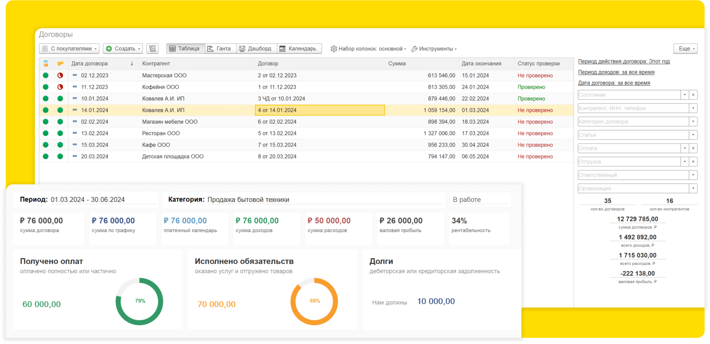

---
{}
---

Инструменты для управления бизнесом на основе данных

[tabs]

[tab:Рабочий стол::]

Первая

[/tab]

[tab:Договоры::]

{width=1680px height=814px}

**Договор** содержит подробную информацию о товарах, услугах и условиях поставки

**Планирование** доходов и расходов, периода выставления актов и счетов, поступлений и платежей

[/tab]

[tab:Вкладка::]

Деньги

[/tab]

[/tabs]

