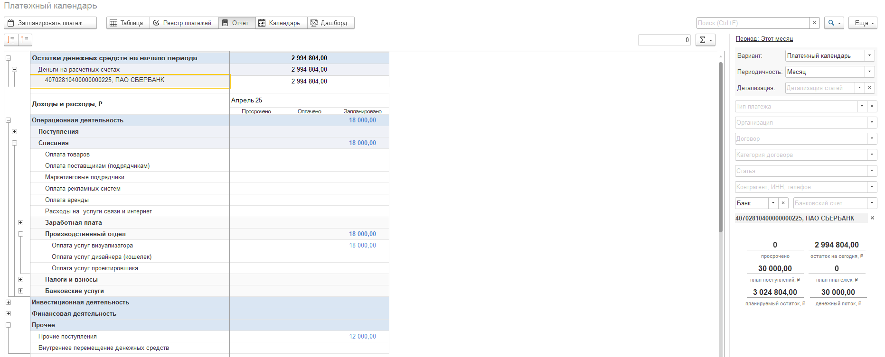

## Отчет о движении денежных средств

1. Добавлен новый вариант отчета: ДДС + Подразделения для 1С:Бухгалтерия 8. 

   Если организация ведется учет денежных средств по подразделениям, в отчете ДДС стало возможным разделить денежный поток по подразделениям.

   [image:./reliz-1-33-0-0.png:::0,0,100,100::square,33.1697,30.7463,12.3422,69.2537,,top-left,&square,68.2328,28.6567,31.3464,71.3433,,top-left:1426px:335px]

    

2. Добавлена возможность расшифровки поля отчета ДДС в разрезе контрагент/документ.

3. Исправлена ошибка в варианте отчета: Факт. Детализация по организациям.

   Реализована расшифровка с учетом отбора по организации.

4. Добавлена расшифровка с учетом отбора по проектам в варианте отчета в варианте отчета: ДДС + проекты

   {width=1444px height=329px}

5. Вариант отчета: Факт + БДДС. Детализация по доп аналитике.

   План БДДС в отчете отражается и в детализации дополнительной аналитики.

   {width=1272px height=377px}

## Платежный календарь

1. Реализация  возможности отбора: по счетам/по кассе/по кошельку. Теперь в правой части экрана появилась функция, позволяющая сузить выбор до конкретного счета.

2. Реализовали отображение остатков денежных средств на начало периода.

3. В отчёте об остатках денежных средств отображаются все счета, даже если они не относятся к текущей организации, по которым были запланированы платежи.

   {width=1864px height=753px}

4. Исправление ошибки, связанное с остатками в календаре с дашбордом.

   {width=1518px height=524px}

## Отчет ОПиУ

1.  
