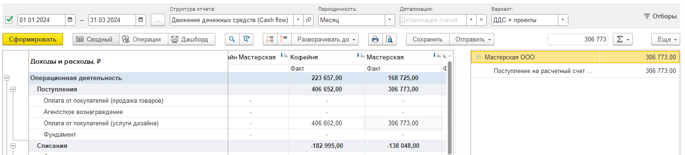
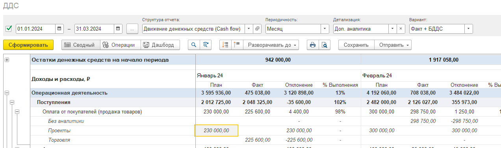
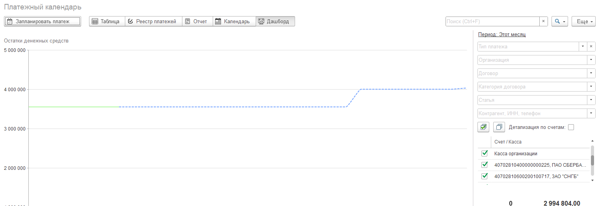

## Отчет о движении денежных средств

### Новый функционал

1. Добавлен новый вариант отчета: ДДС + Подразделения для 1С:Бухгалтерия 8.

   Если организация ведется учет денежных средств по подразделениям, в отчете ДДС стало возможным разделить денежный поток по подразделениям.

   [image:./reliz-1-33-0-0.png:::0,0,100,100::square,33.1697,30.7463,12.3422,69.2537,,top-left&square,68.2328,28.6567,31.3464,71.3433,,top-left:1426px:335px]

2. Добавлена возможность расшифровки поля отчета ДДС в разрезе контрагент/документ.

3. Добавлена возможность отбора по нескольким организациям.

4. Добавлена детализация по номенклатуре.

5. Добавлена расшифровка с учетом отбора по проектам в варианте отчета в варианте отчета: ДДС + проекты

   {width=1444px height=329px}

6. Вариант отчета: Факт + БДДС. Детализация по доп аналитике.

   План БДДС в отчете отражается и в детализации дополнительной аналитики.

   {width=1272px height=377px}

### Исправление ошибок

1. Исправлена ошибка в варианте отчета: Факт. Детализация по организациям.

   Реализована расшифровка с учетом отбора по организации.

## Платежный календарь

1. При создании платежек в платежном календаре с видом платежа “Ежемесячный“ появилась возможность указать шаблон даты в виде:

   -  \[ТекущийМесяц\]

   -  \[ПрошлыйМесяц\]

   -  \[СледующийМесяц\]

      Данный шаблон при создании платежек преобразуется в соответствующую дату

      [image:./reliz-1-33-0-6.png:::0,0,100,100:84:square,3.0255,71.7742,96.4968,12.2581,,top-left:628px:620px]

2. Реализованы возможности отбора: по счетам/по кассе/по кошельку. Теперь в правой части экрана появилась функция, позволяющая отобрать платежки до конкретного счета.

3. Добавлено отображение остатков денежных средств на начало периода.

4. В блоке остатках денежных средств отображаются все счета, даже если они не относятся к текущей организации, по которым были запланированы платежи.

   [image:./reliz-1-33-0-3.png:::0,0,100,100:100:square,0.6591,16.4297,56.7797,37.9147,,top-left&square,69.6798,65.7188,13.371,7.109,,top-left:1062px:633px]

5. Исправление ошибки, связанное с остатками в календаре с дашбордом.

   {width=1518px height=524px}

6. Исправление ошибок по остаткам в календаре.

## Отчет ОПиУ

1. Добавлен вариант отчета **P&L + подразделение**

2. Исправлены ошибки, связанные с отбором по организациям и подразделениям в отборах.

3. В группах статей для ОПиУ появилось возможность указать «Количество знаков после запятой» для расчетов процентов в отчете.

   [image:./reliz-1-33-0-5.png:::0,0,100,100::square,18.7578,40.8389,32.4224,7.5055,,top-left:805px:453px]

4. Добавлен вариант отчета **P&L + разделы проекта**

   [image:./reliz-1-33-0-8.png:::0.4699248120300752,5.027932960893855,98.02631578947368,93.29608938547486:::1064px:179px]

5. Отчет ОПиУ. Вариант отчета Факт + БДР. Плановые суммы теперь тоже рассчитываются по формулам.

6. В договорах теперь есть новый реквизит -- «Доп. аналитика». Он расположен в табличных частях “доходы” и “расходы”, которые также отображается и в отчёте ОПиУ.

   [image:./reliz-1-33-0-10.png:::0,0,100,100::square,48.5046,71.3693,32.7698,24.2739,,top-left:769px:482px]

## Управленческие документы

1. Финансовый план (БДДС). Появилась возможность заполнить документ по платежному календарю

   [image:./reliz-1-33-0-7.png:::0,0,100,100::square,29.549,11.0656,36.3919,17.623,,top-left:643px:244px]

2. Финансовый план (БДР). Появилась возможность заполнить документ по плановым суммам договоров (табличные части доходы и расходы)

[image:./reliz-1-33-0-9.png:::0,0,100,100::square,37.5242,18.7097,31.1412,25.8065,,top-left:517px:155px]

## Документы

1. Бухгалтерский документ “Операция введенная вручную. Добавлена команда “Распределение” для отражения данных в ОПиУ.

2. Бухгалтерский документ “Отражение зарплаты в бухучете. Добавлена возможность создать на основании документ “Управленческая операция“ (1) с помощью которой удобнее распределять по статьям/проектам/видам деятельности заработную плату.

   По умолчанию статьи берутся из самого документа. Если была создан на основании документ, необходимо указать статус “Создана управленческая операция“ (2) дабы избежать дублей в отчете.

   [image:./reliz-1-33-0-11.png:::0,0,100,100::square,51.2796,3.5294,24.9289,24.902,,top-left&square,66.8246,28.6275,33.1754,13.3333,,top-left:1055px:510px]

[image:./reliz-1-33-0-14.png:::4.344391785150079,0,95.65560821484992,100:::1266px:619px]

