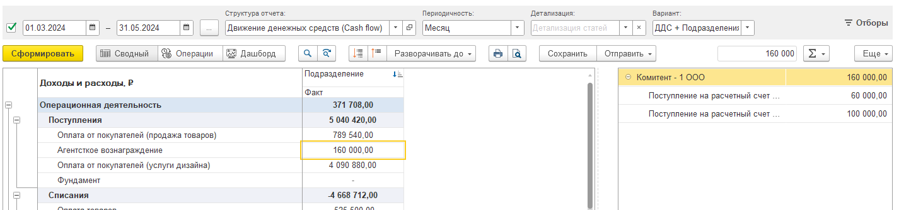
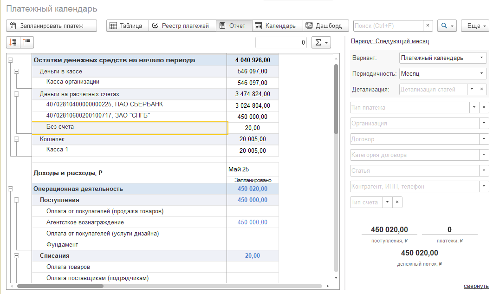

## Отчет о движении денежных средств

1. Вариант отчета: ДДС + Подразделения. 

   Реализован вариант отчета по подразделениям в Бухгалтерии предприятии (Если режим учёта по подразделениям включён и денежные средства распределены по подразделениям).

    Детализация по подразделения в БП. Реализована расшифровка статьи по контрагентам и документам в правой части экрана.

   {width=1426px height=335px}

2. Вариант отчета: Факт. Детализация по организациям.

   Исправление ошибки. Если в системе учёта несколько организаций, то при расшифровке данных одной из них документы будут отображены с учётом текущих отборов.

3. Вариант отчета: ДДС + проекты.

    Реализована расшифровка статьи по контрагентам и документам в правой части экрана.

   {width=1444px height=329px}

4. Вариант отчета: Факт + БДДС. Детализация по доп аналитике.

   План БДДС в отчете отражается и в детализации дополнительной аналитики.

   {width=1272px height=377px}

## Платежный календарь

1. Реализация  возможности отбора: по счетам/по кассе/по кошельку. Теперь в правой части экрана появилась функция, позволяющая сузить выбор до конкретного счета.

2. Реализовали отображение остатков денежных средств на начало периода.

3. В отчёте об остатках денежных средств отображаются все счета, даже если они не относятся к текущей организации, по которым были запланированы платежи.

   {width=1864px height=753px}

4. Исправление ошибки, связанное с остатками в календаре с дашбордом.

   {width=1518px height=524px}