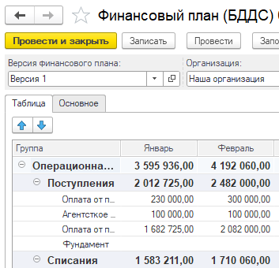
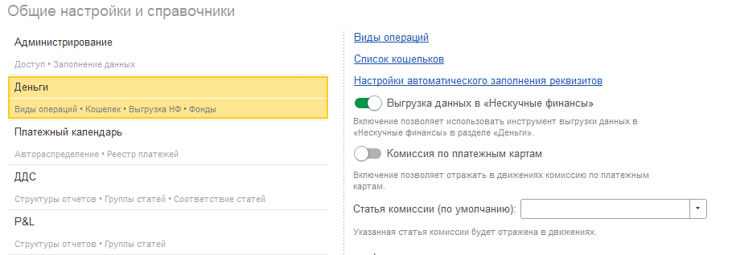
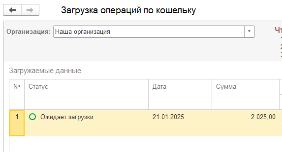
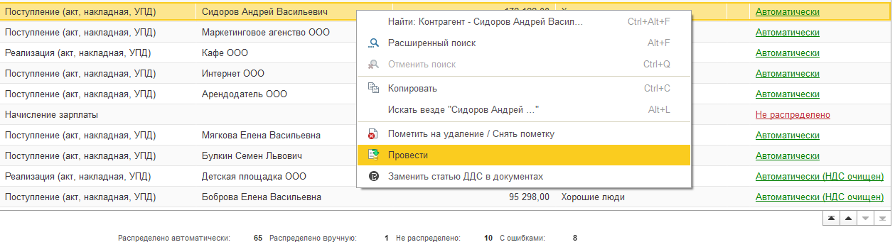
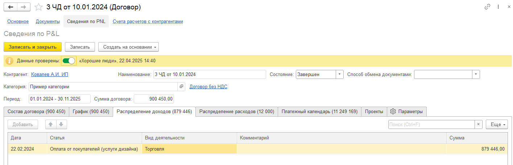

## Отчет о движении денежных средств

### Новый функционал

1. Для варианта отчета **Факт + БДДС** добавлен отбор по версии финансового плана. По умолчанию установлена последняя версия плана.

   Версия указывается в документе БДДС.

   {width=353px height=340px}

2. Для **1С:Бухгалтерия предприятия** добавлен отбор **Выводить предоставленные займы**. Выводятся остатки по «58.03» счету, подписаны как «Предоставленные займы».

[image:./reliz-1-34-0-0.png:::0,0,100,100::square,2.1875,49.0741,97.8125,8.642,,top-left,&square,0.625,92.1296,87.5,4.1667,,top-left:320px:648px]

## Отчет о прибылях и убытках

### Новый функционал

1. В группе статей (P&L) при редактировании наименования автоматически заполняется буквенный код тем же текстом, что и в наименовании.

## Деньги.

### Новый функционал

1. В разделе “Деньги” появилась команда проведения документов, команда пометки на удаление и снятия пометки.

   [image:./reliz-1-34-0-3.png:::0,0,100,100::square,44.4688,58.6402,37.3494,19.83,,top-left:913px:353px]

2. В момент проведения операции кошелька форма документа автоматически закрывается.

3. Для конфигурации  «1С:Бухгалтерия предприятия» в разделе «Настройки», блок «Деньги» была добавлена возможность отражения комиссии по платежным картам для документа «Поступление на расчетный счет»

   Для этого необходимо указать статью движения денежных средств комиссии.

   В документе поступления на расчетный счет, если вид операции указан «Операции по платежным картам» и включено отражение комиссии в настройках, то движения в регистры (Движение денежных средств, Доходы и Расходы) пойдут с учетом суммы комиссии.

   {width=910px height=318px}

4. В загрузке операций по кошельку в таблице была добавлена колонка «№» (порядковый номер строки).

   {width=573px height=310px}

5. При создании документа «Операция по кошельку»  реквизит «организация» автоматически заполняется основной организацией, установленной пользователем с справочнике «Организации».

### Исправление ошибок

1. При загрузке операций по кошельку добавлены группировки по объединению одинаковых наименований при создании новых элементов справочников: статьи движения денежных средств, кошельки, контрагенты. Исправлена ошибка при выборе группы статей.

## Документы

### Новый функционал

1. В разделе **Документы** появилась команда проведения документов, команда пометки на удаление и снятия пометки.

   {width=1259px height=348px}

2. В[comment:BPxUo] БП[/comment] в документе **Счет покупателю** были добавлены реквизиты P&L. При создании на основании счета покупателю документов оплаты реквизиты P&L переносятся в документы оплаты.

   [image:./reliz-1-34-0-4.png:::0,0,100,100::square,65.7253,83.3333,31.5789,15.6667,,top-left:779px:300px]

3. В **1С: Бухгалтерия предприятия** в документе **Реализация (акты, накладные, УПД)** при выборе реквизита **Счет на оплату** появляется предложение заполнения реквизитов P&L.

4. Для **1С:Управление нашей фирмой** в раздел **Документы** добавлены стандартные документы **Отчет о розничных продажах** и **Операция по платежным картам**. В документах также добавлены реквизиты P&L (дата принятия к управленческому учету, доп. аналитика, проект, раздел).

## Договоры

### Новый функционал

1. В инструменте **Формирование актов и счетов** при заполнении списка автоматически устанавливается галочка в актах и счетах в том порядке, как задано в графике внутри договора.

## **Управленческие документы**

### Новый функционал

1. В документе **Кредиты и займы** был добавлен реквизит **доп. аналитика**.

## Проекты

### Новый функционал

1. В списке проектов в наборы колонок «Основной» и «Этапы проектов» была добавлена колонка «Контрагент».

2. При копировании проекта все реквизиты из вкладки «Обзор» копируются в новый проект.

3. В отчетах «Анализ расходов» и «Анализ доходов» внизу добавлена строка с общими итогами.

4. В проекте была добавлена печатная форма «Акт - Отчет агента».

## Договоры

### Новый функционал

1. В табличных частях **Доходы** и **Расходы** добавлены колонки **Доп. аналитика**.

   Данные параметры отражаются в отчета ОПиУ соответствующим методом.

   {width=1415px height=458px}