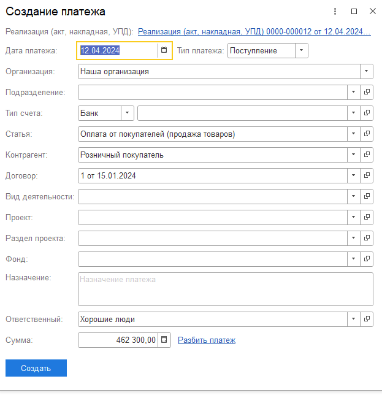

## **Деньги**

### Новый функционал

Для конфигурации **1С:Управление нашей фирмой** в разделе «Настройки», блок «Деньги» была добавлена возможность отражения комиссии по платежным картам для документа «Поступление на счет».

Для этого необходимо указать статью движения денежных средств комиссии.

В документе поступления на счет, если вид операции указан «Отчет эквайера» и включено отражение комиссии в настройках, то движения в регистры (Движение денежных средств, Доходы и Расходы) пойдут с учетом суммы комиссии.

## **Документы**

### Новый функционал

1. Для конфигурации **1С:Управление нашей фирмой** в списке документов команда «Заменить статью ДДС в документах» (при нажатии правой кнопкой мыши) предлагает выбор статьи и статьи себестоимости и заполняет этими данными выделенные документы (только заполняет, стандартное проведение не выполняется), а для документа «Отчет о розничных продажах» сделает движения по регистрам (Доходы и Расходы).

2. Для **1С:Управление нашей фирмой** в раздел **Документы** добавлен стандартный документ **Списание запасов**. В документе также добавлены реквизиты P&L (дата принятия к управленческому учету, доп. аналитика, проект, раздел, статья).

3. Для **1С:Бухгалтерия предприятия** в раздел **Документы** добавлен стандартный документ **Больничный лист**. В документе также добавлены реквизиты P&L (дата принятия к управленческому учету, доп. аналитика, статья).

4. Для **1С:Бухгалтерия предприятия** в раздел **Документы** добавлен стандартный документ **Отпуск**. В документе также добавлены реквизиты P&L (дата принятия к управленческому учету, доп. аналитика, статья).

5. Для **1С:Бухгалтерия предприятия** в раздел **Документы** добавлен стандартный документ **Корректировка поступлений**. В документе также добавлены реквизиты P&L (дата принятия к управленческому учету, доп. аналитика, статья).

6. Добавлено создание документа **Управленческая операция** на основании документа «Начисление зарплаты». Поведение аналогично документу «Отражение зарплаты в бухучете»

### Исправление ошибок

Решена проблема с курсовыми разницами в документе **Реализация товаров/услуг.** Проблема могла возникнуть в момент, когда аванс был принят по одному курсу валют, а реализация произошла по другому курсу

## **Платежный календарь**

### Новый функционал

Для  конфигурации **1С:Бухгалтерия предприятия**  в документах Счет покупателям и от поставщиков, Реализация и Поступление (акты, накладные, УПД) при создании/редактировании платежного календаря добавлена кнопка «Разбить платеж» рядом с суммой.

При нажатии открывается еще одна форма с колонками «Дата», «Сумма», где можно распределить сумму по разным датам. По умолчанию первая строка уже есть: дата берется из даты платежа, сумма общая. Если несколько платежей, то на основной форме реквизит «Дата платежа» будет переименован в «Дата первого платежа». Внизу основной формы сумма всегда общая выводится.  Все остальные данные, кроме суммы и даты, берутся из данных основной формы.

{width=623px height=644px}

## **Проекты**

### Новый функционал

В проекте, во вкладке «Деньги» при установке отборов суммы итогов («всего поступило», «всего выплачено» и «денежный поток») теперь меняются.

Во вкладках «Деньги» и «Документы» отбор по периоду по умолчанию устанавливается «за все время», а не за период проекта, как было реализовано ранее.

## **ДДС**

### Новый функционал

1. Добавлен новый вариант отчета «Горизонтальный анализ».

   Реализовано сравнение последних 2-ух месяцев в периоде.

   -  **Рост/Падение**  = Проанализируйте, изменилось ли значение по сравнению с предыдущим периодом: выросло или упало;

   -  **Абсолютное отклонение** = Последний месяц - Предыдущий месяц;

   -  **Относительное отклонение** = Абсолютное отклонение / Предыдущий месяц \* 100.

2. Отборы и расшифровки теперь учитывают иерархию подразделений и дополнительную аналитику.

## **ОПиУ**

### Новый функционал

1. Добавлен новый вариант отчета «Горизонтальный анализ».

   Реализовано сравнение последних 2-ух месяцев в периоде.

   -  **Рост/Падение**  = Проанализируйте, изменилось ли значение по сравнению с предыдущим периодом: выросло или упало;

   -  **Абсолютное отклонение** = Последний месяц - Предыдущий месяц;

   -  **Относительное отклонение** = Абсолютное отклонение / Предыдущий месяц \* 100.

2. Отборы и расшифровки теперь учитывают иерархию подразделений и дополнительную аналитику.

3. В Отчетах добавлена колонка **Итого**.

## **Распределение документов**

### Исправление ошибок

При ручном распределении документов строки с пустой статьей не сохраняются в таблице распределения и не учитываются в движениях документа.

## **Документ Отчет баланс**

### Новый функционал

В разделе «Управленческие документы», в документе «Отчет баланс» был убран реквизит «Версия финансового плана», а в табличной части добавлена колонка «Комментарий».