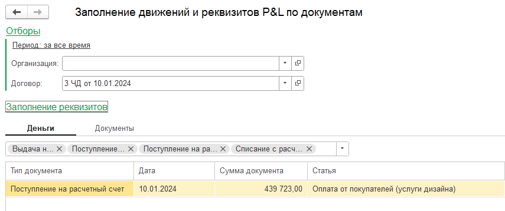
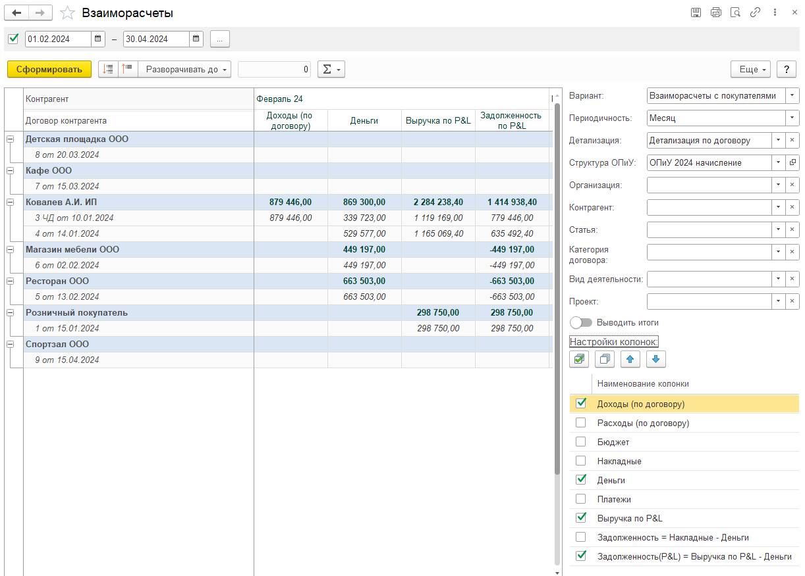
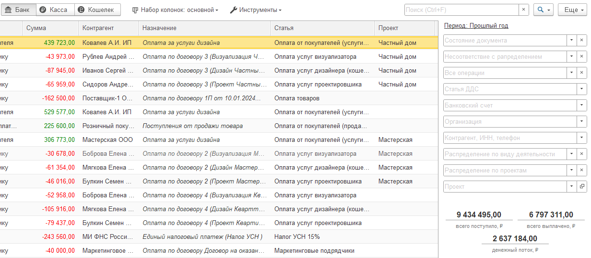
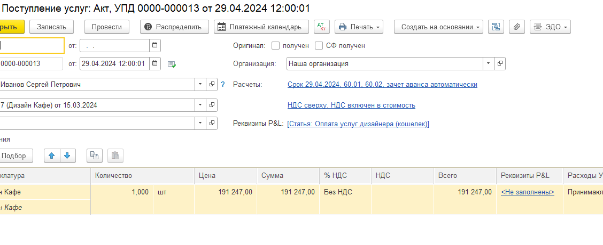
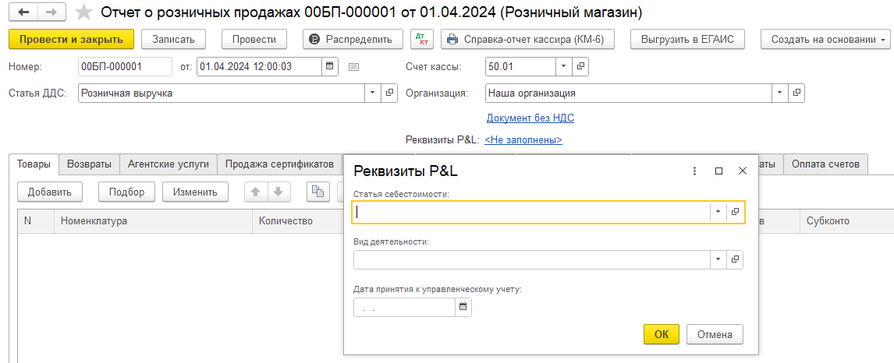
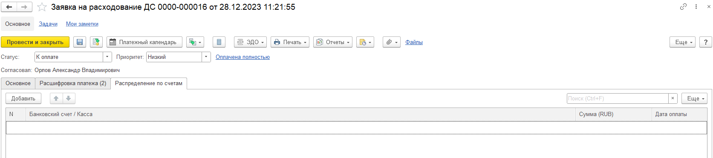
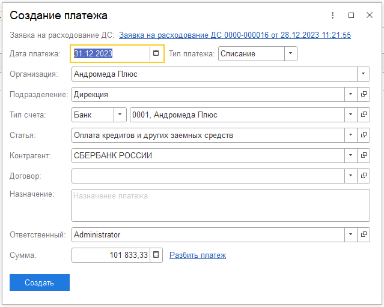
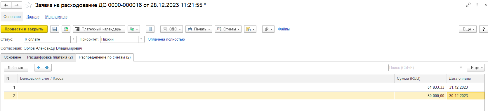
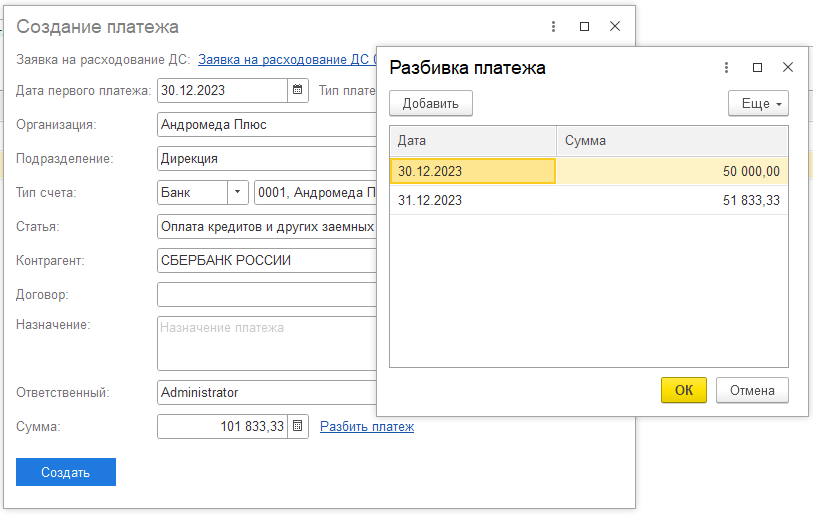

## Проекты

### Новый функционал

1. Отчет по проектам: Добавлен отбор по ответственному

2. Отчет по проектам: В варианте отчета «План-факт: общие показатели» добавлена детализация по статьям ДДС

3. Форма списка проектов: добавлено автоматическое сохранение последних выбранных периодов (Период действия проекта, Период создания проекта, период этапа)

## ОПиУ

### Новый функционал

1. Для варианта отчета P&L + доп аналитика добавлена колонка **Итого**

## ДДС

### Исправление ошибок

1. Исправлена ошибка расшифровки, которая возникала, когда расходный документ был распределен по номенклатуре

### Новый функционал

1. Для варианта отчета ДДС + Проекты добавлена колонка «Без проекта»

2. Для варианта отчета ДДС + Проекты добавлена колонка Итого

3. В отчете ДДС отбор «Тип счета» был дополнен следующими вариантами:

   -  «Все, кроме банка»,

   -  «Все, кроме кассы»,

   -  «Все, кроме кошелька».

[image:./reliz-1-36-0-4.png:::53.24176273403647,20.348837209302324,39.179134984874494,66.27906976744185::square,56.1152,67.4689,43.7973,32.1654,,top-left:1920px:1080px]

## **Платежный календарь**

### Новый функционал

1. В календаре и отчете платежного календаря стал учитываться «остаток к оплате»: «запланированная» и «просроченная» суммы считаются с учетом «оплаченной» суммы. В «оплаченную» сумму попадает только та сумма, которая подкреплена документом оплаты.

2. В отчете платежного календаря отбор «Тип счета» был дополнен следующими вариантами:

-  «Все, кроме банка»,

-  «Все, кроме кассы»,

-  «Все, кроме кошелька».

## Структура отчетов ДДС и ОПиУ

### Исправление ошибок

1. Исправлена проблема, когда при добавлении статьи через кнопку "Добавить статью" статья могла добавиться  под другую статью, а не в группу

2. Теперь можно подобрать несколько статей в одну группу. Для этого нужно при открытии формы статей выделить несколько статей и нажать Выбрать

## Договоры

### Новый функционал

1. Обработка по заполнению документов в блоке «Параметры» теперь доступен и для УТ/КА/ERP

   {width=855px height=358px}

2. В инструменты был добавлен отчет «Взаиморасчеты», который позволяет контролировать все процессы в рамках каждого договора, настроить отчет «под себя», указав только те колонки, которые необходимы пользователю.

   Блок «настройки колонок» позволяет включить/отключить колонки в отчете.

[image:./reliz-1-36-0-5.png:::16.87515329899436,20.116279069767444,61.48311667075465,23.02325581395349:::1920px:1080px]

{width=1222px height=876px}

### Исправление ошибок

1. Изменено поведение вкладки «Сведения P&L». Теперь, при переходе во вкладку «Сведения P&L», не теряются данные на вкладке Основное. Дополнительно исправлено поведение некоторых реквизитов

## Деньги

### Новый функционал

1. В таблицу документов добавлено поле «Проект», которое отображает по каким проектам распределен документ

2. В отборы добавлено поле «Проект»

   {width=1232px height=540px}

3. В загрузку операций по кошелькам  было добавлено заполнение проектов и разделов. Колонки появляются, если  в настройках включено использование проектов. Ненайденные проекты и разделы предлагается создать. При поиске и создании раздела учитывается проект, так как на основании проекта создаются разделы.

   [image:./reliz-1-36-0-7.png:::0,0,100,100::square,75.0156,35.3712,24.9844,24.8908,,top-left:1605px:458px]

### Исправление ошибок

1. УТ/КА/ERP. Банковские операции. Валютные суммы переведены в рубли для корректного отражения в отчетах.

## Загрузка данных из банка (Клиент-банк)

### Новый функционал

1. На форму загрузки добавлена кнопка «Распределить по правилам P&L». При нажатии на кнопку, отмеченные галочкой документы будут распределены по правилам, которые описаны в документе "Автоматическое распределение документов по правилам"

   [image:./reliz-1-36-0.png:::0,0,100,100::square,40.884,46.3668,24.1252,17.6471,,top-left:1086px:289px]

## Документ Распределение затрат

### Новый функционал

1. В систему добавлен новый документ. Документ позволяет распределить в соответствии с правилами на проекты, доп аналитику документы, которые ранее не были распределены.

2. Для распределения затрат необходимо:

   1. Заполнить данные: Организация, Период, Режим распределения затрат (По проектам, по доп аналитике);

   2. Выбрать виды документов для распределения (Деньги, бух документы);

   3. Выбрать вид распределения (Равномерно, пропорционально сумме проекта, вручную);

3. Заполнение списка документов происходит по следующему принципу:

   1. Ищутся все документы по заданным параметрам, которые не распределены по проекту / доп. аналитике

   2. Документы не должны быть распределены вручную

   3. К списку добавляются все документы, которые были распределены текущим документом (в случае, если в документ вносятся изменения)

   4. Из списка исключаются все документы, которые были распределены другими документами распределения

4. Распределение документов происходит по следующему принципу:

   1. Берутся данные стандартного распределения документа (его можно посмотреть в самом документе, нажав кнопку Распределить)

   2. Из документа распределения собираются проценты распределения, заполненные на первом этапе

   3. По собранным процентам проводится распределение документа. Сумма документа берется согласно процентам и, если итоговая сумма не сходится с распределением по процентам, то остаток добавляется к последней строке

5. Для распределения необходимо провести документ

6. Если отменить проведение документа, то данные распределения будут стерты и проводки документа вернутся к стандартным

## Фонды

### Новый функционал

1. В справочник «Фонды» добавлен реквизит «Использовать по умолчанию при списании». Данный реквизит можно установить только для одного фонда одновременно.

[image:./reliz-1-36-0-2.png:::0,0,100,100::square,3.5604,73.8095,38.2353,12.7976,,top-left:646px:336px]

1. В документах списания при записи, по умолчанию будет установлен фонд при следующих условиях:

   1. В документе не заполнен фонд

   2. Стоит настройка использования фондов и дата начала использования меньше даты документа

   3. В одном из фондов стоит галочка «Использовать по умолчанию при списании»

2. Список документов:

   1. БП:

      1. Списание с расчетного счета

      2. Выдача наличных

      3. Кошелек

   2. УНФ:

      1. Расход из кассы

      2. Расход со счета

      3. Кошелек

## Документы

### Новый функционал

1. УНФ. В подсистему добавлен документ «Перемещение запасов»

2. Бухгалтерия предприятия. В документе «Поступление услуг, работ» в табличные части «Товары», «Услуги», «Агентские услуги» добавлена колонка «Реквизиты P&L». Состав реквизитов аналогичен тем, что есть в документе

   {width=1128px height=460px}

3. Для Бухгалтерии предприятия в документ «Отчет о розничных продажах» был добавлен реквизит «Статья себестоимости». Также при первоначальной установке продукта P&L был добавлен блок по установке статьи себестоимости для заполнения движений по документам «Отчет о розничных продажах».

   {width=1146px height=466px}

4. УТ/КА/ERP. Документ. **Заказ покупателя**. Автоматическое заполнение реквизиты P&L на основании договора (необходимо заполнить параметры во вкладке Сведения P&L -> Параметры)

5. УТ/КА/ERP. Документ **Заказ поставщика**. Добавлена команда **Платежный календарь**

6. УТ/КА/ERP. Документ **Заявка на расходование денежных средств.** Добавлена команда "Платежный календарь"

   Если данный документ не разбит на даты платежа (с помощью табличной части **Распределения по счетам**), то сумма платежного календаря уйдет общая на дату документа.

   Если что-то указано, он возьмет сумму и дату из таблицы.

Первый пример, когда ничего не заполнено

{width=1673px height=373px}

{width=639px height=512px}

\
Второй пример, когда заполнено

{width=1671px height=383px}

{width=813px height=516px}