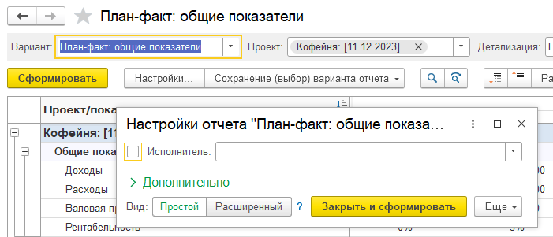
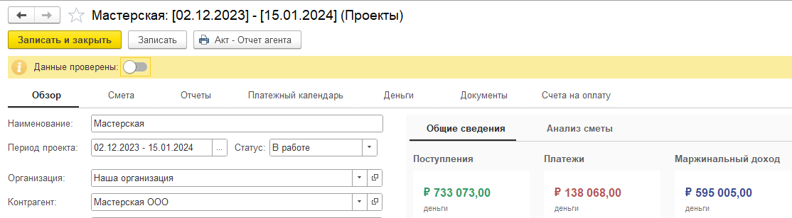
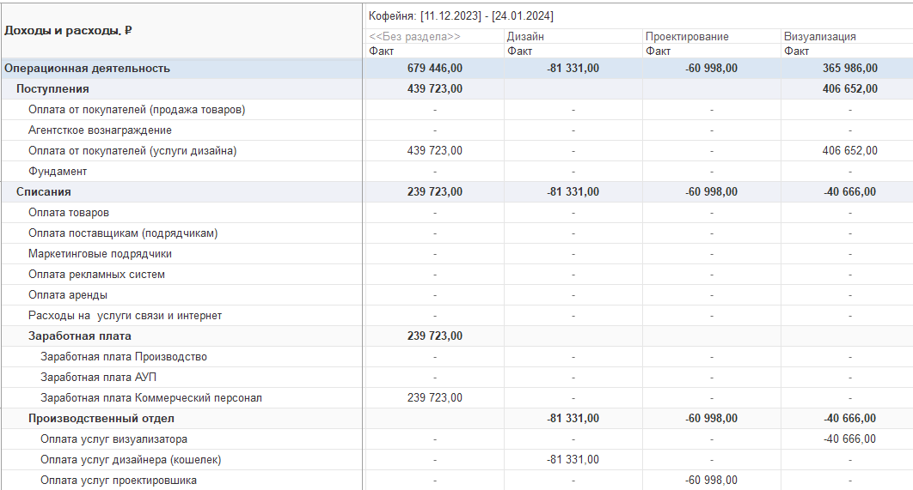
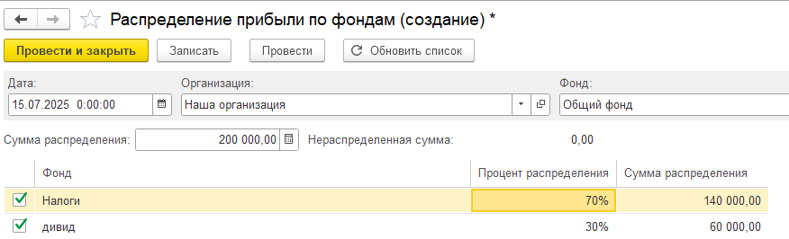
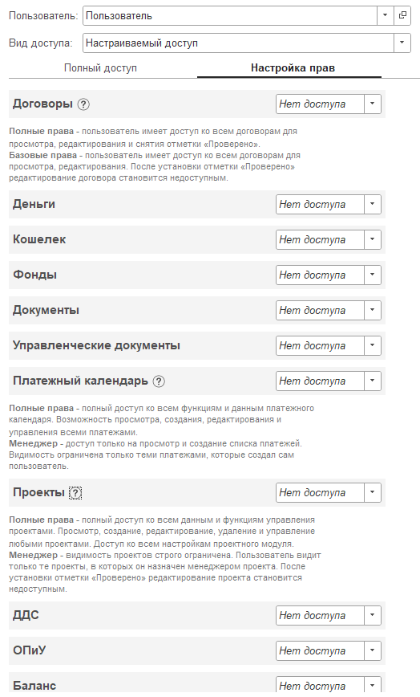

## Договоры

### Новый функционал

1. В договоре в форме заполнения графика был добавлен реквизит «формат даты», который по умолчанию заполнен «ДД MMMM гг “г.”», но его можно изменить. Если в расшифровке указано одно из следующих шаблонов: \[ТекущийМесяц\], \[ПрошлыйМесяц\] и \[СледующийМесяц\], то данные шаблоны заменяются на дату в текущей строке с тем форматом, который указан в реквизите  «формат даты».

[image:./reliz-1-37-0-0.png:::0,0,100,100::square,12.5175,57.8652,8.4615,6.6011,,top-left&square,33.6364,38.3427,17.2727,6.0393,,top-left&square,74.965,42.5562,22.6573,49.0169,,top-left:1430px:712px]

1. Сначала в расшифровке платежа укажите один из подходящих параметров: \[ТекущийМесяц\], \[ПрошлыйМесяц\] и \[СледующийМесяц\]

2. При заполнении графика поменяйте формат графика, по умолчанию стоит как  «ДД MMMM гг “г.”»

3. Вы сразу увидите результат расшифровки, который будет отражен в будущих актах и счетах.

**Справочник «Категории договоров»**

1. Справочник стал иерархическим.

2. Изменен отбор по категории договора во вкладке «Договоры». Теперь, при выборе элемента справочника, который имеет подчиненные элементы, отбор будет установлен по всем элементам, которые подчинены выбранному.

### Исправление ошибок

**Обработка «Найти документы и заполнить реквизиты P&L»**

1. Исправлена ошибка «Использование блокировки допустимо только внутри транзакции в режиме управляемых блокировок!»

## Отчет «Взаиморасчеты»

### Новый функционал

1. Изменена логика заполнения поля «Задолженность P&L». Теперь данные в поле соответствуют тем, что указаны в варианте отчета «P&L + Финансовый поток»

2. В поле «Прибыль по P&L» добавлен вывод данных из таблиц договоров «Распределение доходов» и «Распределение расходов»

## **Проекты**

### Новый функционал

1. **ОТЧЕТЫ:** Внутри проекта, во всех вариантах отчетов был настроен порядок разделов в соответствии с порядком разделов в проекте. Чтобы порядок обновился, необходимо перезаписать сам проект.

2. **ОТЧЕТЫ:** из шапки отчетов был скрыт отбор по ответственному. Настроить отбор можно через команду «Настройки».

   {width=701px height=301px}

3. **ОТЧЕТЫ:** В вариант отчета «План-факт: общие показатели» был добавлен вариант детализации «По разделам и статьям».

4. Добавлена возможность скопировать сам проект через команду «Еще-Скопировать». Копируются только основные данные проекта, без сметы. Смета копируется командой во вкладке «Смета» «Заполнить-Скопировать из другого проекта».

5. Изменено представление проекта на «Наименование + Период действия проекта». Пример: «Проект: \[21.01.25\] - \[21.03.25\]»

6. В проекте была добавлена вкладка «Счета на оплату», в которой в виде таблицы выводятся документы «Счета покупателям» и «Счета от поставщиков».

7. Был добавлен новый реквизит «Менеджер» - пользователь, который контролирует проект. А реквизит «Ответственный» был переименован в «Исполнитель».

8. Добавлены реквизиты для проверки проекта. Функционал аналогичен тому, что реализован в договоре в форме «Сведения P&L»

9. Изменена печатная форма «Акт - отчет агента». Теперь форма формируется в разрезе разделов проекта. Добавлено поле «Наименование услуг», которое содержит данные из услуг, по которым распределен раздел проекта

{width=1114px height=308px}

## Операция по кошельку

### Новый функционал

1. Расширен тип поля Контрагент. Теперь в него можно выбрать физические лица

2. Добавлен валютный учет по кошельку. Если кошелек имеет валюту, отличную от рубля, то в движения уйдут данные сумм как \[Курс валюты\] \* \[Сумма документа\]

[image:./reliz-1-37-0-9.png:::0,0,100,100::square,0,36.1781,99.5082,6.8646,,top-left:610px:539px]

## **Платежный календарь**

### Новый функционал

1. Для конфигурации **1С:Управление нашей фирмой** добавлена возможность запланировать платежи из документов «Приходная накладная» (списание) и «Расходная накладная» (поступление).

2. В проекте во вкладке «Платежный календарь» добавлена возможность «скопировать» платежку.

3. В разделе «Платежный календарь» была исправлена ошибка при открытии таблицы, в случае когда убрана колонка «Остаток к оплате» или «Дата».

## **Отчет о движении денежных средств**

### Новый функционал

1. Во вкладку «Операции» добавлена колонка «Назначение платежа». Она заполняется из реквизита документа «Назначение платежа» (если он есть). Для документов «Управленческая операция» и «Кошелек» заполняется из реквизита «Комментарий»

2. В отчете в остатках на начало и на конец периода к отбору по депозитным счетам («Выводить остатки депозитных счетов») был добавлен счет «55.04».

3. Были добавлены варианты отчета: «ДДС + Организации» и «ДДС + Разделы проекта».

{width=1062px height=571px}

## **Структуры отчетов ДДС и ОПиУ**

### Новый функционал

1. Исправлено добавление группы в структурах отчета ДДС и ОПиУ: при добавлении группы, когда курсор установлен на строке со статьей, новая группа добавляется в саму группу, где находится статья, а не внутрь статьи.

2. Была убрана возможность перетаскивать статьи из правой части в структуру, чтобы не возникало ошибки при переносе.

## Бухгалтерские документы

### Исправление ошибок

1. Для **1С:Бухгалтерия предприятия** была исправлена ошибка в документах «Операции, введенные вручную» при открытии формы ручного распределения.

2. В разделе «Деньги» исправлена ошибка  при стандартном поиске по списку документов или при заполнении статей движения денежных средств: «Поле объекта не найдено «Проект.Наименование»».

3. Для конфигурации **1С:Управление нашей фирмой** при создании документа «Отчет о розничных продажах» добавлено автоматическое заполнение статьи себестоимости. Ранее статья не заполнялась.

## ОПиУ

### Новый функционал

**Параметры для отчета**

1. Добавлен новый справочник «Параметры для отчета ОПиУ». Справочник содержит поля:

   1. Наименование

   2. Буквенный код. По умолчанию, формируется из наименования. Используется для установки параметра в формулах

2. Добавлен новый регистр сведений «Параметры для ОПиУ»

   1. Периодичность регистра установлена как месяц

   2. Содержит поля:

      1. Период (дата)

      2. Параметр (Параметры для отчета ОПиУ)

      3. Значение (Число)

3. Справочник и регистр добавлены в настройки в раздел «P&L»

4. В группах, являющихся формулами, добавлено использование параметров, созданных в справочнике «Параметры для отчета ОПиУ»

5. В отчете ОПиУ переделан расчет формул для групп-формул и формирование дашбордов для этих групп:

   1. Если в формуле указан параметр из справочника «Параметры для отчета ОПиУ», то, при расчете формулы, будет запрошено значение параметра ОПиУ, с учетом текущего периода (т.е. если отчет сформирован за несколько месяцев, то на каждый месяц будут запрошены значения)

[image:./reliz-1-37-0-4.png:::0,0,100,100::square,0.3158,68.1941,43.4737,19.1375,,top-left&square,44.6316,30.1887,27.7895,7.5472,,top-left:950px:371px]

[image:./reliz-1-37-0-5.png:::0,0,100,100::square,0,7.3491,11.5055,12.5984,,top-left&square,39.7797,67.1916,56.9155,28.3465,,top-left:817px:381px]

[image:./reliz-1-37-0-6.png:::0,0,100,100::square,1.3011,84.8889,39.777,9.5556,,top-left:538px:450px]

## Фонды

### Новый функционал

**Документ «Распределение прибыли по фондам»**

1. Добавлен новый документ «Распределение прибыли по фондам»

2. Документ расположен во вкладке «Фонды»

3. Логика работы документа:

   1. Необходимо в шапке документа заполнить следующие поля: Организация, Фонд, Сумма распределения

   2. После заполнения Фонда заполнится таблица ниже. Логика заполнения: Все фонды, не помеченные на удаление и не равные полю Фонд

   3. При установке галочки процент будет заполнен автоматически как 100 для первого элемента, 100 - общий процент для последующих

   4. Если процент уже был заполнен и изменено значение галочки Распределять, то процент не изменится

   5. Для последней строки, в которую указывается процент, если общий процент будет равняться 100, к сумме строки будет добавлен остаток от всех операций

   6. При проведении документа в регистр Остатки по фондам будут сделаны движения

      1. Расход. Из фонда в шапке документа

      2. Приход. На фонды в таблице, согласно суммам

[image:./reliz-1-37-0-7.png:::10.007358351729213,9.186046511627907,51.14872046439375,32.093023255813954::square,0,47.4638,31.0742,13.0435,,top-left:1920px:1080px]

{width=876px height=266px}

## Администрирование. Настройка ролей доступа к системе P&L

### Новый функционал

Роли доступа стали еще гибче. 

Если указывается вид доступа как настраиваемый, у пользователя вместо рабочего стола открывается список доступных ему команд.

{width=524px height=868px}