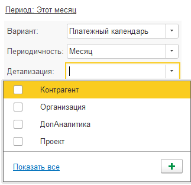

## Договор

### Исправление ошибок

Возникавшая при открытии договора ошибка, связанная с функционалом P&L, была устранена.

## **Платежный календарь**

### Исправление ошибок

В отчете платежного календаря исправлена ошибка дублирования наименований банковских счетов в остатках на начало и на конец периода.

### Новый функционал

В детализацию отчета платежного календаря добавлена возможность выбирать несколько детализаций, порядок назначается порядком, в котором выбирались варианты.

{width=323px height=312px}

## Деньги

#### **Начисления денежных документов**

Для денежных документов в ручном распределении добавлен реквизит «Дата начисления».[ В статье подробно описано, для чего данный функционал как с ним работать](./../../p-l/dengi/nachisle).

## Документы

#### **Расходы будущих периодов**

 [В статье подробно описано, для чего данный функционал и как с ним работать.](./../../p-l/balans/raskhody-buduschikh-periodov)

#### **Взаиморасчеты**

[В статье подробно описано, для чего данный функционал и как с ним работать.](./../../p-l/balans/vzaimoraschety-2)

