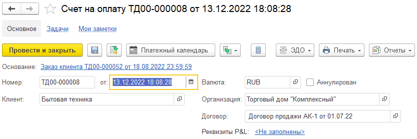
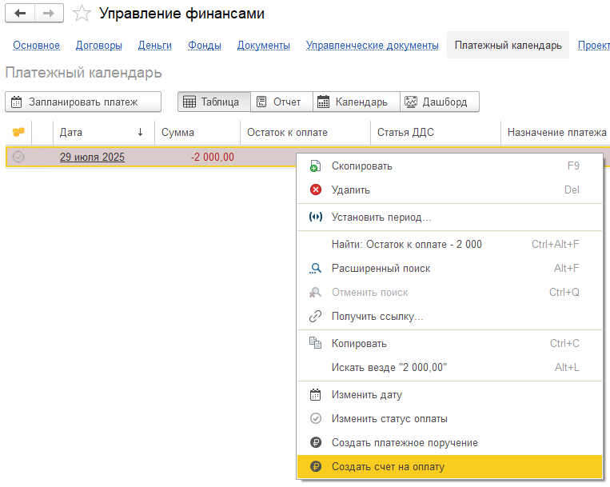

## **Платежный календарь**

### Новый функционал

1. Для **1С:Комплексная автоматизация/Управление торговлей/ERP** в документе «Счет на оплату клиенту» добавлена возможность запланировать платеж на основании текущего документа. И наоборот, на основании платежа с документом-источником «Заказ клиента» можно создать документ «Счет на оплату клиенту», команда появляется при нажатии правой кнопкой мыши по строке платежа.

   {width=833px height=278px}

   {width=763px height=609px}

2. Добавлена проверка наличия плановых платежей при создании любого нового платежа из документа-источника (на его форме создания) и добавлена возможность сразу заменить найденный плановый платеж новым фактическим платежом, создаваемым на основании документа-источника.

   Поиск плановых платежей происходит по совпадающим реквизитам:  организация, контрагент, статья.

   Дата планируемого платежа должна находиться в следующем диапазоне: «**Дата нового платежа + - 3 дня (включительно)**». Плановые платежи должны быть не оплаченными.

   Если плановый платеж найден, пользователю будет предложено на выбор два действия:

   1. действие «Заменить» - найденный плановый платеж будет удален из платежного календаря, новый фактический платеж будет сохранен;

   2. действие «Оставить» - найденный плановый платеж и фактический платеж будут сохранены.

   В платежном календаре было расширено поле «Контрагент», теперь оно может быть как физическим лицом (справочник «Физические лица»), так и юридическим (справочник «Контрагенты»).

3. **Важно!** Для корректного отображения данных контрагента по платежному календарю **обязательно** после обновления на новый релиз (версия 1.39.0.0) выполнить обработку в разделе «Настройки», блок «Администрирование», которая называется «Заполнить реквизит «вид получателя» в платежном календаре».

   [image:./tanya-2.png:::0,0,100,100::square,34.0642,54.4073,31.3234,5.0152,,top-left:1277px:658px]

## **Проекты**

### **Исправление ошибок**

1. Была исправлена ошибка, когда установлен режим проектов «Расширенный», и в проекте заполнены по разделу статьи, при удалении раздела будет появляться сообщение о том, что в разделе есть статьи, и удаление не происходит.

2. В отчетах проекта, где есть детализация по номенклатуре, («Анализ доходов/расходов») исправлена расшифровка суммы по номенклатуре (раннее не учитывался отбор по текущей номенклатуре).

## **Фонды**

### Новый функционал

1. При нажатии на кнопку обновления теперь обновляются и остатки в левом списке фондов.

2. Исправлена ошибка по некорректному выводу сообщения о наличии остатков в денежных документах по списанию при выборе фонда или при проведении документа.

## **Деньги**

### Новый функционал

1. В инструменты была добавлена команда «Выгрузить данные по кошельку». После ее нажатия предлагается форма выбора периода, за который будут выгружены операции по кошельку (не помеченные на удаление). Далее открывается отдельная форма с таблицей, в которой выводятся все реквизиты документа операции по кошельку. Колонки «Доп.аналитика», «Проект, Раздел» и «Фонд» выводятся согласно установленным настройкам, если включен по ним учет, то выводятся. Если есть распределение по подразделениям, статьям, доп.аналитике, проектам, разделам и фондам, то в соответствующих колонках будет их перечень.

[image:./reliz-1-39-0-2.png:::0,0,100,100::square,62.8606,72.3881,25.601,26.1194,,top-left:832px:134px]

## **Документы**

### Новый функционал

1. Для **1С:Комплексная автоматизация/Управление торговлей/ERP** в раздел «Документы» добавлены стандартные документы «Отчет комиссионера (агента) о продажах» и «Отчет комиссионера о списании». В документах также добавлены реквизиты P&L (дата принятия к управленческому учету, доп. аналитика, проект, раздел, статьи).

2. Для **1С:Бухгалтерия предприятия** в раздел «Документы» добавлен стандартный документ «Счет покупателю».

## Договоры

### **Заполнение движений и реквизитов P&L по документам**

1. В обработке изменен отбор по договору, теперь можно указывать несколько значений.

[image:./reliz-1-39-0-3.png:::0,0,100,100::square,0.4212,20.7957,43.2182,7.5949,,top-left:1187px:553px]

### **Исправление ошибок**

Для **1С:Комплексная автоматизация** исправлены ошибки при формировании отчета «Взаиморасчеты» и при создании проектов.

## Отчет ОПиУ

### Новый функционал

1. В отборах появилась галочка «Выводить % от дохода». При ее установке во всех вариантах отчета появляется колонка «% от дохода»

[image:./reliz-1-39-0-4.png:::0,0,100,100::square,73.4807,69.3878,14.4436,6.9074,,top-left&square,47.7506,27.1586,10.8129,72.8414,,top-left:1267px:637px]

## Управленческие документы

#### Документ "Финансовый план (БДР)"

1. Изменен принцип заполнения документа по команде «Заполнить по договорам». Теперь структура документа не будет очищаться. Будут перезаполнены только суммы по существующим данным договоров за указанный период

## Договоры

#### Обработка «Формирование актов и счетов»

1. При создании документов добавлено автоматическое заполнение дополнительной аналитики и проектов

#### 

## Отчет ДДС

### Исправление ошибок

1. Исправлена проблема, когда при выборе периодичности «Год», суммы расшифровывались только за месяц

2. Добавлена расшифровка данных для колонки Итого

   

## Отчет «Баланс»

### Новый функционал

1. Добавлена команда «Заполнить базовый баланс». При нажатии на нее формируется структура базового баланса и создаются статьи баланса. После создания достаточно только установить параметры отборов и группировки

   [Как работать с базовым балансом описано у нас в инструкции](./../../p-l/balans/sbor-bazovogo-balansa)

2. Изменен визуальный стиль команд над отчетом

3. В отчет добавлен новый элемент «ПРОВЕРКА = (АКТИВ - ПАССИВ)»

   1. Элемент появляется, когда в структуре отчета нет статьи с указанным признаком «Накопленная прибыль»

   2. В него выводится разница между активом и пассивом

## Договоры

### Исправление ошибок

1. Исправлена ошибка, которая не позволяла копировать строки в таблице «Состав договора»

   

## Документы

### Новый функционал (для Бухгалтерии)

1. В подсистему добавлен документ «Возврат товаров поставщику»

2. В подсистему добавлен документ «Возврат товаров от покупателя»

3. Доработан документ «Реализация отгруженных товаров». Расширен список проводок по себестоимости

4. Авансовый отчет.

   1. Добавлены реквизиты Проект и Раздел проекта

   2. Реквизиты P&L добавлены на форму «Командировка»

   3. Добавлены движения по регистру «Расходы»

5. В подсистему добавлен документ «Выпуск продукции (отчет производства)»

### Новый функционал (для УНФ)

1. В подсистему добавлен документ «Отчет комиссионера»