## **Договоры**

### **Новый функционал**

1. Для **1С:Бухгалтерия предприятия** в обработке «Формирование актов и счетов» при автоматическом создании документа «Счет покупателю» добавлено заполнение реквизита «Оплата до» на основании расчетных данных договора. 

   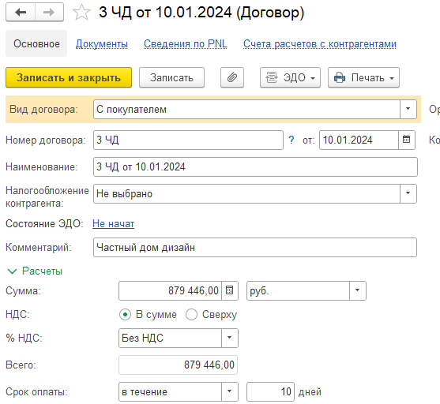{width=557px height=512px}

   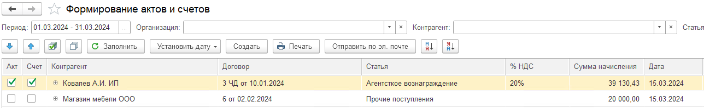{width=1288px height=199px}

   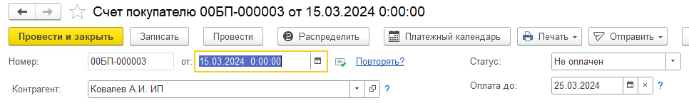{width=966px height=145px}

2. Исправлена ошибка установки статуса проверки в сведениях по P&L.

3. Добавлено заполнение доп. аналитики при заполнении распределения доходов/расходов в договоре.

## **Деньги**

### **Новый функционал**

1. Для **1С:Бухгалтерия предприятия** в документе «Поступление на расчетный счет» при изменении реквизита «Счет на оплату» добавлено заполнение реквизитов из счета покупателю.

   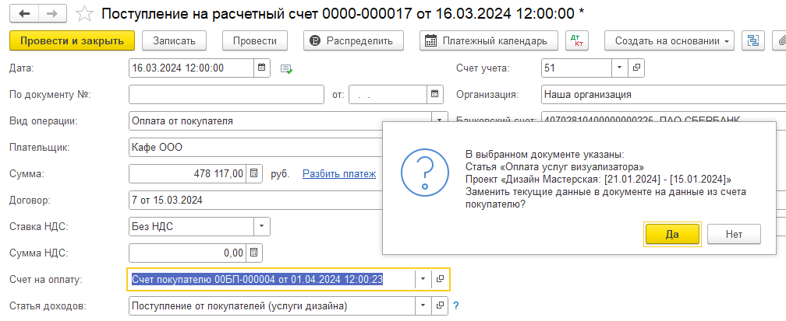{width=1008px height=413px}

2. В документ «Кошелек» добавлена поддержка валютных операций. Сумма автоматически конвертируется в рубли по курсу на дату создания документа.

## **Документы**

### **Исправление ошибок**

1. В списке документов исправлена ошибка некорректного вывода «красного флага», указывающего на ошибку распределения, для документа «Выпуск продукции (Отчет производства)» в **1С:Бухгалтерия предприятия** и для документа «Отчет комиссионера» в **1С:Управление нашей фирмой**.

2. Для **1С:Управление торговлей / Комплексная автоматизация / ERP** исправлена ошибка замены статьи ДДС и статьи себестоимости при использовании команды «Заменить статью ДДС в документах» для документа «Возврат товаров от клиента».

3. Для **1С:Управление торговлей / Комплексная автоматизация / ERP** если бухгалтерский документ в валюте (не RUB), то сумма в движениях пересчитывается в рубли.

### Новый функционал

1. В регистр сведений «Соответствие статей ДДС и подразделения» были добавлены две новые статьи, для которых можно настроить соответствие с подразделением: статья (взносы по единому тарифу) и  статья (на несч. случ.).

   [image:./reliz-1-40-0-5.png:::0,0,100,100::square,41.5238,57.3034,25.9048,8.9888,,top-left:1050px:356px:center]

   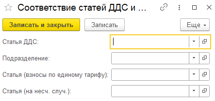{width=443px height=209px}

2. Для **1С:Бухгалтерия предприятия** в документах «Отражение зарплаты в бухучете» и «Начисление зарплаты» в движениях был добавлен поиск соответствия и заполнение статей в соответствии с определенным подразделением.

3. В документе «Отражение зарплаты в бухучете» был добавлен новый реквизит «Статья для НДФЛ». Если статья указана, то будут сформированы движения по таблице документа «Начисленный НДФЛ».

   {width=966px height=606px}

4. Для **1С:Бухгалтерия предприятия** в документе «Операция, введенная  вручную» в форме распределения документа была добавлена колонка «Дата» и возможность ее устанавливать.

5. Для **1С:Бухгалтерия предприятия** в раздел «Документы» добавлен стандартный документ «Передача ОС». В документе также добавлены реквизиты P&L (дата принятия к управленческому учету, доп. аналитика, проект, раздел, статьи).

6. Для **1С:Бухгалтерия предприятия** в раздел «Документы» добавлен стандартный документ «Увольнение». В документе также добавлены реквизиты P&L (дата принятия к управленческому учету, доп. аналитика, проект, раздел, статьи).

7. Для **1С:Управление нашей фирмой** в раздел «Документы» добавлен стандартный документ «Корректировка долга» (Взаимозачет)». В документе также добавлены реквизиты P&L (дата принятия к управленческому учету, доп. аналитика, проект, раздел, статьи).

## Управленческие документы

### Новый функционал  - Управленческая операция

1. В документе «Управленческая операция» с видом операции «Отражение заработной платы» добавлена команда «Загрузить зарплату». Данная команда открывает в отдельной вкладке форму загрузки, где можно добавить таблицу данных по сотрудникам для заполнения документа.

   Если какие-то элементы не были найдены в программе, то об этом сообщат статусы, и будет предложено создание отсутствующих элементов загрузки.

   По умолчанию, при загрузке устанавливается галочка «Отразить методом начисления».

   {width=970px height=169px}

   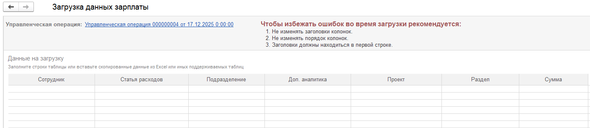{width=1410px height=307px}

2. Добавлена возможность провести документ будущего периода

### **Исправление ошибок -** Кредиты и займы

1. В документе «Кредиты и займы» во вкладке «Платежный календарь» исправлена ошибка при отображении сведении по записанным данным в платежном календаре.

### Новый функционал  - Заказ поставщику

:::tip 

[Как пользоваться документом описано здесь](./../../p-l/new-article-3/zakaz-postavschiku)

:::

1. Исправлена ошибка при записи документа «Счет на оплату».

2. Изменен дизайн формы.

3. Один раздел можно выбрать только в одном документе.

### Новый функционал  -Финансовый план БДР и Финансовый план БДДС

1. Изменен дизайн форм документа. Увеличен шрифт в документе.

   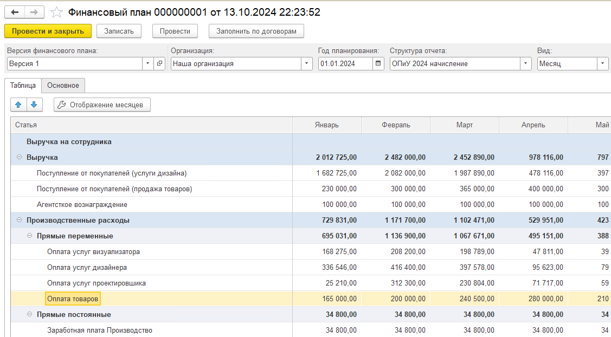{width=1127px height=622px}

2. Добавлена команда «Отображение месяцев». Она позволяет визуально скрыть месяца на форме документа

   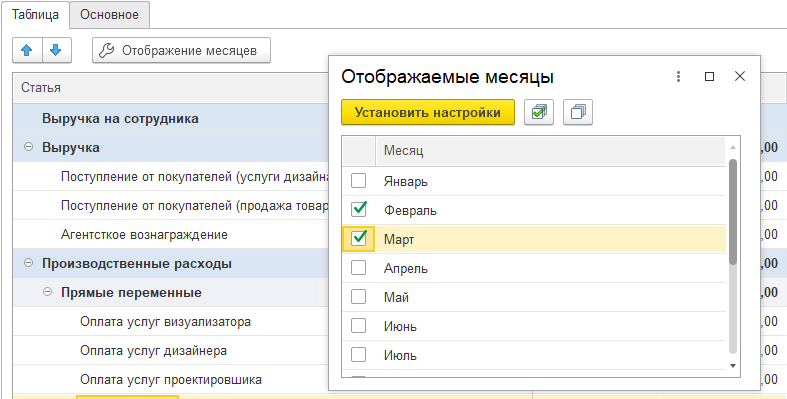{width=787px height=399px}

3. Добавлена команда «Перенести сумму». Она позволяет перенести сумму с одного месяца на другой (вычитает с текущего и прибавляет к выбранному)

4. Изменена команда «Распределить сумму». Теперь можно выбрать, на какие месяца распределить указанную сумму

5. Добавлена колонка Итого (по месяцам)

6. Закреплены колонки групп / статей

7. Добавлена команда «Установить комментарий». Она позволяет установить комментарий к любой ячейке суммы. Ячейки с установленным комментарием помечаются зеленым цветом

## **Платежный календарь**

### **Исправление ошибок**

1. Исправлена ошибка в отчете платежного календаря, когда при отборе периода за несколько месяцев  и отборе периодичности «Неделя» колонки остатков на начало и на конец периода не совпадали с колонками основного отчета.

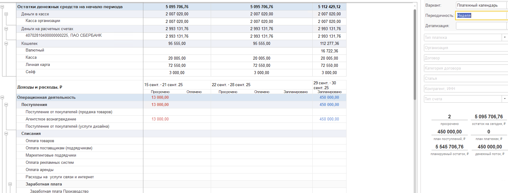{width=1680px height=641px}

### **Новый функционал**

1. В платежный календарь добавлено прикрепление файлов

   [image:./reliz-1-40-0-23.png:::0,0,100,100::square,52.3431,91.3242,23.4313,8.4475,,top-left:1259px:438px:center]

2. Добавлены валютные суммы. В списке документов будет выводиться сумма документа в рублях

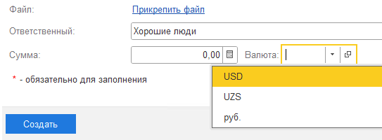{width=543px height=200px}

### **Новый функционал -** Реестр платежей

1. Изменены формы документа и списка. Добавлено получение данных из подсистемы согласования

2. Изменена форма списка платежей. Добавлено получение данных из подсистемы согласования

## **Проекты**

### **Новый функционал**

1. В портфель проектов добавлена возможность добавлять доп. аналитику. При заполнении сметы по портфелю в режиме «расширенный» доп. аналитика автоматически проставляется из портфеля.

   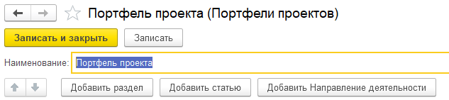{width=633px height=141px}

2. Расширена загрузка данных по разделам проекта из таблицы. Теперь можно загружать номенклатуру вместе с разделами. Система работает только в режиме «Профессионал»

[image:./reliz-1-40-0-25.png:::0,0,100,100::square,29.927,83.7838,51.4599,9.7973,,top-left:548px:296px:center]

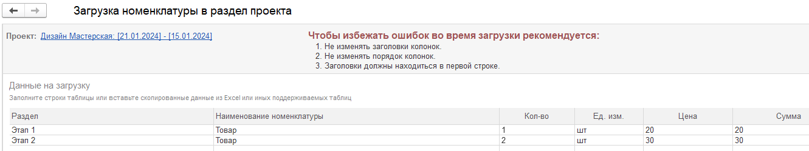{width=1331px height=249px}

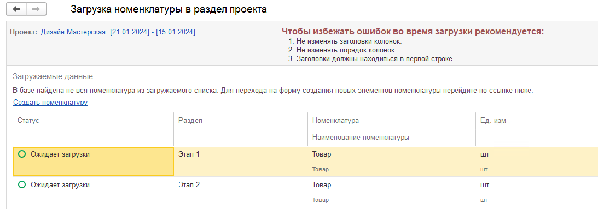{width=1093px height=383px}

### **Исправление ошибок**

Исправлена ошибка при нажатии «Анализ сметы» на вкладке «Обзор».

## **Отчет ДДС**

### **Новый функционал**

1. На вкладке «Дашборд» теперь отображаются отборы, которые влияют не только на сам отчет, но и на диаграммы.

   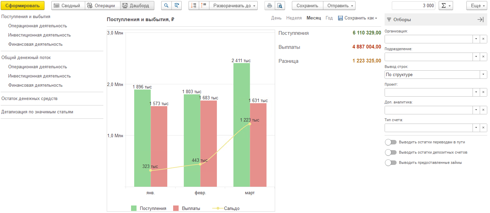{width=1432px height=624px}

2. В отчете  все установленные отборы теперь сохраняются при новом открытии модуля P&L.

3. В вариантах «Факт + Платежный календарь» и «Факт + БДДС» текст в колонке «Отклонение» если содержит отрицательную сумму, то имеет красный цвет, если положительную - то зеленый цвет.

   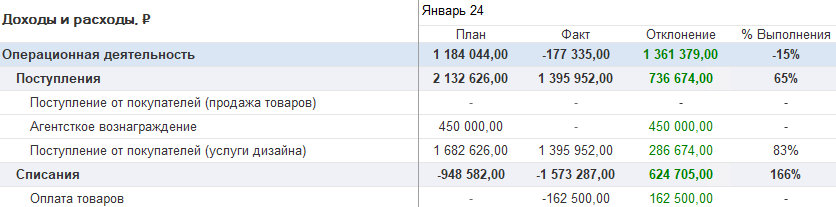{width=836px height=207px}

4. Для **1С:Управление торговлей / Комплексная автоматизация / ERP** в расшифровке суммы добавлена возможность выбрать группировку: по контрагенту или по партнеру.

   [image:./reliz-1-40-0-13.png:::0,0,100,100::square,32.5714,0,63.2857,19.598,,top-left:700px:199px:center]

5. У строки «Общий денежный поток» добавлена колонка «Итого».

6. Добавлено отображение количества установленных отборов.

   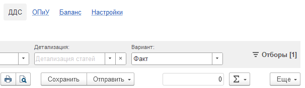{width=606px height=176px}

7. Во вкладка «Операции» были добавлены отборы для документов: Распределение по доп. аналитике, Распределение по проектам, Распределение по разделам.

   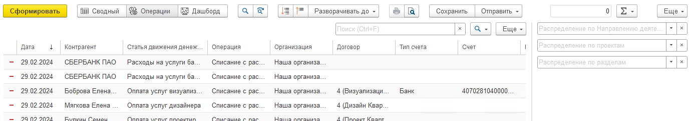{width=1382px height=244px}

8. Для **1С:Управление торговлей / Комплексная автоматизация / ERP** суммы для валютных счетов теперь выводятся в рублях. Данные берутся по управленческому учету

## Автораспределение по ДДС

1. Изменено поведение правил распределения денежных документов

2. Правила работают только для документов «Поступление на счет» и «Списание / расход со счета»

3. Правила работают для распределения документов по БУ / УУ при соблюдении заданных условий

4. Добавлена команда распределения документов в форму «Деньги»

## **Отчет ОПиУ**

### **Новый функционал**

1. В отчете  все установленные отборы теперь сохраняются при новом открытии модуля P&L.

2. Для **1С:Управление торговлей / Комплексная автоматизация / ERP** в расшифровке суммы добавлена возможность выбрать группировку: по контрагенту или по партнеру.

   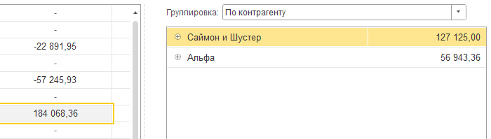{width=700px height=199px}

3. В вариантах «P&L + Проект» и «P&L + Разделы проектов» добавлено отображение колонки «Без проекта".

   [image:./reliz-1-40-0-16.png:::0,0,100,100::square,84.1544,0,15.7635,19.883,,top-left&square,38.9163,31.8713,18.1445,68.1287,,top-left:1218px:342px:center]

4. Добавлено отображение количества установленных отборов.

5. В варианте отчета «P&L + Финансовый поток» если включен учет по НДС , то после колонки «Сумма» выводится колонка «Сумма НДС».

   [image:./reliz-1-40-0-17.png:::0,0,100,100::square,79.4436,11.7284,16.7697,19.1358,,top-left&square,48.609,52.1605,9.5827,47.8395,,top-left:1294px:324px:center]

## Фонды

#### Новый функционал

1. Вкладка «Фонды» пополнилась разделом «Операции», где отражен перечень документов, отражающих внутренние операции с фондами.

   [image:./reliz-1-40-0-19.png:::0,0,100,100::square,30.69,34.1232,12.2554,19.4313,,top-left:971px:211px:center]

2. Документ «**Распределение прибыли по фондам**». Добавлена проверка заполненности фонда в шапке.

## Распределение документов

### Новый функционал

1. Если при распределении документов будет скопирована первая строка и в ней будет отредактирована сумма, то во вторую строку встанет остаток от этой суммы.

   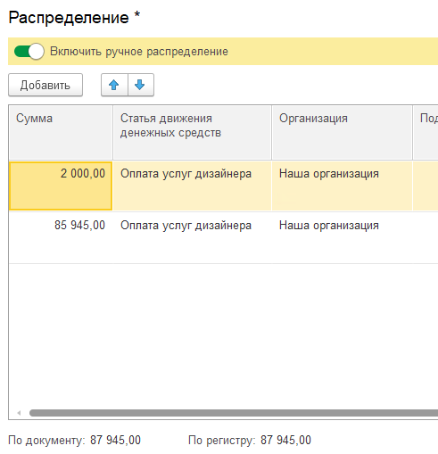{width=491px height=509px}

## Отчет «Баланс»

### Новый функционал

1. Добавлена новая статья «Расход ниже прибыли»

2. Добавлена команда обновления предопределенных статей баланса

3. Исправлена ошибка по формированию отчета более чем за 5 периодов (день / месяц / год)

4. Исправлено отображение периодов в шапках отчета

## **Способ отражения в ОПиУ для УТ/КА/ERP**

1. В конфигурациях **«1С:Управление торговлей», «Комплексная автоматизация» и «ERP»** была реализована функциональность, состоящая из двух блоков, отвечающих за отражение сумм управленческого учета и учета себестоимости.

   Особенность данных систем заключается в наличии множества реквизитов, связанных с управленческими суммами. Поскольку для каждого клиента может потребоваться использование определенных реквизитов (по умолчанию используется «СуммаУпр»), была предусмотрена возможность гибкой настройки источника данных. Это позволяет вручную указать требуемый реквизит, из которого система будет автоматически получать значения.

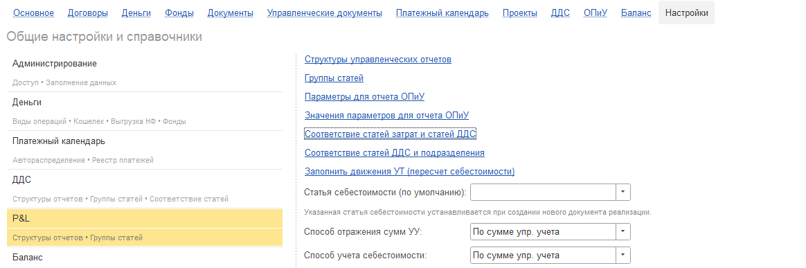{width=1164px height=387px}