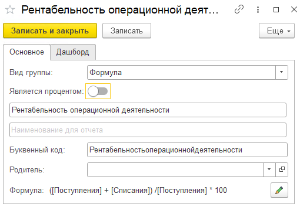
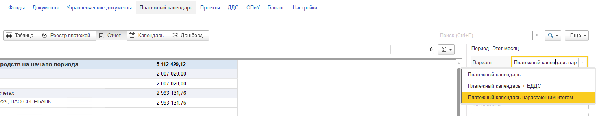

## Документы

### **Новый функционал -** автоматические правила по документам ОПиУ

1. В инструменте можно указать правила автоматического заполнения реквизитов стандартных документов, входящих в состав подсистемы

2. Имеется 2 режима правил:

   1. Простой.

      1. Позволяет указать в качестве условий предопределенные правила

      2. В качестве реквизитов заполнения указываются заранее определенные свойства

   2. Профессиональный

      1. Позволяет настроить условия совпадения правила с максимальной детализацией. В основе составления условий лежит СКД (отборы как в отчете)

      2. Имеется возможность заполнять любой реквизит документа, кроме стандартных(Ссылка, Номер, Дата)

3. Данные правила проверяются при записи документа. Если документ попадает под правило, то выйдет окно, что документ можно заполнить по правилам

4. Также документы можно заполнить по правилам из формы «Документы» подсистемы

5. В правилах появилась команда «Найти и заполнить документы»

   1. При нажатии открывается форма, в которой подбираются все документы, которые соответствуют заданному правилу

:::tip 

[Как пользоваться инструментом подробно описано в инструкции по продукту](./../p-l/dokumenty/avtopravila-po-dokumentam-opiu)

:::

### **Новый функционал - регламентные операции**

В системе реализовано соответствие статей с регламентными операциями.

:::tip 

[Как пользоваться инструментом подробно описано в инструкции по продукту](./../p-l/dokumenty/dokumenty-dlya-bukhgalterii-predpriyatiya/reglamentnye-operacii)

:::

### **Новый функционал**

В **1С:Бухгалтерия предприятия** при создании на основании документа «Платежное поручение» добавлено заполнение реквизитов  P&L из документа «Поступление (акты, накладные, УПД)».

В **1С:Бухгалтерия предприятия** в документе реализации в табличные части «Товары» и «Услуги» были добавлены реквизиты P&L (доп. аналитика, проект, раздел).  В номенклатуре был добавлен реквизит «Доп. аналитика». При выборе номенклатуры в строке таблицы документа предлагается заполнение реквизитами из номенклатуры, если они заполнены.

[image:./reliz-1-41-12.png:::0,0,100,100::square,90.1125,69.5444,9.8875,30.4556,,top-left:1244px:417px:center]

[image:./reliz-1-41-13.png:::0,0,100,100::square,0,38.0952,92.16,27.8388,,top-left:625px:273px:center]

{width=1042px height=198px}

## Платежный календарь

### Новый функционал

1. Возможность создавать несколько платежных поручений по выделенным строкам

   {width=998px height=832px}

2. Появилась колонка ПП, отображающее, что на основании платежного календаря был создан документ платежного поручения.

3. Для **1С:Бухгалтерия предприятия** в настройках добавлен параметр в блок платежный календарь “Указывать статью по умолчанию по бух. учету в платежном поручении”, чтобы в платежном поручении проставлялась статья по умолчанию.

   [image:./reliz-1-41-16.png:::0,0,100,100::square,38.733,81.3793,45.0679,12.7586,,top-left:1105px:290px:center]

[image:./reliz-1-41-17.png:::0,0,100,100::square,38.959,39.6914,15.3785,4.2076,,top-left&square,60.5678,90.0421,26.183,5.0491,,top-left:1268px:713px:center]

[image:./reliz-1-41-18.png:::0,0,100,100::square,52.6638,70.068,47.2489,17.3469,,top-left:1145px:294px:center]

### Исправление ошибок

1. При создании платежного поручения теперь счет контрагента проставляется по умолчанию.

2. В платежном поручении проставляется автоматически очередность «5».

## Деньги

### **Новый функционал**

1. Если в денежном документе указана дата начисления, НДС с него автоматически очищается (в зависимости от настроек учета)

### **Новый функционал - а**втоматические правила по документам ДДС

1. В автоправила ДДС добавлены кассовые документы (ПКО и РКО)

:::tip 

[Как пользоваться инструментом подробно описано в инструкции по продукту](./../p-l/dengi/avtopravila-po-dokumentam-dds)

:::

### Для Бухгалтерии предприятия - учет денежных средств по терминалам

1. Реализован механизм детализированного учета движения наличных денежных средств по различным кассам (терминалам).

:::info 

[Как пользоваться инструментом подробно описано в инструкции по продукту](./../p-l/dengi/uchet-denezhnykh-sredstv-po-terminalam-kassam)

:::

### Исправление ошибок

1. Исправлена ошибка проведения документа «Поступление наличных», когда документ был распределен вручную.

## Отчет ДДС

### **Новый функционал**

1. Для групп отчета ДДС реализован функционал расчета группы по формуле. Функционал аналогичен группам отчета ОПиУ.

   {width=510px height=353px}

   {width=1135px height=234px}

## Управленческие документы

### **Новый функционал -** документ Бюджет

1. Изменен дизайн формы документа

2. Добавлена команда скрытия месяцев

3. Добавлены команды переноса и распределения суммы

4. Добавлена возможность установить комментарии в ячейки документа

### **Новый функционал -** Установочный баланс

1. При проведении документа «Установочный баланс», если уже существует другой проведенный документ с теми же параметрами: месяц, организация, структура отчета, то появляется оповещение пользователю о том, что аналогичный документ уже создан.

## Платежный календарь

### **Новый функционал**

1. В отчете «Платежный календарь» Добавлен вариант отчета «Нарастающим итогом». В поле «Просрочено» выводится просрочка за все периоды, а не только за указанный.

   {width=1517px height=296px}

2. В список платежек добавлена колонка с отметкой прикрепленного файла.

[image:./reliz-1-41-21.png:::0,0,100,100::square,94.0618,18.5874,5.8195,76.9517,,top-left:842px:538px:center]

## Документы

### Новый функционал

1. Если в денежном документе установлена дата начисления, то при проведении документов Поступление товаров / услуг и Реализация товаров / услуг будет выполнена проверка на наличие проводок методом начисления.

### Исправление ошибок

1. Исправлена ошибка, когда в документе «Начисление ЗП» не заполнялась статья НДФЛ и не формировались движения по ней

## Баланс

### Новый функционал

1. Добавлены новые статьи

   1. Активы -> Задолженность сотрудников - отражает остатки ДТ по 70 счету

   2. Пассивы  ->  Задолженность перед сотрудниками - отражает остаток КТ по 70 счету

## УТ / КА / ERP

1. Исправлена ошибка при нажатии кнопки «Распределить» в документе «Выемка из кассы ККМ»

2. Исправлена ошибка, когда при автоматическом распределении многострочных документов в расходы уходила только одна строка

3. Акт выполненных работ корректно отражается в ОПиУ

## **Проекты**

### Новый функционал

1. Во вкладку «Документы» был добавлен отбор по разделам текущего проекта.

### Исправление ошибок

1. Исправлена ошибка в режиме проектов «профессиональный» после записи проекта, когда значки номенклатуры («М» и «У») менялись.

## ОПиУ

### Новый функционал

1. В варианте отчета «P&L: План-Факт» исправлено заполнение колонки «План» для формул. Раннее плановая сумма не рассчитывалась для групп статей, которые являются формулами, если в формуле использовались «Параметры для отчета ОПиУ» (раздел «Настройки», блок «P&L»). Теперь такие параметры учтены.

2. В варианте отчета «P&L + Финансовый поток» в колонке «% выполнения» было добавлено заполнение процентами по статьям.

3. В «Параметры для отчета ОПиУ» добавлена доп. аналитика, ее можно указать там же, где и значение параметра. В формуле на поиск значения параметра теперь также влияет доп. аналитика, указанная либо в отборе, либо в варианте «P&L + Доп. аналитика», либо в детализации. Если в параметре доп. аналитика не указана, то этот параметр также будет использоваться в формуле.

   [image:./reliz-1-41-22.png:::0,0,100,100::square,40.965,42.8962,23.9357,7.6503,,top-left:1057px:366px:center]

## Настройки

### **Исправление ошибок**

Исправлена ошибка по нарушению прав доступа при открытии вкладки «Настройки» .