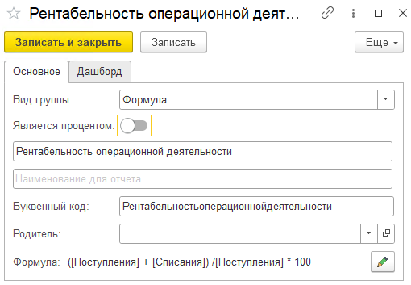
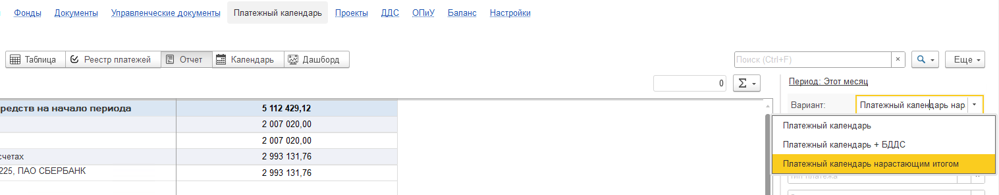

## Документы

### **Новый функционал -** автоматические правила по документам ОПиУ

1. В инструменте можно указать правила автоматического заполнения реквизитов стандартных документов, входящих в состав подсистемы

2. Имеется 2 режима правил:

   1. Простой.

      1. Позволяет указать в качестве условий предопределенные правила

      2. В качестве реквизитов заполнения указываются заранее определенные свойства

   2. Профессиональный

      1. Позволяет настроить условия совпадения правила с максимальной детализацией. В основе составления условий лежит СКД (отборы как в отчете)

      2. Имеется возможность заполнять любой реквизит документа, кроме стандартных(Ссылка, Номер, Дата)

3. Данные правила проверяются при записи документа. Если документ попадает под правило, то выйдет окно, что документ можно заполнить по правилам

4. Также документы можно заполнить по правилам из формы «Документы» подсистемы

5. В правилах появилась команда «Найти и заполнить документы»

   1. При нажатии открывается форма, в которой подбираются все документы, которые соответствуют заданному правилу

:::tip 

[Как пользоваться инструментом подробно описано в инструкции по продукту](./../../p-l/dokumenty/avtopravila-po-dokumentam-opiu)

:::

## Деньги

### **Новый функционал**

1. Если в денежном документе указана дата начисления, НДС с него автоматически очищается (в зависимости от настроек учета)

### **А**втоматические правила по документам ДДС

1. В автоправила ДДС добавлены кассовые документы (ПКО и РКО)

:::tip 

[Как пользоваться инструментом подробно описано в инструкции по продукту](./../../p-l/dengi/avtopravila-po-dokumentam-dds)

:::

### Для Бухгалтерии предприятия - учет денежных средств по терминалам

1. Реализован механизм детализированного учета движения наличных денежных средств по различным кассам (терминалам).

:::tip 

[Как пользоваться инструментом подробно описано в инструкции по продукту](./../../p-l/dengi/uchet-denezhnykh-sredstv-po-terminalam-kassam)

:::

### Исправление ошибок

1. Исправлена ошибка проведения документа «Поступление наличных», когда документ был распределен вручную.

## Отчет ДДС

### **Новый функционал**

1. Для групп отчета ДДС реализован функционал расчета группы по формуле. Функционал аналогичен группам отчета ОПиУ.

   {width=510px height=353px}

   {width=1135px height=234px}

## Управленческие документы

### **Новый функционал -** документ Бюджет

1. Изменен дизайн формы документа

2. Добавлена команда скрытия месяцев

3. Добавлены команды переноса и распределения суммы

4. Добавлена возможность установить комментарии в ячейки документа

## Платежный календарь

### **Новый функционал**

1. В отчете «Платежный календарь» Добавлен вариант отчета «Нарастающим итогом». В поле «Просрочено» выводится просрочка за все периоды, а не только за указанный

{width=1517px height=296px}

## Документы

### Новый функционал

1. Если в денежном документе установлена дата начисления, то при проведении документов Поступление товаров / услуг и Реализация товаров / услуг будет выполнена проверка на наличие проводок методом начисления.

### Исправление ошибок

1. Исправлена ошибка, когда в документе «Начисление ЗП» не заполнялась статья НДФЛ и не формировались движения по ней

## Баланс

### Новый функционал

1. Добавлены новые статьи

   1. Активы -> Задолженность сотрудников - отражает остатки ДТ по 70 счету

   2. Пассивы  ->  Задолженность перед сотрудниками - отражает остаток КТ по 70 счету

## УТ / КА / ERP

1. Исправлена ошибка при нажатии кнопки «Распределить» в документе «Выемка из кассы ККМ»

2. Исправлена ошибка, когда при автоматическом распределении многострочных документов в расходы уходила только одна строка

3. Акт выполненных работ корректно отражается в ОПиУ