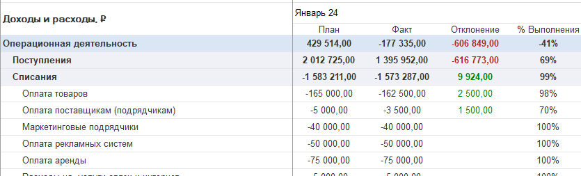
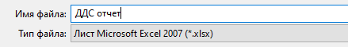

## **Отчет ДДС**

### Новый функционал

1. Для вариантов отчетов: ДДС + Организации (Подразделения, Доп аналитика, Проекты, Разделы проекта) во вкладке «Отборы» была добавлена настройка «Отражать остатки денежных средств». Если данная настройка установлена, то будут выводиться остатки на начало и на конец периода за последний месяц установленного периода.

   [image:./reliz-1-42-0-3.png:::0,0,100,100::square,76.8829,6.8053,15.0634,10.9641,,top-left&square,76.4355,93.3837,23.5645,6.6163,,top-left&square,0,23.4405,49.2916,27.2212,,top-left:1341px:529px:center]

2. В вариантах отчета «ДДС + БДДС» и «ДДС + Платежный календарь» была изменена логика расчета колонки «Отклонение». Ранее считалось, как План-Факт, изменено на Факт-План.

   {width=835px height=253px}

3. Исправлена ошибка, когда в отчет ДДС в варианте ДДС + Подразделения несколько раз выводилась колонка «Без подразделения»

4. Исправлено сохранение отчетов в формате EXCEL. Теперь суммы в отчете сохраняются в формате «Число». Необходимо использовать стандартную команду «**Сохранить**»

   [image:./reliz-1-42-0-9.png:::0,0,100,100::square,73.8547,41.9355,8.1359,15.1613,,top-left:1266px:310px:center]

{width=439px height=60px}

{width=748px height=617px}

## **Платежный календарь**

### **Исправление ошибок**

1. Исправлена ошибка при выборе документа оплаты, если в планируемом платеже контрагент указан, как физическое лицо.

2. Исправлены ошибки формирования отчета «Платежный календарь нарастающим итогом»

   {width=1451px height=225px}

3. Реестр платежей. Исправлена ошибка вывода суммы реестра платежей

### Новый функционал

1. В режиме «Таблица» добавлен отбор по доп. аналитике.

   [image:./reliz-1-42-0-5.png:::0,0,100,100::square,76.3217,90.6061,23.6039,9.0909,,top-left:1343px:330px:center]

2. Добавлена настройка видимости колонок, позволяющая изменить набор колонок.

   [image:./reliz-1-42-0-6.png:::0,0,100,100::square,69.3855,17.1429,29.3855,79.0476,,top-left:895px:210px:center]

## Проекты

### Новый функционал

1. Для документов, в которых указан тип операции «Возврат», был изменен алгоритм формирования движений. Исправлено некорректное отражение возвратов денежных средств заказчикам и поставщикам в отчетности и блоках отображения проектов. Теперь если по проекту был возврат от покупателя, он будет отражен в блоке Доходы, а не Расходы.

   Чтобы исправить данный момент по старым проектам, необходимо перепровести документы по возвратам.

2. В списке проектов добавлен отбор по менеджеру.

   [image:./reliz-1-42-0-8.png:::0,0,100,100::square,77.9637,90.5852,21.9665,9.4148,,top-left:1434px:393px:center]

3. Для режима «Профессиональный» в смете появилась возможность установить вручную статью ДДС по каждой строке номенклатуры.

4. Появилась возможность создать реализацию на основании этапа проекта

##  

## **Договоры**

### **Новый функционал**

1. Для **1С:Бухгалтерия предприятия** в обработке «Формирование актов и счетов» был добавлен отбор «Только открытые». Если данный отбор установлен, то будут выводиться данные по договорам, которые не закрыты.

   [image:./reliz-1-42-0-0.png:::0,0,100,100::square,91.4535,42.2535,8.5465,57.7465,,top-left:1603px:71px:center]

[image:./reliz-1-42-0.png:::0,0,100,100::square,70.5634,68.2143,22.6761,14.6429,,top-left:710px:280px:center]

## **Деньги**

### **Новый функционал**

1. В **1С:Бухгалтерия предприятия** в документах «Поступление на расчетный счет» и «Списание с расчетного счета», если вид операции установлен «Депозит», то  движения в регистры P&L не формируются.

2. Теперь в разделе деньги доступно редактирование ручного распределения любого документа, вне зависимости от даты запрета изменений.

3. Для **1С:Комплексная автоматизация/Управление торговлей/ERP** во вкладке «Деньги» в списке документов «Банк», в колонке «Дата» теперь выводится «Дата проведения банком». Если данная дата не заполнена в документе, то тогда выводится дата документа.

4. Для документа «Операция по кошельку» добавлен вывод ошибки распределения, если сумма по детализации отличается от суммы документа.

5. Добавлен в блок «Кошелек» отбор «Несоответствие с распределением».

6. Автоправила ДДС. Для расходных документов добавлен реквизит «Фонд»

## **Документы**

### **Исправление ошибок**

1. В списке документов, где указан статус распределения «Автоматически (НДС очищен)», исправлено отображение наличия ошибки распределения (красный флаг).

2. В **1С:Бухгалтерия предприятия** в документе «Операция введённая вручную» при распределении исправлена ошибка, когда дата не сохранялась.

3. В **1С:Бухгалтерия предприятия** в документе «Реализация (акты, накладные, УПД)» появилась важная поправка. Теперь, если документ распределен вручную и статья себестоимости заполнена, формируются движения по себестоимости.

### Новый функционал

1. В **1С:Бухгалтерия предприятия** в документе «Счет покупателю» в табличную часть «Товары и услуги» были добавлены «Реквизиты P&L» (статья, доп. аналитика, проект и раздел). При выборе номенклатуры в строке таблицы документа предлагается заполнение реквизитами из номенклатуры, если они заполнены. Из документа «Счет покупателю» при создании на основании документа «Реализация (акт, накладная)» передаются реквизиты P&L  из табличной части.

2. Теперь в разделе документы доступно редактирование ручного распределения любого документа, вне зависимости от даты запрета изменений.

## **Управленческие документы**

### Новый функционал

1. В документ «Учет основных средств» были добавлены в табличную часть реквизиты «Количество» и «Цена». Также реализован автоматический расчет стоимости при изменении цены или количества.

   {width=1569px height=287px}

2. В документе «Ввод начальных остатков по терминалам» выведено поле с суммой остатка по кассе организации на дату документа (остатки по 50 счету)

### **Исправление ошибок**

1. Документ «Бюджет». Исправлены ошибки отображения на форме документа

## Общие

### **Статьи движения денежных средств**

В элемент справочника «Статьи движения денежных средств» был добавлен реквизит «Комментарий».

## 