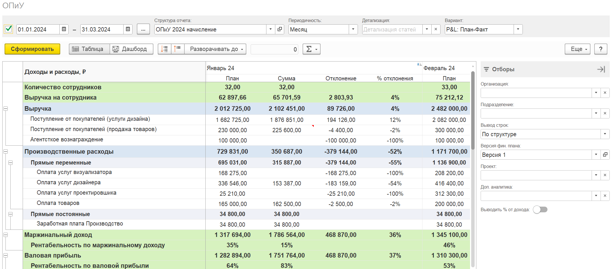
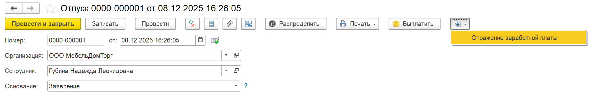
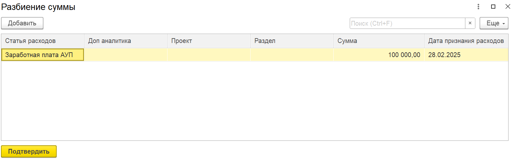

## Отчет ОПиУ

### Новый функционал

1. В варианте отчета P&L: План-Факт добавлен отбор по версии плана

   {width=2134px height=940px}

2. Для всех детализаций по отчету добавлен вывод данных с пустым значением, например \<\<Без контрагента>>, \<\<Без статьи>>, \<\<Без подразделения>> и т.д.

## Деньги

### Новый функционал

1. Добавлен отбор по физическому лицу

   [image:./reliz-1-43-0.png:::0,0,100,100::square,77.8356,74.4817,22.1644,25.5183,,top-left:2143px:777px:center]

2. Реализован функционал автоматического распределения документов Поступление / Списание с расчетного счета на основании документов Счет от поставщика и Счет покупателю.

:::tip 

[Как пользоваться автоматическим распределением расписано в этой статье](./../../p-l/dengi/avtomaticheskie-raspredelenie-na-osnovanii-scheto)

:::

### Исправление ошибок

1. Исправлена ошибка при использовании произвольных колонок

   {width=1150px height=199px}

## Кошелек

### Новый функционал

1. При создании операции по кошельку на основании управленческой ведомости, если заполнить физическое лицо, то движения по пройдут только по указанному физическому лицу. Соответственно задолженность по заработной плате закроется только по данному сотруднику.

   {width=2121px height=982px}

## Документы

### Новый функционал

1. Для Бухгалтерии предприятия. Документ «Регламентная операция». Добавлены движения по виду операции «Начисление налогов на единый налоговый счет», «Амортизация и износ основных средств», «Расчет налога на прибыль»

2. Для Бухгалтерии предприятия. Документ «Операция по платежной карте». В распределение добавлена колонка НДС

3. Для Бухгалтерии предприятия. Документ «Начисление зарплаты». Реализована работа соответствия статьи ДДС и подразделения.

4. В документ «Счет от поставщика» добавлен функционал ручного распределения

   :::tip 

   [Подробно рассказано, для чего данный функционал и как распределять на основании счетов на оплату/поставщиков](./../../p-l/dengi/avtomaticheskie-raspredelenie-na-osnovanii-scheto)

   :::

5. Для Бухгалтерии предприятия. Документ «Отражение зарплаты». Добавлено создание на основании отпуска.

   {width=1888px height=301px}

6. Документ «Реализация». Добавлен функционал сопоставления параметров и статей ДДС / себестоимости.

### Исправление ошибок

1. При проведении документов, если был отключен функционал очистки НДС и имеется ручное распределение с указанным НДС, то в регистрах он будет очищен.

2. Для Бухгалтерии предприятия. Документ «Реализация». Исправлена ошибка, когда при добавлении номенклатуры очищались реквизиты P&L во всех строках документа.

3. Для всех документов реализовано чтение данных после записи. Теперь после чтения / записи документа не будут визуально слетать данные P&L.

## Платежный календарь

### Новый функционал

1. В показателях справа добавлено отображение сумм просроченных оплат и поступлений

## Проекты

### Новый функционал

1. В смету проектов добавлена колонка «Содержание». Она заполняется из номенклатуры с типом Услуга и передается в документ Реализация

   {width=2199px height=516px}

2. Реализовано создание документа «Реализация» в разделе проекта. При создании реализации из проектов автоматически открывается подходящая форма документа.

   {width=955px height=705px}

3. Добавлен отбор по исполнителю

4. В проекты добавлена вкладка «Файлы»

5. Для проекта можно прикрепить несколько файлов. Все файлы хранятся в таблице с полями «Файл» и «Описание»

6. Во вкладке «Файлы» добавлено отображение всех присоединенных файлов документов, отраженных на вкладке «Документы» проекта.

   {width=2145px height=538px}

## Управленческие операции и инструменты

### Документ Отражение зарплаты (управленческий)

1. Добавлена группировка по сотруднику в разрезе статей

   [image:./reliz-1-43-0-5.png:::0,0,100,100::square,14.1782,46.3252,16.3194,9.3541,,top-left:2134px:555px:center]

   {width=2127px height=619px}

2. Добавлена сортировка по ФИО

3. Добавлено распределение суммы строки при группировке по сотруднику

   {width=1026px height=685px}

   {width=1596px height=502px}

   {width=1603px height=496px}

   {width=2065px height=163px}

4. Добавлена загрузка данных документа из табличного документа (напр. из Excel)

   {width=2136px height=319px}

5. Добавлена таблица дополнительных начислений.

6. Для таблицы дополнительных начислений также реализована группировка, сортировка, распределение

7. При создании документа на основании другого, автоматически удаляются строки с не заполненной статьей ДДС

8. Добавлена таблица Итого. В ней отображаются сгруппированные данные по таблицам документа

### Автоправила ДДС

1. В статьях распределения добавлено отображение знака %

### Контроль лимитов расходов

1. В платежном календаре появился дашборд, который отражает данные Плана и Факта

2. В платежном поручении появился блок, который отражает данные Плана и Факт

   {width=756px height=265px}

:::tip 

[Для чего нужен контроль лимитов бюджета и как им пользоваться, описано в данной статье](./../../p-l/platezhnyy-kalendar/kontrol-limitov-byudzheta)

:::

### Взаиморасчеты по заработной плате

1. Добавлены новые настройки, которые позволят учитывать или нет стандартные документы начисления зарплаты в подсистеме

## Доработки для конфигурации УТ/КА/ERP

1. Из списка документов убран документ «Возврат от клиента» с типом операции «Возврат от комиссионера»

2. В номенклатуру добавлены реквизиты «Статья ДДС» и «Статья себестоимости». Они находятся в карточке номенклатуры в разделе «Дополнительные реквизиты»

3. Для документов «Отчет о розничных продажах», «Реализация», «Отчет комиссионера» изменены движения:

   1. Для регистра «Доходы» изменена логика получения статьи ДДС. Теперь, если заполнена статья ДДС в номенклатуре, то она и встанет в движения иначе статья из документа

   2. Для регистра «Расходы» изменена логика получения статьи себестоимости. Теперь, если заполнена статья себестоимости в номенклатуре, то она и встанет в движения иначе статья из документа