## Система обновлений

1. Добавлено оповещение о доступном обновлении

   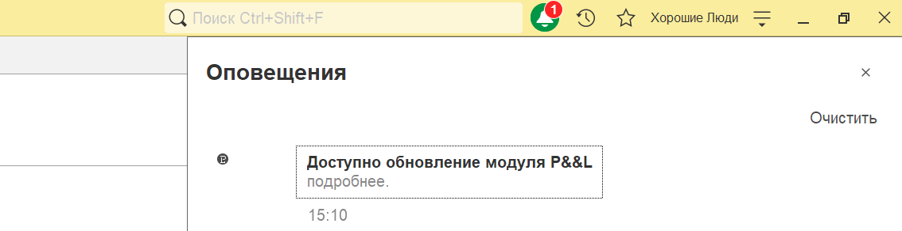{width=1134px height=292px}

2. На форму обновления добавлена плашка, в которой указан текущий релиз

3. Добавлена возможность указать в качестве описания релиза PDF документ

## **Платежный календарь**

### **Новый функционал**

1. Изменена логика статуса оплаты платежа: если у платежа установлен статус, что оплачен, но не прикреплен ни один документ оплаты, данный платеж считается полностью оплаченным.

2. Для **1С:Бухгалтерия предприятия** в документе «Ведомость в банк» добавлена возможность создания платежного календаря.

   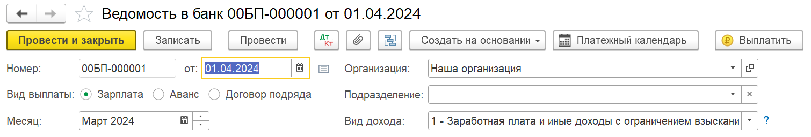{width=1510px height=256px}

3. Для **1С:Бухгалтерия предприятия** при создании платежного календаря в документах «Счет покупателю» или «Счет от поставщика» реквизиты P&L первоначально заполняются из первой строки табличной части. Если там реквизиты не указаны, то тогда заполняются из шапки документа.

4. Исправлена ошибка при изменении даты платежа из списка платежного календаря в договоре.

## **Деньги**

### **Новый функционал**

1. Для **1С:Бухгалтерия предприятия** в документе «Поступление на расчетный счет» добавлено отражение отклонения курса продажи валюты в регистр «Расходы». Для отражения необходимо в разделе «Настройки», блок «Деньги» заполнить статью «Статья отклонения курса продажи валюты»

   Данные будут попадать по данной статье в отчет ОПиУ кассовым методом.

   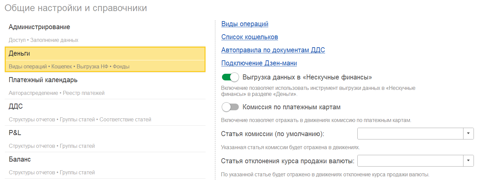{width=1456px height=537px}

2. В  контекстное меню списка документов (при нажатии правой кнопкой мыши по строке) была добавлена команда копирования документа.

   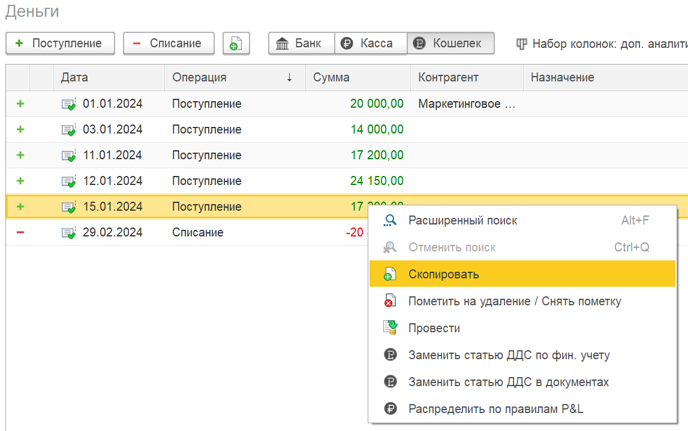{width=1147px height=720px}

3. При попытке в ручном распределении документа сохранить распределение, в котором в одной из строк указана «Дата начисления», а в другой -- оставлена пустой, исправлена ошибка и добавлено оповещение пользователю о необходимости правильного заполнения.

   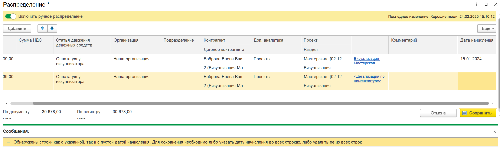{width=2347px height=697px}

4. Документ «Списание с расчетного счета». При создании на основании «реестр выплат самозанятым» договор корректно отражается в проводках

5. В варианты наборов колонок был добавлен вариант «Доп. аналитика» (отображается при использовании доп. аналитики). Если выбрать этот набор, то будет отображаться колонка по доп. аналитике, в которой будет выводиться вся доп. аналитика из движений документа.

   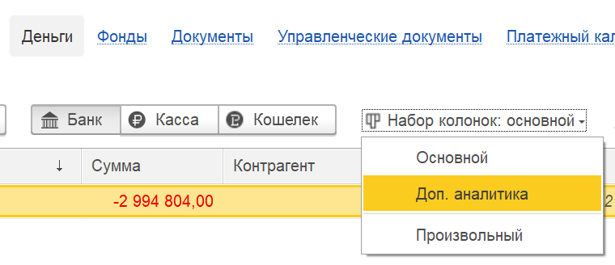{width=760px height=328px}

### Исправление ошибок

1. Исправлена ошибка, когда в некоторых случаях некорректно формировались движения по расходам будущих периодов.

2. Исправлена ошибка, когда в некоторых случаях в валютных документах поступление и списание с расчетного счета в регистры P&L уходила некорректная сумма.

## **Документы**

### **Новый функционал**

1. Для **1С:Бухгалтерия предприятия** в документе «Поступление (акты, накладные, УПД)» с видом «Приобретение прав» были добавлены реквизиты P&L и формирование движений в регистр «Расходы».

2. Для **1С:Бухгалтерия предприятия** реализован полный перенос реквизитов P&L при создании документов на основании: «Реализация (акты, накладные, УПД)»  и «Счет покупателю», в том числе при создании на основании из списка документов.

3. В документе «Реализация (акты, накладные, УПД)»  при отказе пользователя (ответ «Нет») реквизиты P&L теперь не очищаются. При ответе «Да»:

   1. полностью заполняются реквизиты P&L в шапке реализации из шапки счета;

   2. полностью заполняются реквизиты P&L в табличной части реализации из табличной части счета.

4. Для **1С:Бухгалтерия предприятия** в раздел «Документы» добавлен стандартный документ «Передача НМА». В документе также добавлены реквизиты P&L (дата принятия к управленческому учету, доп. аналитика, проект, раздел, статьи). Для формирования движений по себестоимости берутся проводки документа по всему счету Дт «91» и по всему счету Кт «04».

5. Для **1С:Бухгалтерия предприятия** в документе «Реализация (акты, накладные, УПД)» в движениях по себестоимости доп. аналитика заполняется доп. аналитикой из табличной части. Если в таблице не указана, то тогда заполняется  из шапки документа.

6. Для **1С:Бухгалтерия предприятия** в подсистему добавлен документ «Передача материалов в эксплуатацию»

7. Документ Реализация. Исправлена ошибка, когда данные P&L из табличных частей не уходили в регистры P&L

8. Также исправлен алгоритм автозаполнения реквизитов P&L в изначальной таблице ручного распределения: сначала берутся данные из строк табличных частей (Товары, Услуги, Агентские услуги, Права), если реквизиты не заполнены, то тогда берутся значения из шапки документа.

9. Для документов «Начисление зарплаты» и «Отражение зарплаты в бухучете» в **1С:Бухгалтерия предприятия** теперь появилось возможность реализовать соответствие подразделения с доп. аналитикой.

   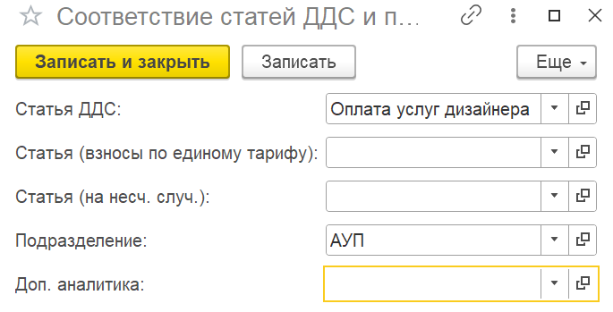{width=685px height=349px}

## **Управленческие документы**

### Новый функционал

1. В учете основных средств добавлен функционал мастер-формы по загрузке данных.

   {width=1618px height=171px}

   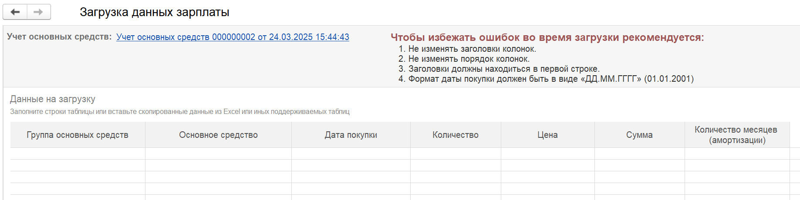{width=1837px height=460px}

2. В документ «Отражение заработной платы» была добавлена возможность загрузки данных о взносах, налогах и прочим расходам по сотрудникам.

3. Переименована таблица «Дополнительные начисления» в «Налоги, взносы и прочее»

   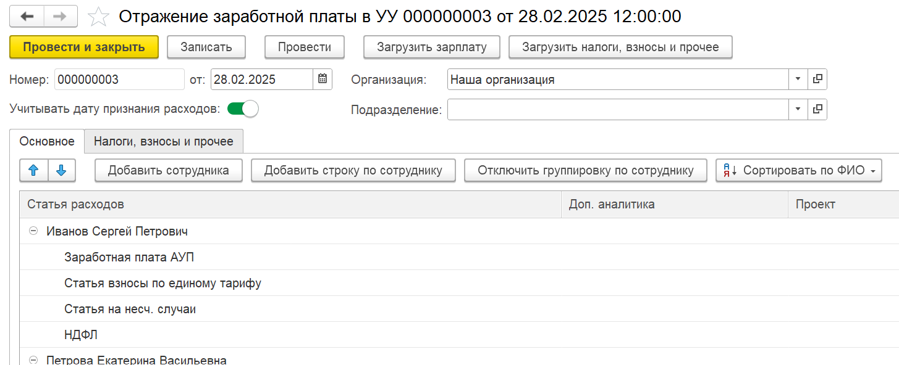{width=1455px height=592px}

4. В документе «Управленческая ведомость по выплате» были добавлены общие итоги в табличной части. Для **1С:Бухгалтерия предприятия** была добавлена колонка «Подразделение» и ее автоматическое заполнение по сотруднику, а также возможность сгруппировать таблицу по подразделению и заполнить данные по выбранному подразделению.

   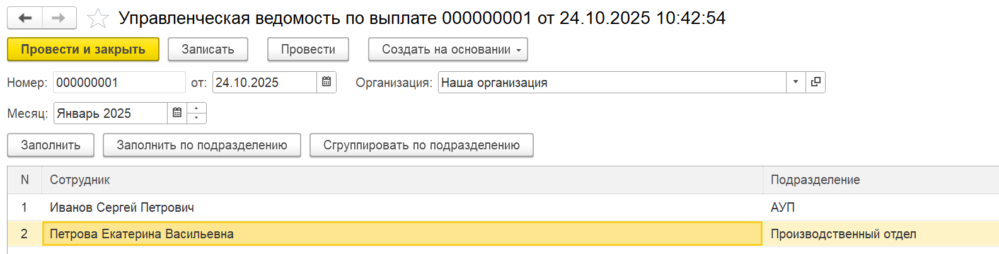{width=1585px height=403px}

5. Был добавлен новый документ «Ввод начальных остатков по зарплате» для ввода непогашенной задолженности между предприятием и сотрудниками на произвольную дату.

[image:./reliz-1-44-0-6.png:::0,0,100,100::square,0,85.0794,28.0118,5.291,,top-left:1021px:945px:center]

## **ОПиУ**

### **Новый функционал**

При расшифровке суммы было реализовано, что все суммы из регистра «Расходы» отображаются с минусом, а также суммы из распределения расходов в договоре.

## Проекты

### Новый функционал

1. В форме списка добавлено сохранение произвольного набора колонок

2. В произвольный набор колонок добавлены колонки «Менеджер» и «Статус»

3. Добавлено новое поле «Комментарий»

4. В произвольном варианте колонок добавлена колонка «Комментарий»

5. Во вкладке «Обзор», в «Анализ сметы» были добавлены данные (колонки «Деньги» и «Накладные») по статьям, которые не запланированы во вкладке проекта «Смета», но по которым могут быть расходы. Также были добавлены данные по статьям с незаполненным разделом, выводятся данные с обозначением «Без раздела».

   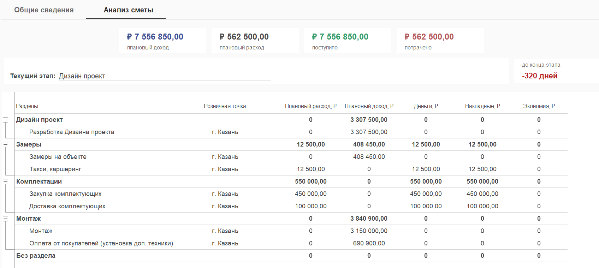{width=1696px height=759px}

## Автоправила ДДС

### Новый функционал

1. Добавлена связь отборов в условии Договор, если указано условие «Контрагент»

2. При проведении денежных документов появилась возможность автоматически распределить документ по правилам, если они были созданы ранее.

3. Добавлен блок «Период действия автоправил». Если период не указан, правило является бессрочным.

   Приоритет при поиске правил: При наличии нескольких правил, подходящих под условия документа, должен применяться принцип более специфичного периода. Например, правило с подходящим конкретным периодом имеет приоритет над бессрочным правилом.

   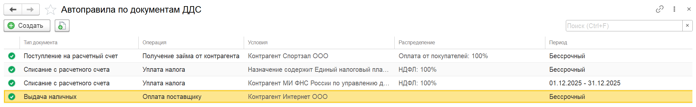{width=2139px height=331px}

   {width=883px height=265px}

4. Добавлено поле «комментарий»

   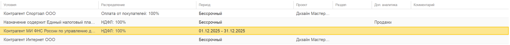{width=2419px height=217px}

## Доработки для Управление торговлей/Комплексной Автоматизации/ERP

1. Если на основании документа «Заявка на расход ДС» был создан платежный календарь, а затем на основании заявки сделан документ «Списание ДС», то к созданному платежному календарю автоматически подвяжется созданное списание

2. В форме «Деньги» добавлено отображение контрагента как подотчетного лица

3. В обработке «Заполнение движений себестоимости» добавлено отображение документов без себестоимости

4. В документе «Отчет комиссионера» изменено поле, по которому формируется движение в регистр Расходы. Вместо «Сумма комитента» теперь «Сумма продажи»

5. Исправлена ошибка, когда в некоторых случаях при ручном распределении документа из формы Деньги возникала ошибка