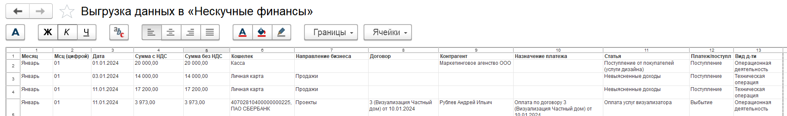
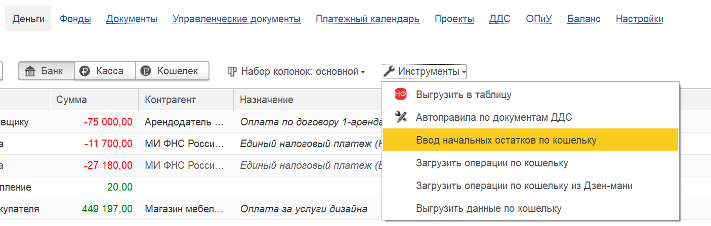
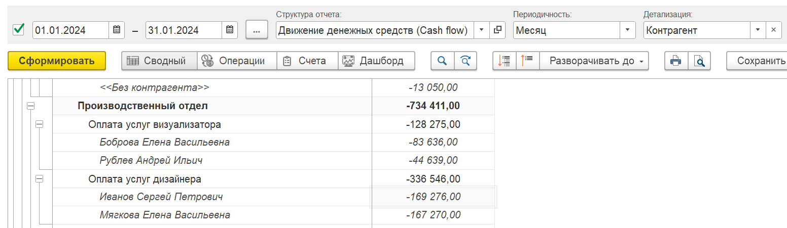
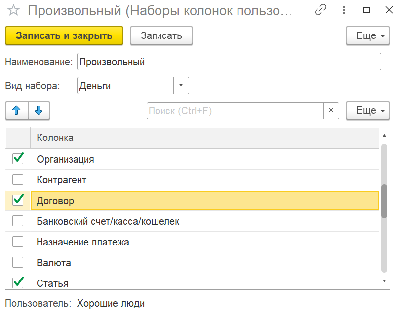
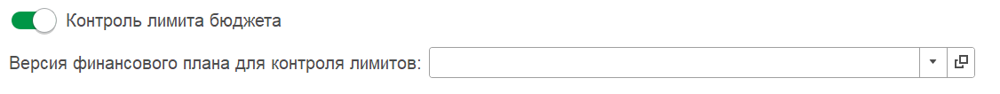
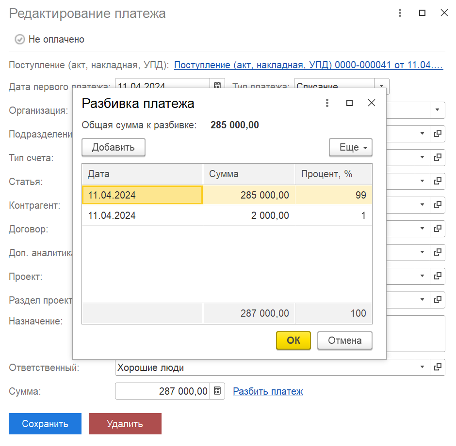
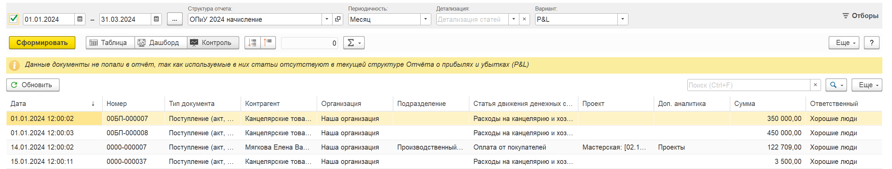

## **Распределение документа**

### Новый функционал

1. В форме распределения документа добавлена проверка на наличие статьи в смете проекта при изменении статьи или раздела проекта.

   [image:./reliz-1-45-0-0.png:::0,0,100,100::square,14.9306,36.2525,10.4167,11.2016,,top-left&square,62.3843,41.7515,10.706,8.7576,,top-left&square,0,86.3544,46.3542,13.442,,top-left:2487px:706px:center]

2. Реализовано разбиение суммы НДС по количеству месяцев при использовании команды «Разбить сумму».

## **Деньги**

### Новый функционал

1. Для **1С:Бухгалтерия** **предприятия** в денежных документах поступлений  с видом операции «Возврат от подотчетного лица» исправлено некорректное отражение возвратов денежных средств. Теперь  будет отражен в блоке Доходы, а не Расходы в проектах.

2. Для выгрузки в «Нескучные финансы» в таблице добавлены новые колонки «Сумма с НДС», «Сумма без НДС», «Направление бизнеса» и «Договор».

   {width=1851px height=274px}

3. Был добавлен новый документ «Ввод начальных остатков по кошельку», который предназначен для ввода и хранения начальных остатков денежных средств по кошелькам  для целей управленческого учета.

   Движения по документу используются для корректного формирования начального сальдо в отчете о движении денежных средств (ДДС). Создать документ можно через команду «Инструменты» в разделе «Деньги».

   {width=1405px height=447px}

4. Для **1С:Бухгалтерия** **предприятия** в денежных документах реализовано заполнение физического лица в движениях. Данное улучшение обеспечивает корректное отображение операций с физическими лицами в отчете «Движение денежных средств» при детализации по контрагентам.

   {width=1552px height=451px}

5. В набор колонок «Произвольный»  добавлена колонка «Договор», которую можно вывести в  список документов.

   {width=802px height=639px}

## **Документы**

### **Исправление ошибок**

1. Для **1С:Бухгалтерия** **предприятия** исправлена ошибка отображения документов «Расход материалов».

2. Для **1С:Бухгалтерия** **предприятия**  в документе «Поступление (акты, накладные, УПД)» исправлена ошибка при формировании движений в регистр «Расходы будущих периодов».

### Новый функционал

1. Для **1С:Бухгалтерия** **предприятия** в документе «Регламентная операция» с видом операции «Расчет транспортного налога» добавлено формирование движений в регистр Расходы на суммы по проводкам СчетДт «20» или «26» и СчетКт «68.07».

2. Для **1С:Бухгалтерия предприятия** в подсистему добавлен документ «Оприходование товаров».

3. **Документы «Начисление зарплаты» и «Отражение зарплаты в бухучете»**

   1. Исправлена ошибка, когда в регистры не вставали суммы НДФЛ с превышения

   2. Добавлено вычитание строк начисленного НДФЛ из строк начисления

   3. В «Соответствие статей ДДС и подразделения» добавлены реквизиты «Проект» и «Раздел»

   4. Изменено визуальное оформление списка «Соответствие статей ДДС и подразделения»

   5. Если на основании документов «Начисление зарплаты» и «Отражение зарплаты в бухучете» создан документ «Отражение ЗП в управленческом учете» и если в этих документах указана статья «НДФЛ», то в суммах начислений будет вычтен НДФЛ

## **Управленческие документы**

### Новый функционал

1. В документе «Отражение заработной платы в УУ» добавлена команда «Установить параметры», которая позволяет выбрать реквизиты P&L (статью,  доп. аналитику, проект, раздел проекта) и заполнить выбранными значениями все выделенные строки в таблице вкладки  «Основное» или «Налоги, взносы и прочее».

   [image:./reliz-1-45-0-4.png:::0,0,100,100::square,55.7447,11.2412,17.0821,13.1148,,top-left:1645px:427px:center]

2. Для документов «Кредиты и займы» добавлена возможность помечать документ на удаление, даже если это недействующая версия. Если документ помечается на удаление он автоматически убирается из цепочки версий документов, ни является ничьим основанием и ни формирует никаких движений.

3. В список документов «Кредиты и займы» добавлен блок под названием «Платежный календарь». Колонка «Общая сумма» рассчитывается как сумма всех запланированных платежей по выбранному документу в рамках платежного календаря. 

   Колонка «Оплачено» рассчитывается как сумма оплаченных платежей. 

   Колонка «Осталось заплатить» рассчитывается как остаток, по формуле: \[Общая сумма\] - \[Оплачено\].

   [image:./reliz-1-45-0-6.png:::0,0,100,100::square,76.2731,19.5918,22.6273,52.6531,,top-left:2587px:367px:center]

### Исправление ошибок

1. Документы «Финансовый план БДР и БДДС» Исправлено поведение команд «Распределить сумму» и «Перенести сумму». Теперь они работают только в строках со статьей

## **Платежный календарь**

### Новый функционал

1. Расширен список типов файлов, которые можно прикрепить к записи календаря.

2. Для контроля лимитов добавлена настройка версии финансового плана. Настройка выполняется в разделе «Платежный календарь»

   {width=1126px height=106px}

3. Изменено появление плашки «Контроль лимитов». Теперь она появляется во всех вариантах отображения формы «Платежный календарь»

4. В отчете платежного календаря для варианта отчета «Платежный календарь + БДДС» добавлен отбор по версии финансового плана.

   [image:./reliz-1-45-0-7.png:::0,0,100,100::square,81.713,5.2101,17.0718,5.7143,,top-left&square,81.0764,66.5546,18.9236,7.0588,,top-left:2592px:892px:center]

5. В документе «Реестр платежей» добавлено заполнение колонки «Контрагент» физическим лицом, если оно указано в запланированных платежах.

6. Также добавлена колонка «Комментарий», в которую можно вносить текст. В печатной форме «Реестр платежей» комментариями заполняется колонка «Примечание». Данные комментарии передаются и в заявки на согласование, в поле «Описание»

7. Для **1С:Бухгалтерия** **предприятия**  добавлен отбор «Остатки по депозитам» (по умолчанию отбор установлен как «Не включать остатки по депозитам»).

   Данный отбор влияет на вывод остатков в блоках «Остаток на сегодня» и «Планируемый остаток», в остатках на начало и конец периода в отчете по платежному календарю, и в остатках во вкладке «Календарь».

   [image:./reliz-1-45-0-9.png:::0,0,100,100::square,80.6713,48.3965,19.3287,4.0816,,top-left&square,0.8102,25.2187,45.9491,4.6647,,top-left&square,80.6713,54.6647,18.75,21.4286,,top-left:2593px:1030px:center]

8. Доработан функционал «Разбивки платежа» в модуле платежного календаря системы:

   1. добавлено отображение общей суммы планируемого платежа;

   2. в таблице разбивки была добавлена колонка «Процент»;

   3. реализована логика автоматического расчета суммы части платежа на основании введенного процента;

   4. добавлена строка «Итого» под таблицей с автоматическим расчетом общей суммы расшифровки.

      {width=940px height=921px}

## Новая логика автоматического распределения платежного календаря

1. При проведении денежного документа система теперь выполняет расширенную проверку для его автоматического сопоставления с плановыми платежами. Новый алгоритм работает следующим образом:

   -  **Первичный отбор:** Система ищет незавершенные плановые платежи, совпадающие по базовым параметрам (дата, организация, статья ДДС, контрагент, договор).

   -  **Уточнение по сумме:** Среди найденных записей приоритет отдается платежу, сумма которого **точно соответствует** сумме документа.

   -  **Логика выбора:**

      1. Если найдено **несколько** плановых платежей с одинаковой подходящей суммой, к распределению назначается платеж с **наиболее ранней датой**.

      2. Если платежей с точным совпадением суммы **не найдено**, система выбирает плановый платеж с **самой ранней датой** из отобранных на первом этапе.

   -  **Результат:** Найденному плановому платежу присваивается статус **«Оплачено»**, а к нему прикрепляется текущий документ в качестве документа-основания оплаты.

## **Проекты**

### Новый функционал

1. Во вкладке «Документы» добавлены колонки «Раздел» и «Статья»

2. Изменено отображение колонки «Сумма». Теперь, если сумма по доходам, то она будет отображена зеленым цветом. По расходам сумма будет отображена с отрицательным знаком и красным цветом

### **Исправление ошибок**

1. В отчете по проекту «План-факт: общие показатели» добавлено корректное отображение сумм по возвратам.

## **Отчет ОПиУ**

### **Новый функционал**

1. В варианте отчета «P&L: План-Факт»  для статей, по которым в выбранной плановой версии БДР не установлено плановое значение (фактически 0), отклонение  заполняется фактическим значением. Также было изменено наименование колонки с «% отклонения» на «% Выполнения» и формула расчета процента на \[Факт\] / \[План\] \* 100%.

2. Добавлена новая вкладка «Контроль». На ней отображены все документы, статьи которых не отражены в структуре отчета ОПиУ

   {width=2602px height=496px}

## Взаиморасчеты (Бета-версия)

### Новый функционал

1. Появилась новый блок «Взаиморасчеты», позволяющий мониторить текущие задолженности между клиентами и поставщиками как по управленческому учету, так и по бухгалтерскому. Данный функционал доступен только КОРП версии.

## Обработка «Заполнение реквизитов документов»

1. Изменено поведение обработки. Теперь, если не заполнены реквизиты в параметрах заполнения, то и в документе они будут очищены

## Обработка «Найти и заполнить документы по правилам»

1. Добавлена возможность установить отбор по распределенным вручную документам

## Правила заполнения документов ОПиУ

1. Добавлена возможность автоматически закрывать документы после заполнения по правилам

2. Для правил с вариантом настройки «Профессиональный» добавлен вывод условия на форму списка

## Роли доступа

1. При режиме работы "Настраиваемый доступ (только P&L)" добавлено ограничение на открытие карточки физического лица и вкладки «Сведения по P&L»