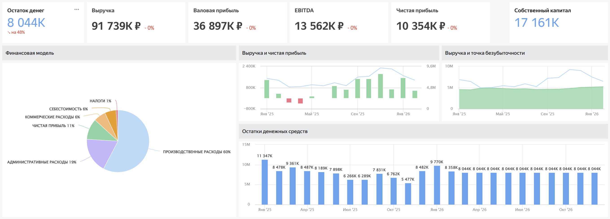
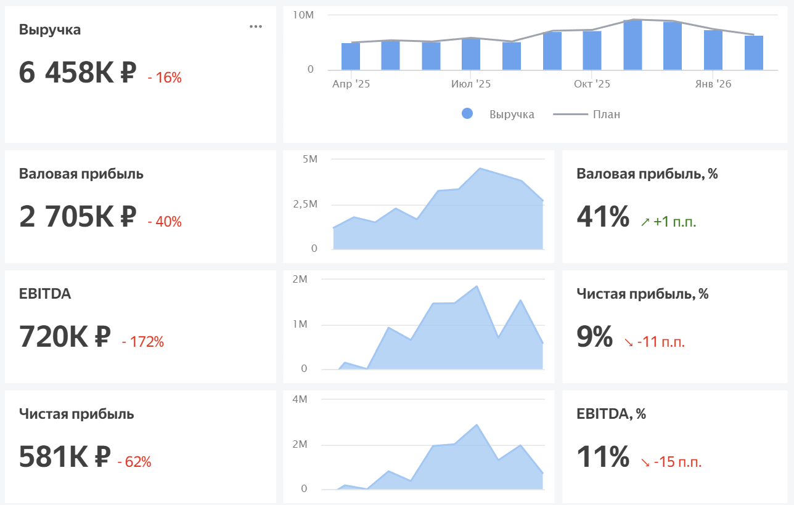
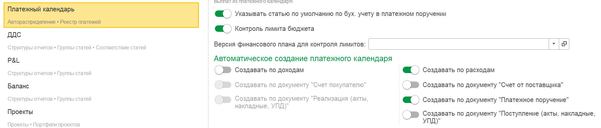
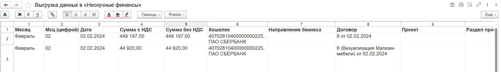
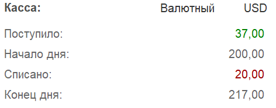
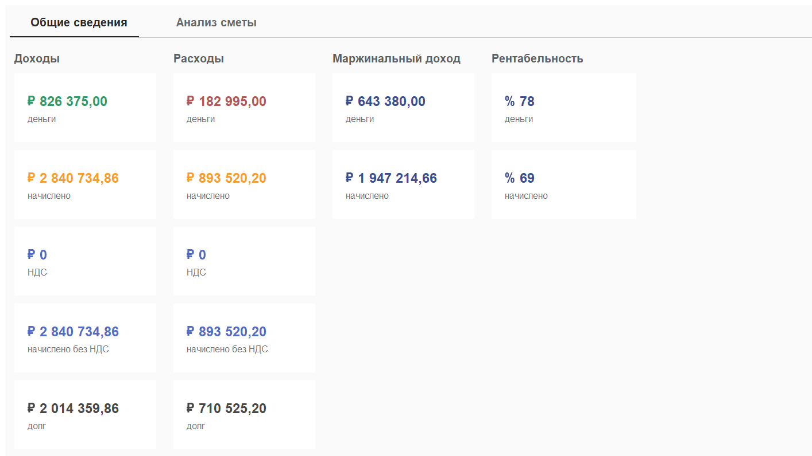
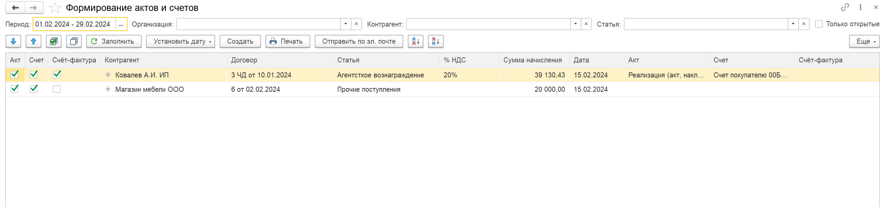

## **Фонды**

### **Новый функционал**

1. Добавлена возможность вести учет по фондам в разных режимах: «Деньги», «Начисления», «Начисления + деньги».

:::note 

**После обновления на новый релиз, если в системе уже используются фонды, то обязательно нужно указать режим в разделе «Настройки», блок «Деньги».**

:::

:::info 

[Ссылка на руководство по настройке и использованию фондов.](./../../p-l/fondy-2/_index)

:::

---

## Интеграция с BI системой (beta)

В модуле P&L для **1С:Предприятие** появился новый блок **BI**, который позволяет выгружать управленческие данные в систему бизнес-аналитики **Yandex DataLens** и строить интерактивные аналитические панели.

Этот инструмент расширяет возможности стандартной финансовой аналитики и позволяет по-новому работать с управленческой отчетностью.

Теперь данные из системы могут использоваться не только в отчетах внутри 1С, но и в полноценной BI-среде, где можно создавать дашборды, визуализации и аналитические панели для руководителей.

При этом в модуле уже подготовлен **набор готовых отчетов и аналитических дашбордов**, которые автоматически работают с данными управленческого учета. Пользователю не требуется самостоятельно настраивать BI-аналитику, система предоставляет **готовое рабочее место для руководителя и финансового директора**.

В этих панелях уже собраны ключевые показатели бизнеса: финансовые результаты, движение денежных средств, структура доходов и расходов, показатели проектов и другие управленческие метрики.

Кроме того, в системе предусмотрен **готовый шаблон для подготовки презентации финансовой отчетности**, который позволяет финансовому директору быстро сформировать наглядные материалы для управленческих встреч, совещаний или отчетности перед собственниками.

{width=2719px height=981px}

{width=1288px height=820px}

Если заинтересовались новый блоком, пожалуйста, свяжитесь с нами любым удобным способом!

---

## Платежный календарь

### Новый функционал

1. При создании платежного календаря тип платежа по умолчанию устанавливается как «Списание», раннее было «Поступление».

2. Для **УТ/КА/ERP** Добавлена возможность создания платежного календаря на основании  документа «**Приобретение товаров и услуг**»

3. Добавлено автоматическое создание записей платежного календаря при проведении следующих документов:

   1. Счет на оплату

   2. Счет на оплату поставщика

   3. Платежное поручение

   4. Реализация

   5. Поступление

      {width=1840px height=394px}

:::info 

[Ссылка на инструкцию, как настроить автоматическое создание записей платежного календаря](./../../p-l/platezhnyy-kalendar/avtomaticheskoe-platezhny-calendar)

:::

### Исправление ошибок

1. Доработан функционал по дашбордам.

   :::info 

   [Ссылка на инструкцию, как пользоваться дашбордами по платежному календарю](./../../p-l/platezhnyy-kalendar/dashbord)

   :::

2. Исправлена ошибка, когда при отмене проведения привязанной платежки, оставался признак **Оплачено**

3. В поле «Договор» добавлен отбор по организации

4. Улучшена скорость формирования отчета

5. Для **1С:Комплексная автоматизация/Управление торговлей/ERP** реализован корректный вывод остатков.

---

## Управленческие документы

#### Документ «Заявка на оплату»

1. Добавлена возможность прикрепить файлы к заявке

2. Добавлен вывод статуса оплаты и планируемой даты, если создан платежный календарь

#### Документ «Учет основных средств»

1. Добавлен график амортизации ОС. Теперь можно распределить амортизацию на разные проекты и доп аналитику.

:::info 

[Ссылка на обновленную инструкцию по учету основных средств с возможностью указания графика начисления по проектам и доп аналитике.](./../../p-l/new-article-3/uchet-osnovnykh-sredstv)

:::

#### Документ «Финансовый план БДДС»

1. Добавлена плашка с информацией о том, что расходные статьи необходимо писать со знаком минус

2. Добавлена команда, которая позволяет изменить знаки всех сумм в строке

#### **Документ «Кредиты и займы»**

1. Во вкладке «Погашение» добавлена команда «Загрузить график». Команда открывает форму загрузки графика платежей по данным из Excel. Пользователь в Excel копирует уже имеющуюся таблицу платежей, рассчитанную собственным способом, и далее вставляет в табличный документ на форме.

#### **Документ «Управленческая ведомость»**

1. Для **1С:Комплексная автоматизация/Управление торговлей/ERP** в документе «Управленческая ведомость» исправлена ошибка, возникающая при открытии документа.

2. Исправлен учет заработной платы для ситуаций, когда сумма в ведомости указана в рублях, а фактическая выплата сотруднику производится в валюте (например, в долларах или евро).

   **Как это работает теперь:**

   1. При выплате зарплаты через документ «Операция по кошельку» (созданный на основании «Управленческой ведомости») программа корректно отражает движение денег.

   2. Если валюта документа отличается от рублей, система автоматически рассчитывает и списывает курсовую разницу, возникшую при выплате.

   3. Эта разница относится на доходы (методом «Начисление») по специальной статье.

   **Что нужно настроить:**

   Статья для учета курсовой разницы указывается в разделе **«Настройки» -> блок «Деньги»**.

   [image:./reliz-1-46-0-8.png:::0,0,100,100::square,89.8148,0,7.7546,9.9476,,top-left&square,0.8102,30.541,34.2014,15.3578,,top-left&square,36.4005,85.1658,42.8241,14.8342,,top-left:1795px:595px:center]

3. Добавлена возможность закрыть взаиморасчеты с сотрудниками, прикрепив любой документ списания денежных средств

:::info 

[Ссылка на обновленную инструкцию, как пользоваться управленческой ведомостью по выплате](./../../p-l/new-article-3/upravlencheskaya-vedomost-po-vyplate)

:::

---

## Отчет «ОПиУ»

### Новый функционал

1. В варианте отчета План-Факт добавлено открытие документа планирования при расшифровке поля «План»

2. Во вкладке «**Контроль**» добавлена таблица по контролю дублирования начислений через денежные операции и накладные за указанный период, чтобы пользователь мог оперативно исправить данные и избежать искажений в отчётности. Сопоставляются движения по следующим реквизитам: статья, период, организация, контрагент, договор.

3. Группы для ОПиУ. В форме редактирования формулы группы статьи ОПиУ в показателях отображаются только группы, которые не являются формулами.

### Исправление ошибок

1. Исправлены ошибки расчета групп-формул

---

## Отчет ДДС

### Новый функционал

1. В варианте отчета +БДДС добавлено открытие документа планирования при расшифровке поля «План»

---

## Деньги

### Новый функционал

1. Выгрузка в «Нескучные финансы». Добавлены новые поля «Проект» и «Раздел проекта»

   {width=2571px height=372px}

2. В правом блоке добавлен вывод валюты кошелька.

   {width=472px height=186px}

3. Добавлен отбор по полю «Ответственный»

4. Добавлена настройка контроля остатков в кошельке.

:::info 

[Ссылка на инструкцию, как включить контроль по кошелькам](./../../p-l/dengi/koshelek/nastroyka-kontrolya-ostatkov-po-koshelkam)

:::

### Платежное поручение

1. В документ добавлена команда «Распределить»

2. Добавлено автоматическое распределение документа «Списание с расчетного счета» на основании ручного распределения платежного поручения. При этом списание полностью подтянет распределение ПП. Условия работы:

   1. Включена настройка «Деньги» - «Распределять на основании ПК»

   2. Платежное поручение распределено вручную

3. Добавлено автоматическое закрытие платежного календаря при проведении документа «Списание с расчетного счета», созданного на основании платежного поручения

:::info 

[Обновленная ссылка на автоматическое распределение на основании счетов и платежных поручений](./../../p-l/dengi/avtomaticheskie-raspredelenie-na-osnovanii-scheto)

:::

### Исправление ошибок

1. Для **1С:Бухгалтерия** **предприятия** в документе «**Поступление на расчетный счет**» исправлена ошибка формирования движений в валюте в некоторых случаях.

---

## Проекты

### Новый функционал

1. В проекты добавлен новый реквизит «Доп аналитика»

2. При выборе проекта в формах заполнения реквизитов P&L (в т.ч. Платежный календарь) добавлено автоматическое заполнение доп аналитики и раздела из проекта

3. Во вкладке Деньги добавлен вывод физического лица в поле «Контрагент»

4. Добавлены новые блоки, в которых выводится НДС проекта

   {width=1414px height=796px}

[image:./reliz-1-46-0-5.png:::0,0,100,100::square,1.6204,0,16.4931,3.5408,,top-left&square,27.1412,62.1245,31.4815,4.3991,,top-left&square,74.8843,3.5408,21.5278,53.4335,,top-left:1831px:988px:center]

---

## Документы

### Новый функционал

1. Для **1С:Бухгалтерия** **предприятия** в документе «Регламентная операция» с видом операции «**Переоценка валютных средств»**, если есть проводка Дт 91.02  Кт 60.21 добавлено изменение сумм в регистрах Доходы и Расходы и Взаиморасчеты

   1. Для Доходы и Расходы встанет статья из соответствия

   2. Для Взаиморасчеты встанут статьи из документа расчетов

2. Документ «Поступление (акты, накладные, УПД)». Добавлены движения по виду операции «Поступление основных средств»

3. Для **1С:Бухгалтерия** **предприятия** в документе «Регламентная операция» с видом операции «**Амортизация НМА и списание расходов по НИОКР**» добавлено формирование движений по расходам на суммы по проводкам Дт «20.01» и Кт «05.01».

4. Для **1С:Бухгалтерия предприятия** в документе «**Передача товаров**» с видом операции «**Безвозмездная передача**» добавлены реквизиты P&L и формирование движений в регистр «Расходы».

5. Для **1С:Управление нашей фирмой**  в документах «**Пересортица запасов**» и «**Оприходование запасов**» добавлены реквизиты P&L (дата принятия к управленческому учету, доп. аналитика, проект, раздел, статья)  и формирование движений в регистры «Доходы» и «Расходы».

6. Для **1С:Бухгалтерия** **предприятия** в документе «Отчет о розничных продажах» добавлены реквизиты статьи ДДС и статьи себестоимости в таблицу «Товары» и реквизит статьи ДДС в таблицу «Агентские услуги», для построчного заполнения статей при наличии нескольких номенклатурных позиций.

   Также в движениях реализовано автоматическое заполнение статей по параметрам, указанными в правилах соответствия номенклатуры и номенклатурных групп со статьями.

:::info 

[Обновленная ссылка на настройку соответствия параметров и статей](./../../p-l/nastroyki/nastroyki-p-l#соответствие-параметров-и-статей-ддс)

:::

---

### Автоправила ДДС / ОПиУ

1. Добавлено автоматическое распределение документа по автоправилам ДДС при проведении документов

2. Исправлена ошибка, когда в форме заполнения документов при указании отборов отключался отбор по периоду

---

### Ручное распределение. «Взаиморасчеты» и «Расходы будущих периодов»

1. В форме ручного распределения реализован функционал отражения в расходы будущих периодов

2. Теперь, если документ необходимо отразить в РБП необходимо явно это указать и указать дату взаиморасчетов

:::info 

[Обновленная ссылка на статью, как пользоваться ручным распределением.](./../../p-l/dokumenty/ruchnoe-raspredelenie-dokumentov)

:::

:::note Важное замечание!

В связи с изменением логики ведения учета по данных регистрам, рекомендуется воспользоваться обработкой Исправление движений «Расходы будущих периодов» и «Взаиморасчеты»

[image:./reliz-1-46-0-7.png:::0,0,100,100::square,50.2662,90.847,40,9.153,,top-left:1315px:732px:center]

:::

---

## **Договоры**

### Новый функционал

1. В набор колонок по договорам «Произвольный» добавлены следующие колонки: «номер договора», «статья», «доп. аналитика» и «проект».

2. **Формирование актов и счетов**

   В обработке по формированию актов и счетов в таблице добавлена возможность создавать счёт-фактуру на основании реализации (акта), если стоит отметка галочкой в нужной колонке.

{width=2590px height=607px}

---

### Взаиморасчеты (beta)

1. Добавлена дата взаиморасчетов.

2. Добавлена возможность свернуть правую часть по банковским остаткам.