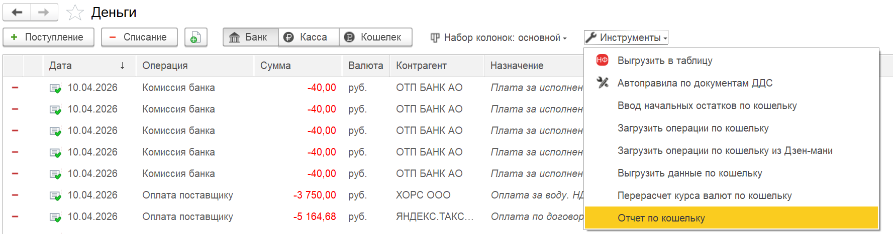
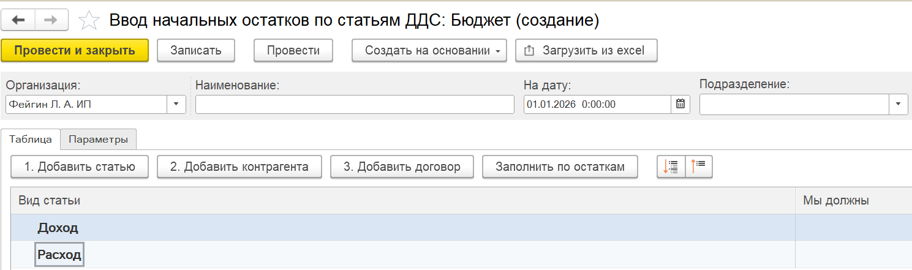
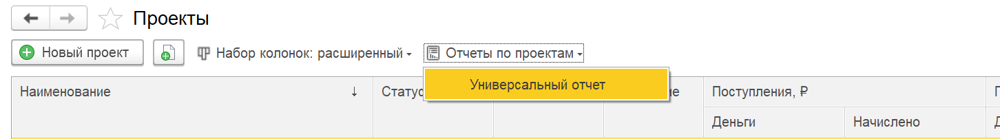

## **Автоправила ДДС**

### Новый функционал

1. Добавлена возможность создать сложное условие применения, как в правилах ОПиУ.

   **Если у вас уже были созданы правила, то нужно будет запустить обработку «Настройки - Технический - Действия - Первичное заполнение данных правил ДДС».**

2. Для кассовых документов реализована возможность распределения по БУ

3. В обработках по перезаполнению документов по автоправилам ДДС и ОПиУ добавлена возможность  проводить документ, даже если он в закрытом периоде.

   [image:./reliz-1-48-0-0.png:::0,0,100,100::square,59.0856,9.2652,23.3796,4.0469,,top-left&square,59.0856,29.9255,40.1042,28.115,,top-left:2596px:1411px:center]

## **Взаиморасчеты**

### Новый функционал

В отчете добавлены горизонтальные итоги для всех вариантов отчета.

## Отчет ОПиУ

### Новый функционал

1. В варианте отчета «P&L + Организации» добавлена колонка «**Итого**»

2. Добавлена проверка на одинаковое наименование для формулы при записи элемента справочников «Статьи движения денежных средств» и «Группы статей (P&L)».

3. Добавлена новая вкладка «**Операции**», которая представлять собой список всех операций за период, указанный в отчете.

### Исправление ошибок

1. Добавлена очистка НДС в статьях с методом «Договор». Работает, если в договоре указан НДС в сумме и он заполнен в строках «Распределение доходов» и/или «Распределение расходов»

2. Исправлена ошибка, когда в варианте отчета «P&L + Подразделения» при отборе по подразделению в иерархии некорректно считались данные в группировка.

## Отчет «Платежный календарь»

### Новый функционал

1. В разделе «Платежный календарь»  выбранный сохраняется произвольный набор колонок

### Исправление ошибок

1. Исправлена ошибка, когда не отображались пустые детализации отчета

2. В варианте отчета «Платежный календарь нарастающим итогом» исправлена ошибка, когда в некоторых случаях в ячейках отчета некорректно выводилась сумма долга

3. Исправлена ошибка, когда в некоторых случаях некорректно отображались остатки на счетах на начало и конец периода

## **Деньги**

### Новый функционал

1. Для **1С:Управление торговлей / КА / ERP** при ручном распределении документов «Поступление безналичных денежных средств» и «Списание безналичных денежных средств» в движениях в регистры «Движение денежных средств», «Расходы/Доходы» период заполняется датой проведения документа.

2. В документе «Операция по кошельку» добавлено заполнение «Проекта» и «»Раздела» в движениях в регистр «Движение по кассе».

3. В разделе «Денежные средства», блок «Инструменты» добавлен «**Отчет по кошельку**».

   {width=1777px height=468px}

### Исправление ошибок

1. При загрузке банковских выписок исправлена ошибка, когда не устанавливалось ручное распределение на основании «Платежного поручения».

## Документы

### Новый функционал

1. В документах, по которым формируются движения в регистры P&L, добавлена возможность «Исключить документ» и «Исключить тип документа» (команда «Еще»). После исключения и проведения документа, по документу останутся только стандартные движения.

2. В **незавершенное производство** добавлен новый документ «Авансовый отчет»

3. Для документов «Реализация» и «Отчет о розничных продажах» в заполнении себестоимости реализована работа с соответствием параметров и статьи ДДС.

4. Для **1С:Управление нашей фирмой**  в документах со статьей себестоимости добавлена очистка от НДС.

5. Для **1С:Управление торговлей** в документе «Реализация товаров и услуг» исправлено заполнение суммы и суммы НДС в движениях в регистр «Доходы», как с установленной галочкой «Цена включает НДС», так и без нее.

6. В **1С:Управление торговлей** в раздел «Бухгалтерские документы» (вкладка «Расходы») добавлен документ «Распределение РБП».

7. В **1С:Бухгалтерия** **предприятия** в регистре «Соответствие статей ДДС и подразделения» в блок «Если» добавлены новые параметры по способу отражения и по виду начисления для налогового учета по налогу на прибыль для подбора статей в документе «Отражение зарплаты в бухучете».

8. В **1С:Управление нашей фирмой** в документе «Начисление налогов» добавлено соответствие статей ДДС и счетов.

9. Для **1С:Управление нашей фирмой**  в раздел «Бухгалтерские документы» добавлен стандартный документ «Выплаты самозанятым». В документе  добавлены реквизиты P&L (дата принятия к управленческому учету, доп. аналитика, проект, раздел, статья) и формирование движений в регистр «Расходы».

10. Для **1С:Управление торговлей** в документе «Реализация товаров и услуг» исправлено заполнение суммы в валюте.

11. Для **1С:Бухгалтерия** **предприятия** в документе «Авансовый отчет» в таблицах «Товары», «Оплата», «Билеты» и «Прочее» добавлены реквизиты P&L (для заполнения построчно) и формирование движений по таблице «Оплата» (ранее не заполнялись).

12. Для **1С:Бухгалтерия** **предприятия** в документе «Начисление зарплаты» в таблицу по сотрудникам добавлены реквизиты P&L (доп.аналитика, проект и раздел). Заполнение реквизитов P&L из строки предусмотрено только для движений по суммам колонки «Начислено».

## Управленческие документы

### **Учет основных средств**

1. Добавлен отчет «Отчет по основным средствам» в разделе «Управленческие документы». Отчет выводит по группам ОС и основным средствам остатки на начало и конец периода, а также поступления и списания.

### Ввод начальных остатков

1. Для документа «Ввод начальных остатков» реализована загрузка данных из Excel.

   {width=1489px height=441px}

## **Проекты**

### Новый функционал

1. Для **1С:Бухгалтерия** **предприятия** при подборе номенклатуры из сметы добавлено отображение колонки «**Содержание**».

2. В отчетах по проекту формула расчета колонки «Отклонение» изменена на «Факт - План», а колонки «% отклонения» на «(Факт - План) / План \* 100».

3. В списке Документы на форме проектов добавлена возможность ручного распределения

   [image:./reliz-1-48-0-2.png:::0,0,100,100::square,42.5926,85.8911,23.8426,7.9208,,top-left:2110px:493px:center]

4. Добавлен «Универсальный отчет» в список проектов.

   {width=1452px height=202px}

## Отчет ДДС

### Новый функционал

1. Для конфигурации **1С:Управление торговлей / КА / ERP** в отчете добавлена возможность видеть остатки по счетам в иностранной валюте

2. Во вкладке «Операции» добавлены итоги и дополнительные отборы.

## Фонды

### Исправление ошибок

1. В документе «Распределение по фондам» исправлена ошибка при добавлении распределения в пустую строку условий