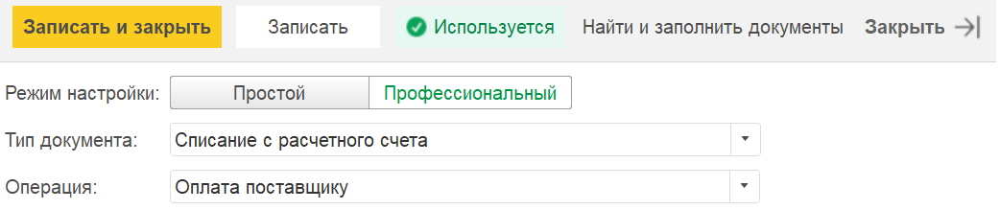
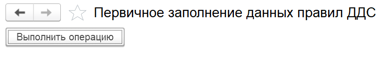
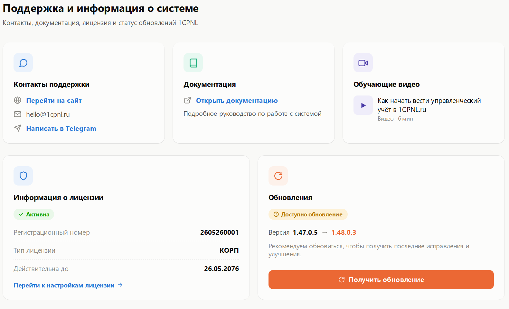
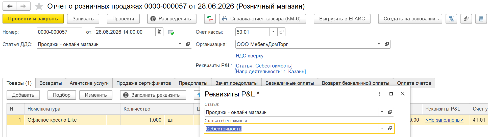
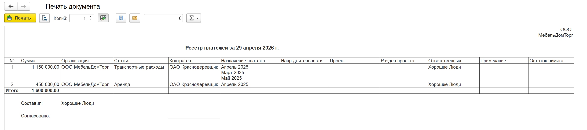
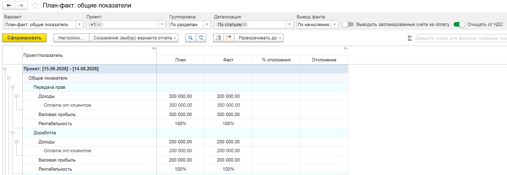
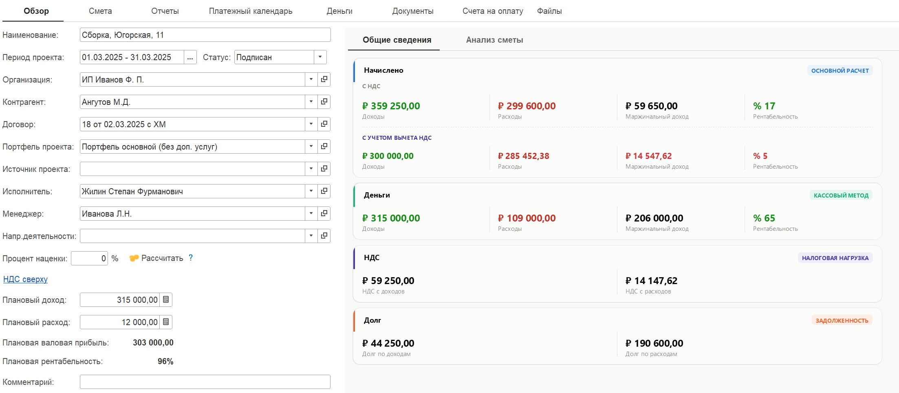
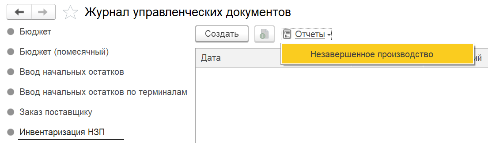
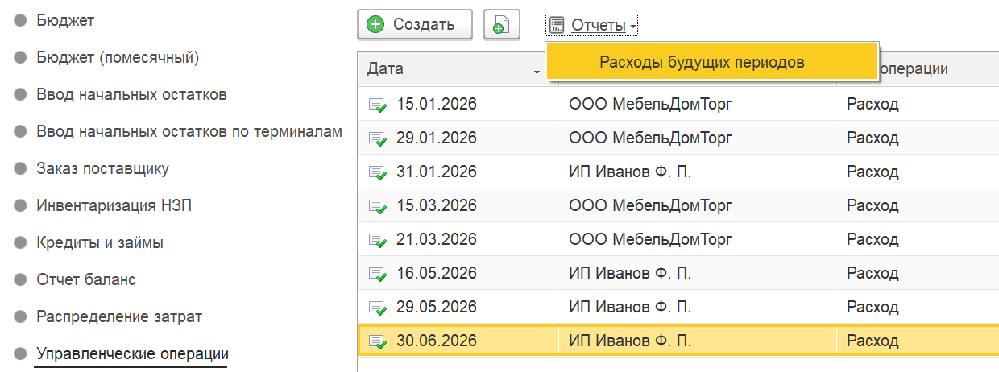

## Автоправила по ДДС

### Новый функционал

1. Появился новый режим «Профессиональный» для гибкого ведения условия по ДДС

{width=1042px height=219px}

:::danger ВАЖНЫЙ МОМЕНТ

Чтобы автоправила ДДС работали корректно, пожалуйста, обновите данные по всем правилам.

Для этого перейдите в соответствующий раздел. **Настройки -> Администрирование -> Действия -> Первичное заполнение данных правил ДДС**

[image:./reliz-1-49-0-13.png:::0,0,100,100::square,0.2888,3.9378,40.7139,6.8394,,top-left&square,43.6976,44.8705,11.165,3.2124,,top-left&square,43.5051,94.6114,28.6826,5.3886,,top-left:1489px:1383px:center]

В самой обработке нажмите на «**Выполнить операцию**»

{width=760px height=124px}

:::

### **Исправление ошибок**

1. Исправлен момент по автоправилам, связанные с валютным учетом комиссии банка.

## Поддержка

В рабочем столе продукта реализована новая вкладка **«Поддержка»**. Это единая точка входа, объединяющая все справочные, контактные и сервисные сервисы, связанные с сопровождением продукта.

При первом открытии форма автоматически подгружает актуальные данные о текущей версии системы и статусе лицензии. Интерфейс разделен на пять функциональных блоков, каждый из которых решает конкретную задачу пользователя:

-  **1\. Контакты поддержки**

-  **2\. Документация**

-  **3\. Обучающие видео**

-  **4\. Информация о лицензии**

-  **5\. Обновления системы**

{width=1581px height=961px}

## ОПиУ

### **Новый функционал**

1. Модернизирована вкладка «**Операции**» для легкой выгрузки всех операции по структуре ОПиУ в таблицу.

   {width=2785px height=813px}

## **Договоры**

### **Новый функционал**

1. В договоре, в «Сведения по P&L», вкладка «Параметры» добавлен реквизит «Раздел». Для **1С:Бухгалтерия** **предприятия** обеспечено заполнение реквизита раздела в документе при выборе договора. Также в обработке по массовому заполнению реквизитов и движений добавлена возможность указать раздел для заполнения.

   {width=1711px height=781px}

## Документы

### Новый функционал

1. Для **1С:Бухгалтерия** **предприятия** в подсистему добавлен документ «Корректировка реализации». Добавлены реквизиты P&L.

2. Для **1С:Бухгалтерия** **предприятия** модернизирована система **Соответствие параметров и статей ДДС**  - добавлены новые документы. Добавлены условия по видам документов.

   :::info 

   [Ссылка на руководство по настройке и использованию соответствия параметров и статей ДДС](./../../p-l/nastroyki/nastroyki-p-l/nastroyka-sootvetstviya-parametrov-i-statey-v-mod)

   :::

3. Для **1С:Бухгалтерия** **предприятия** для документа «**Отчет о розничных продажах**» появилась управленческая статья в реквизитах P&L. Если эта статья не заполнена, программа автоматически использует основную статью из документа.

   {width=1932px height=544px}

4. Для **1С:Бухгалтерия** **предприятия** для документа «**Перемещение товаров**» добавили реквизиты P&L

## **Взаиморасчеты**

### **Новый функционал**

1. В отчете добавлено выделение строк по статьям, которые отсутствуют в структуре отчета.

   {width=2785px height=1051px}

2. Реализован механизм исключения статей при формировании движений по взаиморасчетам.

   Для этого добавлен регистр «Исключение по статьям взаиморасчетов» в раздел «Настройки программы», блок «P&L», «Взаиморасчеты».

   В регистре можно указать статьи, по которым требуется исключить движения по взаиморасчетам при проведении документа.

   [image:./reliz-1-49-0-2.png:::0,0,100,100::square,44.8824,49.3902,40.5947,48.1707,,top-left:1446px:328px:center]

## Деньги

### **Исправление ошибок**

1. При проведении документа «Операция по кошельку» с валютным кошельком, созданному на основании документа «Управленческая ведомость»,  в движениях в регистр «Движение по кассе» сумма заполняется из документа-основания, а не в валюте.

## **Платежный календарь**

### **Новый функционал**

1. В документе «Реестр платежей» добавлен реквизит «Режим сбора». По умолчанию он заполнен значением «По дате реестра». Если режим сбора установлен «По периоду», то тогда рядом появляется  поле «Период» и подбор будет осуществляться уже за введенный период. Если значение «По дате реестра», то подбор осуществляется на дату реестра.

   {width=1501px height=189px}

2. В печатную форму Реестра платежа добавили дополнительные колонки «Проект», «Дополнительная аналитика» и «Контроль лимитов бюджета»

   {width=2508px height=559px}

## **Проекты**

### **Новый функционал**

1. В вариантах отчетов по проекту «Начисление + финансовый поток» и «План и финансовый поток» добавлен горизонтальный блок колонок по итогам.

   {width=2439px height=673px}

2. На вкладке «Незавершенное производство» выведена общая сумма остатков НЗП

   {width=2533px height=876px}

3. При двойном нажатии по строке НЗП теперь открывается документ-основание

4. В вариантах отчетов по проекту «Начисление + финансовый поток» и «План и финансовый поток» добавлен горизонтальный блок колонок по итогам.

   {width=2352px height=469px}

5. При установленном режиме проектов «Расширенный» в проекте во вкладке «Смета» по расходам добавлены колонки (% НДС, НДС и Всего). Данные колонки отображаются только если установлен вариант учета НДС «НДС в сумме» или «НДС сверху» на вкладке «Основное» в проекте.

   {width=2206px height=967px}

## **Управленческие документы**

### **Новый функционал**

1. В документе «Кредиты и займы» добавлен реквизит «Подразделение», он отображается, если настроен учет по подразделениям в программе.

2. **Незавершенное производство**

   В разделе «Управленческие документы», «Инвентаризация НЗП» в команды «Отчеты» добавлен «**Отчет по незавершенному производству**».

   {width=1105px height=327px}

3. **Расходы будущих периодов**

   В разделе «Управленческие документы», «Управленческие операции» в команды «Отчеты» добавлен отчет «**Расходы будущих периодов**».

   {width=1240px height=462px}

## **Отчет ДДС**

### **Новый функционал**

1. В отчете добавлена настройка «Выводить нарастающий итог» во вкладке «Отборы». При включенной настройке после строки «Общий денежный поток» выводится строка «Нарастающий итог», расчет которой производится путем последовательного суммирования показателей всех предшествующих периодов с начала установленного периода.

   {width=2533px height=892px}

2. Исправлена расшифровка сумм с учетом отбора по подразделению и с учетом варианта отчета «ДДС + Подразделения».