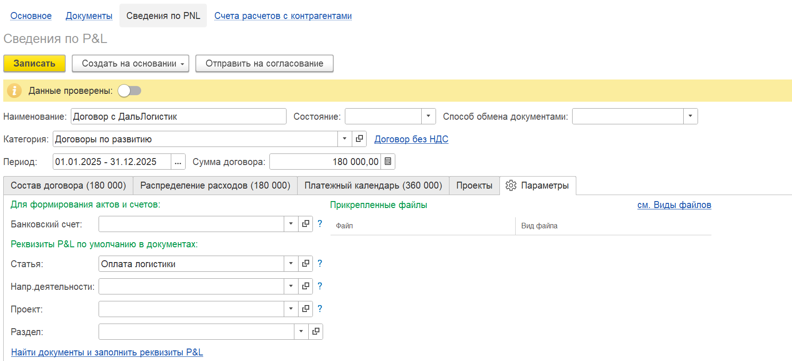
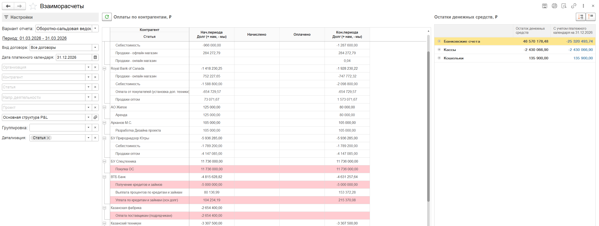
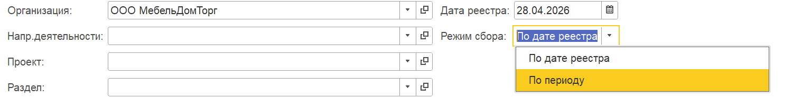
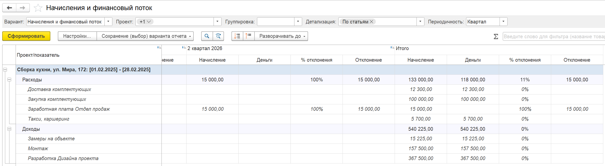
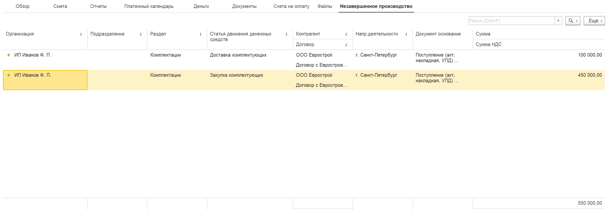
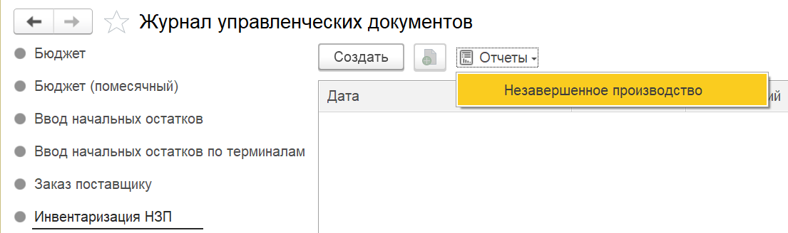
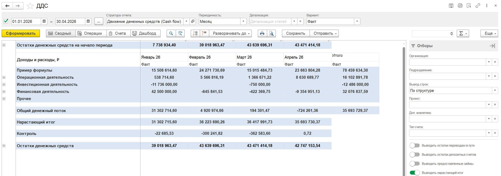

## **Договоры**

### **Новый функционал**

1. В договоре, в «Сведения по P&L», вкладка «Параметры» добавлен реквизит «Раздел». Для **1С:Бухгалтерия** **предприятия** обеспечено заполнение реквизита раздела в документе при выборе договора. Также в обработке по массовому заполнению реквизитов и движений добавлена возможность указать раздел для заполнения.

   {width=1711px height=781px}

## Документы

### Новый функционал

1. Для **1С:Бухгалтерия** **предприятия** в подсистему добавлен документ «Корректировка реализации». Добавлены реквизиты P&L.

## **Взаиморасчеты**

### **Новый функционал**

1. В отчете добавлено выделение строк по статьям, которые отсутствуют в структуре отчета.

   {width=2785px height=1051px}

2. Реализован механизм исключения статей при формировании движений по взаиморасчетам.

   Для этого добавлен регистр «Исключение по статьям взаиморасчетов» в раздел «Настройки программы», блок «P&L», «Взаиморасчеты».

   В регистре можно указать статьи, по которым требуется исключить движения по взаиморасчетам при проведении документа.

   [image:./reliz-1-49-0-2.png:::0,0,100,100::square,44.8824,49.3902,40.5947,48.1707,,top-left:1446px:328px:center]

## Деньги

### **Исправление ошибок**

1. При проведении документа «Операция по кошельку» с валютным кошельком, созданному на основании документа «Управленческая ведомость»,  в движениях в регистр «Движение по кассе» сумма заполняется из документа-основания, а не в валюте.

## **Платежный календарь**

### **Новый функционал**

1. В документе «Реестр платежей» добавлен реквизит «Режим сбора». По умолчанию он заполнен значением «По дате реестра». Если режим сбора установлен «По периоду», то тогда рядом появляется  поле «Период» и подбор будет осуществляться уже за введенный период. Если значение «По дате реестра», то подбор осуществляется на дату реестра.

   {width=1501px height=189px}

## **Проекты**

### **Новый функционал**

1. В вариантах отчетов по проекту «Начисление + финансовый поток» и «План и финансовый поток» добавлен горизонтальный блок колонок по итогам.

   {width=2439px height=673px}

2. На вкладке «Незавершенное производство» выведена общая сумма остатков НЗП

   {width=2533px height=876px}

3. При двойном нажатии по строке НЗП теперь открывается документ-основание

## **Управленческие документы**

### **Новый функционал**

1. В документе «Кредиты и займы» добавлен реквизит «Подразделение», он отображается, если настроен учет по подразделениям в программе.

## **Незавершенное производство**

### **Новый функционал**

1. В разделе «Управленческие документы», «Инвентаризация НЗП» в команды «Отчеты» добавлен «**Отчет по незавершенному производству**».

   {width=1105px height=328px}

## **Отчет ДДС**

### **Новый функционал**

1. В отчете добавлена настройка «Выводить нарастающий итог» во вкладке «Отборы». При включенной настройке после строки «Общий денежный поток» выводится строка «Нарастающий итог», расчет которой производится путем последовательного суммирования показателей всех предшествующих периодов с начала установленного периода.

   {width=2533px height=892px}

2. Исправлена расшифровка сумм с учетом отбора по подразделению и с учетом варианта отчета «ДДС + Подразделения».