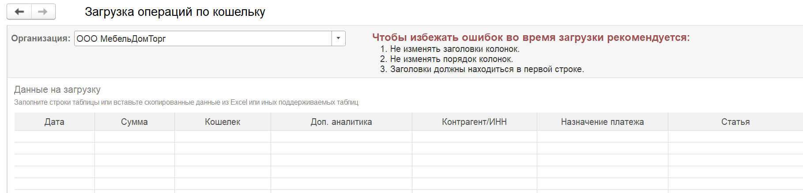

## ДДС

### Новый функционал

1. В отчете добавлен вариант отбора «Все кроме банка / кассы». Теперь есть возможность исключать не весь банковский блок, а еще и по определенным счетам. Позволяет исключить лишние 

   [image:./reliz-1-50-0-0.webp:::0,0,100,100::square,75,61.4826,24.3634,10.6105,,top-left&square,73.1481,72.2384,26.8519,24.1279,,top-left:1960px:780px:center]

   

## Управленческие операции

### Новый функционал

1. Управленческая операция. Добавлена загрузка управленческой операции из Excel

## Проекты

### Новый функционал

1. В распределении по номенклатуре добавлено поле поиска номенклатуры

## Автоправила по ДДС и ОПиУ

### Новый функционал

1. Добавлена очистка условий при изменении режима правила

2. Теперь помеченные на удаление правила не будут влиять на заполнение / распределение документов

## Деньги

### Новый функционал

1. Кошелек. При загрузке данных из Excel появилась возможность указать ИНН контрагента для поиска

   {width=1819px height=439px}

   

2. Исправлена ошибка, когда в некоторых случаях документ «Распределение расходов» нельзя было распровести

3. Исправлена ошибка, когда в документе Инвентаризация НЗП не отображались новые строки

## БП

1. В документе «Отчет о розничных продажах» добавлены движения по возвратам

2. В соответствие параметров и статей ДДС добавлен параметр «Содержание». Работает только для документов «Поступление товаров, услуг» и «Реализация товаров, услуг»

3. Для соответствия параметров и статей ДДС добавлена команда «Найти и заполнить документы»

## УНФ

## УТ / КА / ERP