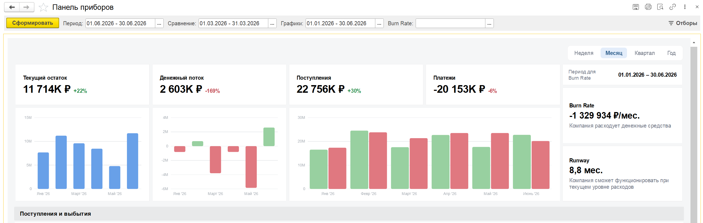
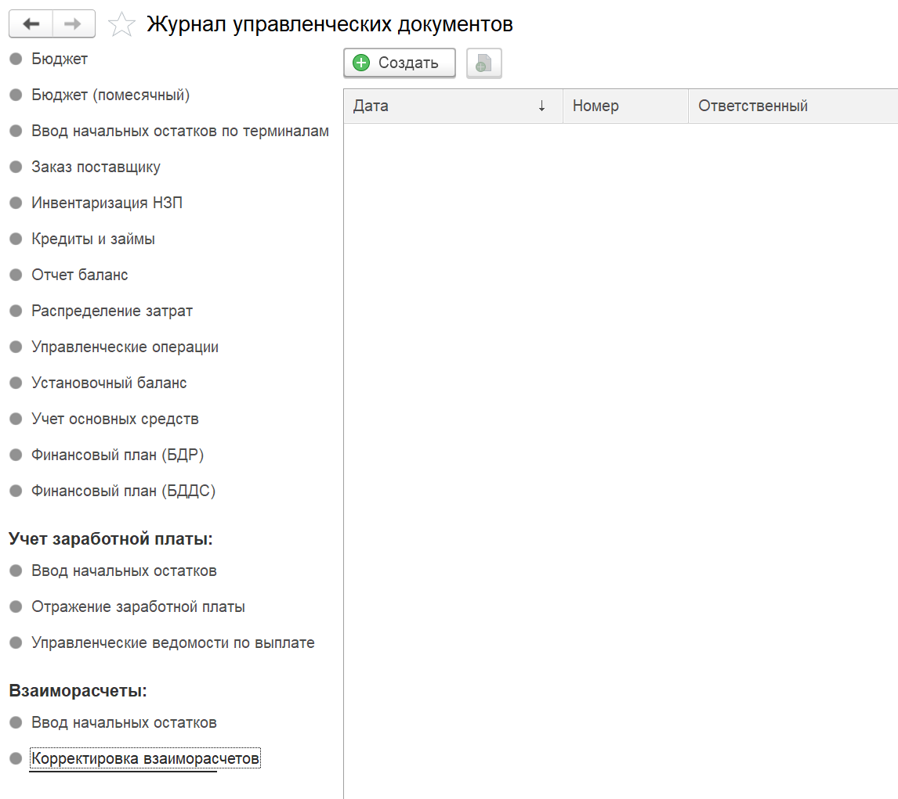
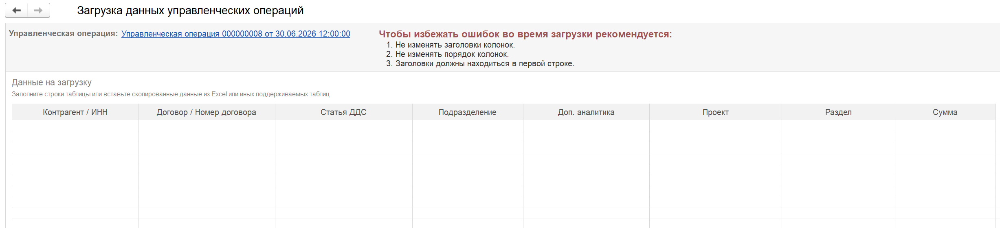
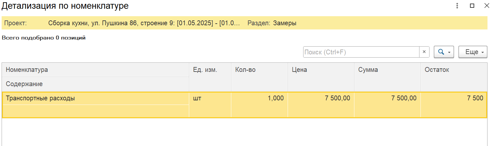
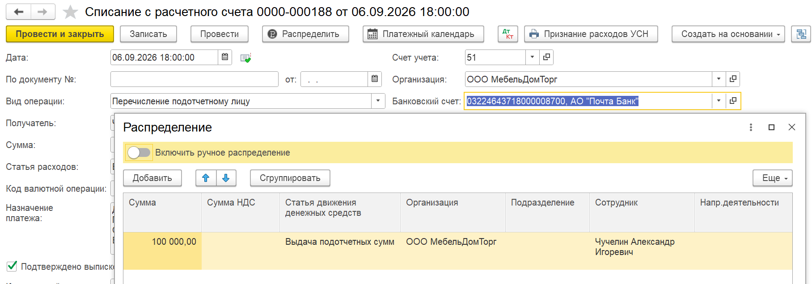

## Панель приборов. Деньги

Добавилась новая вкладка «Панель приборов», где собраны все данные по финансовым операциям в виде дашбордов.

{width=2581px height=820px}

## Новая система RLS

В модуль внедрена стандартная система ограничения доступа на уровне записей (RLS) по организации. Теперь вы можете разграничивать права пользователей не только по функциональным блокам, но и по конкретным организациям -- как в отчетах, так и в документах. Механизм настройки полностью идентичен штатному функционалу 1С, который используется при конфигурировании ролей доступа.

## ОПиУ

### Новый функционал

1. Внедрена система автоматического сопоставления статей РБП с соответствующими статьями расходов бухгалтерского учёта, что гарантирует достоверное формирование показателей в отчёте ОПиУ.

   :::info 

   [Ссылка на руководство по настройке и использованию](./../../p-l/dokumenty/dokumenty-dlya-bukhgalterii-predpriyatiya/raskhod-buduschikh-periodov-po-bukh-uchetu)

   :::

## ДДС

### Новый функционал

1. В отчете добавлен вариант отбора «Все кроме банка / кассы». Теперь есть возможность исключать не весь банковский блок, а еще и по определенным счетам. Позволяет исключить лишние

   [image:./reliz-1-50-0-0.webp:::0,0,100,100::square,75,61.4826,24.3634,10.6105,,top-left&square,73.1481,72.2384,26.8519,24.1279,,top-left:1960px:780px:center]

## Управленческие операции

### Новый функционал

1. В «Управленческие документы» добавлен документ «Корректировка взаиморасчетов» (добавлен внизу в блок "Взаиморасчеты").

   {width=1146px height=1021px}

2. В документах «Финансовый план (БДР)» и «Финансовый план (БДДС)» реквизит «Год планирования» теперь заполняется вариантами ближайших лет.

3. В документе «Финансовый план (БДР)» добавлена возможность указать «Проект».

4. Управленческая операция. Добавлена загрузка управленческой операции из Excel

[image:./reliz-1-50-0-2.webp:::0,0,100,100::square,38.4973,31.694,15.2926,16.9399,,top-left:1504px:366px:center]

{width=2455px height=561px}

## Проекты

### Новый функционал

1. В распределении по номенклатуре добавлено поле поиска номенклатуры

   {width=1522px height=451px}

## Автоправила по ДДС и ОПиУ

### Новый функционал

1. Добавлена очистка условий при изменении режима правила

2. Теперь помеченные на удаление правила не будут влиять на заполнение / распределение документов

## Деньги

### Новый функционал

1. Кошелек. При загрузке данных из Excel появилась возможность указать ИНН контрагента для поиска

   {width=1819px height=439px}

2. Исправлена ошибка, когда в некоторых случаях документ «Распределение расходов» нельзя было распровести

3. Исправлена ошибка, когда в документе Инвентаризация НЗП не отображались новые строки

## Документы

### Новый функционал

1. В форме ручного распределения документа добавлена команда «Сгруппировать».

   [image:./reliz-1-50-0-5.webp:::0,0,100,100::square,18.7173,23.2609,12.8927,11.9565,,top-left:1528px:460px:center]

2. В документе «Отчет о розничных продажах» добавлены движения по возвратам

3. В соответствие параметров и статей ДДС добавлен параметр «Содержание». Работает только для документов «Поступление товаров, услуг» и «Реализация товаров, услуг»

4. Для соответствия параметров и статей ДДС добавлена команда «Найти и заполнить документы»

   :::info 

   [Ссылка на руководство по настройке и использованию соответствия параметров и статей ДДС](./../../p-l/nastroyki/nastroyki-p-l/nastroyka-sootvetstviya-parametrov-i-statey-v-mod)

   :::

## **Платежный календарь**

### Новый функционал

1. При поиске плановых платежей теперь учитывается доп.аналитика, проект и раздел (если реквизиты заполнены в форме создания платежного календаря).

   :::info 

   [Логика работы с замещением в платежном календаре](./../../p-l/platezhnyy-kalendar/logika-raboty-s-zamescheniem-v-platezhnom-kalenda)

   :::

## **Учет по заработной плате**

### Новый функционал

1. **Для управленческого учета заработной платы.** Для **1С:Бухгалтерия** **предприятия**  в документе «Списание с расчетного счета», где указан один из следующих видов операций:

   -  Выдача займа работнику

   -  Выплаты самозанятым по реестру

   -  Перечисление подотчетному лицу

   -  Перечисление заработной платы по ведомостям

   -  Перечисление заработной платы работнику

   -  Перечисление по договорам ГПХ по ведомостям

   -  Перечисление сотруднику по договору ГПХ

   -  Перечисление депонированной заработной платы

   -  Перечисление дивидендов

   -  Перечисление по исполнительному листу работника

      И включен учет по **ЗП «По всему учету»**,  в ручном распределении появляется возможность сделать распределение по сотруднику.  Если сотрудник указан, то по такой строке распределения формируется движение в регистр «Взаиморасчеты с сотрудниками (P&L)».

      {width=1816px height=637px}

:::info 

[Подробно, как пользоваться управленческим учетом по заработной плате](./../../p-l/new-article-3/otrazhenie-zarabotnoy-platy/upravlencheskiy-uchet-zarabotnoy-platy)

:::