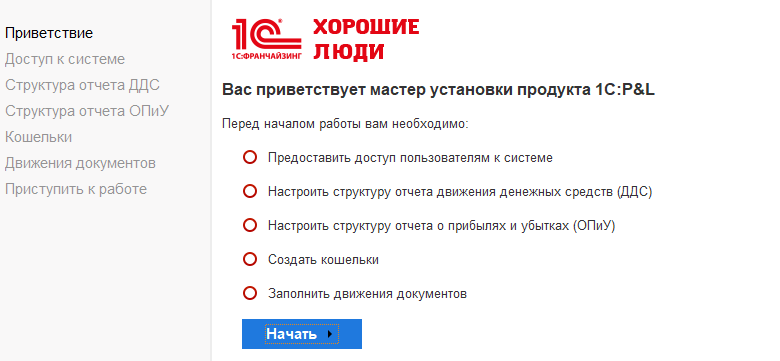
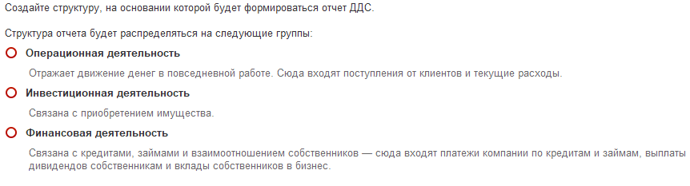

При первом запуске модуля активируется помощник для первичной настройки.

{width=780px height=361px}

#### Доступ к системе

Необходимо указать пользователей, которым будет доступен данный модуль. Доступ можно будет донастроить [позже](./../p-l/nastroyki/administrirovanie#роли-доступа-к-системе-p&l).

#### Структура отчета ДДС

Позволяет создать шаблон ДДС, чтобы было удобнее начать настройку структуры ДДС.

{width=862px height=233px}

#### Структура отчета ОПиУ

Позволяет создать шаблон ОПиУ, чтобы было удобнее начать настройку структуры ОПиУ.

#### Кошельки

Создает кошельки для дополнительных денежных операций. Ввести кошельки можно [позже](./../p-l/dengi/koshelek).

#### Движения документов

Первичное заполнение регистра движений для начального сбора отчетов.

