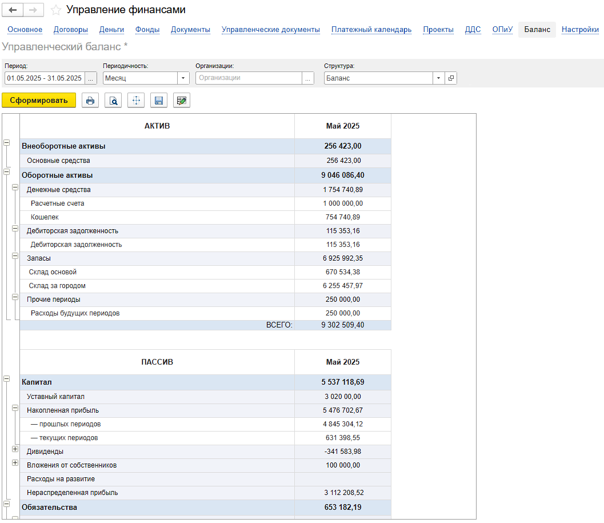

"Баланс" -- это мощный и **универсальный инструмент** для построения управленческого баланса в среде 1С, и дает вам **идеальный баланс между мощью и простотой.** Вы можете быстро получить стандартный отчет, используя готовые настройки, или легко адаптировать структуру, источники данных и детализацию под уникальные требования вашего бизнеса, создавая именно тот отчет, который вам нужен.

**Ключевые преимущества:**

1. **Гибкость источников данных:**

   -  Используйте **любые данные из вашей 1С** – модуль умеет работать с различными источниками информации внутри системы.

   -  **Расширяйте возможности:** При необходимости разработчик легко настроит сбор данных из нестандартных или дополнительных источников специально под ваши задачи.

2. **Быстрый старт с готовыми шаблонами:**

   -  Мы включили **предустановленные статьи (шаблоны)**, которые автоматически собирают данные из **ключевых источников 1С** (ОС, НМА, запасы, расчеты с контрагентами, капитал, кредиты и т.д.).

   -  Это позволяет **мгновенно сформировать стандартный баланс**, просто указав необходимые параметры (период, организацию) и уровень детализации по статьям.

3. **Интуитивное структурирование отчета:**

   -  Баланс представляется пользователю в виде **наглядного древовидного списка (дерева)**.

   -  Четкое разделение на **Активы** и **Пассивы**.

   -  **Логическая группировка:** Статьи объединяются в понятные группы (например, "Внеоборотные активы", "Оборотные активы", "Капитал и резервы", "Долгосрочные обязательства", "Краткосрочные обязательства").

   -  **Полный контроль над статьями:** Каждая конечная статья баланса содержит:

      -  **Код/Настройку источника данных:** Определяет, *откуда* именно брать информацию (например, конкретный счет, регистр, показатель).

      -  **Настраиваемое Наименование:** Как статья будет *отображаться* в готовом отчете (можно переименовать под свои нужды).

      -  **Отборы:** Возможность задать *дополнительные условия* для данных статьи (по подразделениям, проектам, контрагентам и т.д.).

      -  **Детализация:** Управление уровнем *углубления* информации в статье (например, детализация по субконто).

## Структура отчета

[image:./_index.png:::0,0,100,100::square,27.8049,0,28.2927,10.6931,,top-left&square,5.5285,9.1089,19.2683,6.7327,,top-left&square,0.5691,15.6436,24.3089,84.3564,,top-left&square,43.7398,15.4455,19.1057,84.5545,,top-left&square,71.2195,15.6436,11.3008,84.3564,,top-left&square,85.122,15.6436,13.252,84.3564,,top-left:1230px:505px]

1. Структура бюджета - пользователю необходимо указать структуру отчета ОПиУ, которая непосредственно влияет на автоматическое формирование критически важных показателей баланса, таких как: Дебиторская задолженность, Кредиторская задолженность, Текущая прибыль (Чистая прибыль периода), Накопленная прибыль (Нераспределенная прибыль)

2. Команды добавления логических групп и статей баланса

3. Структура отчета, по умолчанию отражены группы «Активы» и «Пассивы»

4. Заголовок. Любая статья может быть добавлена в структуру несколько раз с разными настройками (отборы, детализация). Для каждой "копии" статьи можно задать уникальное название, которое будет отображаться в отчете.

5. Отбор/Значение. У каждой статьи есть возможность указать дополнительные отборы. Пользователь может настроить каждую статью под себя. Доступные отборы настраиваются в самой статье.

6. Детализация. У каждой статьи есть возможность указать дополнительную доступную детализацию.

### Сформированный отчет

{width=1057px height=915px}