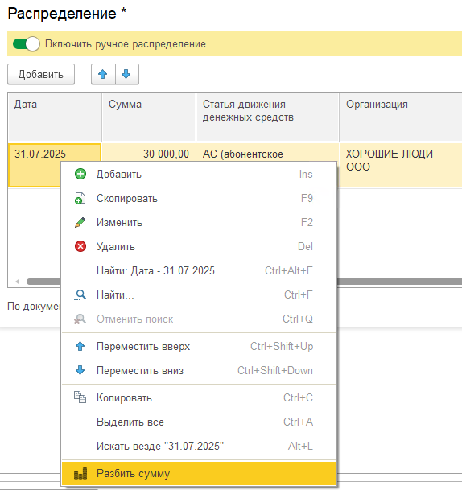
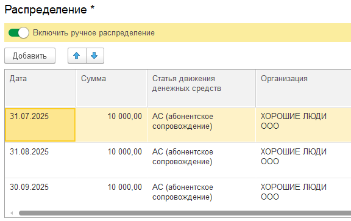
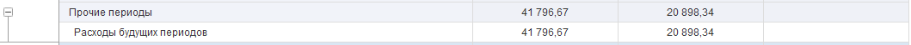

Это затраты, которые бизнес *уже оплатил* (деньги ушли), но экономическая выгода от них будет получена *позже*, в течение нескольких следующих периодов.

Если списать всю сумму сразу в месяц оплаты, это исказит финансовый результат (P&L). В месяце оплаты прибыль будет занижена (из-за большого единовременного расхода), а в следующие месяцы, когда услуга реально используется, расходов не будет видно, и прибыль будет завышена.

Чтобы избежать этих искажений и правильно отразить затраты в финансовых отчетах, в системе реализована возможность разбить такую сумму на части, соответствующие периодам получения пользы.

#### Типичные примеры для использования этого функционала:

-  Оплата подписки на ПО или сервис.

-  Оплата лицензии на длительный срок.

-  Крупные затраты на подготовительные работы, результаты которых будут использоваться долго.

## **Как использовать функционал**

Функционал активируется через ручные распределения.

##  

1. Откройте бухгалтерский расходный документ: откройте документ, который отражает вашу оплату (например, «Поступление товаров и услуг», «Расходный кассовый ордер», «Списание с расчетного счета» или аналогичный документ в вашей конфигурации 1С, связанный с затратами). Важно: функция доступна именно в документах, формирующих затраты.

2. Вызовите команду «Распределения».

   [image:./raskhody-buduschikh-periodov.png:::0,0,100,100::square,71.619,69.4915,27.0476,30.5085,,top-left:525px:118px]

   

3. Для удобства распределения можно использовать команду "Разбить сумму", которая находится в контекстном меню. После чего необходимо выбрать, на какое количество необходимо разбить сумму. После чего сумма разобьется на соответствующее количество строк. И уже автоматически заполнятся даты начисления.

   {width=574px height=609px}

{width=576px height=362px}

## **Как это работает в отчетах**

### **В отчете о прибылях и убытках:**

Каждый месяц в затраты (расходы) P&L попадает только та часть суммы, которая была списана в этом месяце.

Результат в P&L: Расход признается равномерно в течение всего срока полезного использования оплаченной услуги/актива.

-  Январь: Затраты = 10 000 руб.

-  Февраль: Затраты = 10 000 руб.

-  Март: Затраты = 10 000 руб.

-  ... и так далее

### **В Балансе (Бухгалтерский баланс / Управленческий баланс):**

В момент оплаты: вся сумма (например, 120 000 руб.) попадает в актив Баланса на счет (статью) "Расходы будущих периодов".

Каждый последующий месяц: Система автоматически списывает часть суммы (например, 10 000 руб.) из РБП.

Остаток по статье "Расходы будущих периодов" **уменьшается каждый месяц** на списанную часть.

-  *Конец Января:* Списано 10 000 руб. в затраты Января -> РБП = 110 000 руб.

-  *Конец Февраля:* Списано еще 10 000 руб. -> РБП = 100 000 руб.

-  *Конец Марта:* РБП = 90 000 руб.

-  ... и так далее, пока в *Конец Декабря:* РБП не станет = 0 руб.

{width=1059px height=54px}

