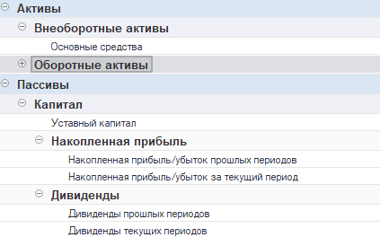

**Цель:** Сформировать первичный (базовый) баланс, отражающий активы и пассивы компании на основе данных системы 1С и начальных вводных остатков.

Баланс -- это собранный из статей отчёт, который показывает финансовое состояние компании. Структура баланса состоит из:

-  Активов (то, что у вас есть -- деньги, запасы, основные средства и т.д.)

-  Пассивов (то, за счёт чего это профинансировано -- капитал, обязательства, кредиты и т.д.)

Баланс в нашей системе -- это гибкий конструктор. Он не жёстко зашит в код, а настраивается прямо пользователем, без привлечения программистов. Ключевая особенность -- вы сами определяете, какие данные будут в отчёте, откуда они берутся и как группируются.

Внутри этих частей находятся логические группы (например, «Внеоборотные активы», «Денежные средства») и статьи -- источники данных.

Важный момент: статьи можно использовать готовые из библиотеки, а можно создавать свои с нуля.

Ключевые особенности:

-  Вы сами определяете структуру.

-  Источники данных могут быть любыми -- управленческие или бухгалтерские.

-  Любая статья может быть настроена «под задачу» -- от уровня детализации до уникальной логики расчёта.

-  Можно «разложить» любую сумму на составляющие прямо в отчёте.

:::tip:true Что такое статья баланса

Статья баланса -- это инструмент для сбора данных из 1С. Она умеет «доставать» из системы любые показатели -- из модуля P&L, из управленческих документов, из бухгалтерии, ERP, УТ и других конфигураций.

Каждая статья:

-  Выбирает источник данных (например, остатки по расчетным счетам, запасы, задолженность).

-  Определяет правила отбора (по организации, дате, группе объектов).

-  Выводит результат в баланс с нужной детализацией.

Гибкость статьи:

-  Можно использовать готовые, встроенные статьи (библиотека статей).

-  Можно создать свою, написав обработчик, который обращается к данным 1С.

-  Одну и ту же статью можно использовать несколько раз с разными отборами и названиями.

:::

### **Создание структуры базового баланса**

Для начала перейдите в структуру баланса. Если ее нет - создайте.

[image:./sbor-bazovogo-balansa.png:::0,0,100,100::square,64.4894,55.4745,33.0267,40.8759,,top-left:1087px:137px]

Нам с вами предстоит работать с отчетом, который имеет древовидную структуру. Главное разделение:

1. **Активы:** Ресурсы компании (чем она владеет).

2. **Пассивы:** Источники формирования ресурсов (собственный капитал и обязательства).

Внутри этих основных блоков создаются **логические группы** (например, "Внеоборотные активы", "Оборотные активы", "Капитал") и уже в них добавляются конкретные **статьи баланса** (например, "Основные средства", "Расчетные счета").

:::tip:true Как добавить статью в баланс:

Нажмите:

1. **"Добавить группу"** - для создания логической группы (например, "Долгосрочные обязательства")

2. **"Добавить статью"** - для выбора конкретной статьи из библиотеки

В появившемся списке выберите нужную статью:

-  Стандартные статьи P&L

-  Конфигурационно-специфичные статьи (для Бухгалтерии, УТ, УНФ и др.)

-  Пользовательские статьи (созданные ранее)

:::

### Заполнение базового баланса

[image:./sbor-bazovogo-balansa-2.png:::0,0,100,100::square,1.1396,46.6216,97.7208,34.4595,,top-left&square,32.4786,22.973,24.9288,25,,top-left:702px:148px]

1. Назовите ваш баланс и опишите структуру P&L. Эти данные нужны для дальнейшего сбора информации.

2. Чтобы создать базовый баланс, нажмите на команду «Заполнить базовый баланс»

{width=423px height=264px}

### Структура отчета баланса

| **Статья (и Логическая Группа)**      | **Источник данных**                                                                                                                             |
|---------------------------------------|-------------------------------------------------------------------------------------------------------------------------------------------------|
| **АКТИВЫ**                            |                                                                                                                                                 |
| **Внеоборотные активы**               |                                                                                                                                                 |
| Основные средства                     | [Документ "Учет основных средств" (Упр. доки -> Учет ОС)](./../new-article-3/uchet-osnovnykh-sredstv)                                           |
| **Оборотные активы**                  |                                                                                                                                                 |
| **Денежные средства:**                |                                                                                                                                                 |
| \- Расчетные счета                    | Остатки по банк. счетам и кассам из 1С (Бухг., УНФ, КА, УТ; из ДДС)                                                                             |
| \- Кошелек                            | Документ "Кошелек" (Вкладка Деньги -> Кошелек)                                                                                                  |
| Взаиморасчеты по дебиторской задолж.  | [Блок P&L "Взаиморасчеты" (см. отд. статью)](./vzaimoraschety-2)                                                                                |
| Запасы (Товары)                       | Остатки из системы 1С (УНФ, Бухг. предприятия, УТ)                                                                                              |
| **Займы**                             |                                                                                                                                                 |
| \- Займы                              | [Документ «Кредиты и займы» (Упр. доки -> "Кредиты и займы)](./../new-article-3/kredity-i-zaymy) |
| **Прочие периоды:**                   |                                                                                                                                                 |
| \- Расходы будущих периодов           | [Данные по РБП (см. отд. статью)](./raskhody-buduschikh-periodov)                                                                               |
| **ПАССИВЫ**                           |                                                                                                                                                 |
| **Капитал:**                          |                                                                                                                                                 |
| Уставный капитал                      | **Ручной ввод** (Задается в Установочном балансе)                                                                                               |
| **Накопленная прибыль:**              |                                                                                                                                                 |
| \- Прошлых периодов                   | Группа "Чистая прибыль" из Отчета P&L (до нач. тек. месяца)                                                                                     |
| \- Текущего периода                   | Группа "Чистая прибыль" из Отчета P&L (за тек. месяц)                                                                                           |
| **Дивиденды:**                        |                                                                                                                                                 |
| \- Прошлых периодов                   | Статья ДДС "Выплата дивидендов" (до нач. тек. месяца)                                                                                           |
| \- Текущего периода                   | Статья ДДС "Выплата дивидендов" (за тек. месяц)                                                                                                 |
| **Накопленная прибыль (Контрольная)** | **Расчет:** Активы - (Все Пассивы кроме этой статьи)                                                                                            |
| **Обязательства:**                    |                                                                                                                                                 |
| Взаиморасчеты по кредиторской задолж. | [Блок P&L "Взаиморасчеты" (см. отд. статью)](./vzaimoraschety-2)                                                                                |

### **Настраиваем статьи пассива**

Для того, чтобы корректно сформировался баланс, необходимо правильно настроить определенные статьи.

1. **Логическая группа: "Накопленная прибыль"**

   -  **Статья: "Накопленная прибыль (убыток) прошлых периодов"**

      -  **Источник данных:** Сальдо накопленной прибыли/убытка **до** начала текущего месяца.

      -  **Настройка:** В отборе этой статьи **необходимо указать** логическую группу "Чистая прибыль" из вашего Отчета о прибылях и убытках (P&L). Эта группа будет источником данных о прибыли/убытке за прошлые периоды.

   -  **Статья: "Накопленная прибыль (убыток) за текущий период"**

      -  **Источник данных:** Рассчитывается как прибыль/убыток за текущий месяц (также на основе указанной группы "Чистая прибыль" из P&L).

2. **Логическая группа: "Дивиденды"**

   -  **Статья: "Дивиденды прошлых периодов"**

      -  **Источник данных:** Сумма дивидендов, выплаченных **до** текущего месяца (накопительным итогом). Берутся из движений денежных средств.

      -  **Настройка:** В статье **необходимо указать** Статью Движения Денежных Средств (ДДС), которая соответствует выплате дивидендов.

   -  **Статья: "Дивиденды текущего периода"**

      -  **Источник данных:** Сумма дивидендов, выплаченных **в текущем** месяце.

      -  **Настройка:** Аналогично, указывается соответствующая Статья ДДС для выплаты дивидендов.

:::tip АКТИВ - ПАССИВ. Как сверить баланс?

**Для этого в нашей системе есть статья: "Накопленная прибыль" (Контрольная статья)**

-  **Назначение:** Это **расчетная** статья. Она показывает нераспределенную разницу между Активом и Пассивом.

-  **Расчет:** `Активы - (Все статьи Пассива КРОМЕ этой) = Накопленная прибыль`.

-  **Важно!** В идеально сбалансированном отчете эта статья должна быть **равна 0**. Если она не равна нулю, это сигнал, что:

   -  Не все статьи Пассива корректно настроены или заполнены (особенно начальные остатки).

   -  Прибыль/убыток прошлых периодов или дивиденды прошлых периодов заданы неверно.

   -  Есть ошибка в данных активов.

   -  **Ваша задача:** Анализировать расхождение и корректировать вводные данные или настройки статей, чтобы добиться нулевого значения здесь.

:::

### **Формируем отчет (предварительный просмотр)**

1. После того как вы настроили все необходимые статьи и группы в структуре баланса, перейдите в сам отчет "Баланс".

2. Укажите нужный **Период** (месяц), на который хотите сформировать отчет.

3. Нажмите кнопку **"Сформировать"**.

4. Система покажет вам баланс на выбранную дату на основе:

   -  Текущих остатков из 1С (ОС, деньги, запасы, взаиморасчеты).

   -  Данных из P&L (прибыль/убыток текущего периода).

   -  **НО:** Пока **без** начальных остатков по капиталу и прошлым периодам! Обратите внимание, что статьи вроде "Уставный капитал", "Накопленная прибыль прошлых периодов", "Дивиденды прошлых периодов" будут пустыми или некорректными. Также статья "Накопленная прибыль" (контрольная) будет показывать большое расхождение.

### **Создаем установочный баланс**

Чтобы баланс стал полным и начал работать корректно с первого месяца, **необходимо задать начальные (входящие) остатки** на определенные даты для статей, которые не формируются автоматически из текущих движений. Это делается через **"Установочный баланс"**.

1. Определите **Стартовую Дату:** С какого месяца вы начинаете вести управленческий учет баланса в этом модуле? (например, январь 2024).

2. В отчете "Баланс" найдите и нажмите кнопку **"Создать установочный баланс"** (или аналогичную команду).

3. В открывшейся форме установочного баланса:

   -  Укажите выбранную **Стартовую Дату** (месяц начала учета).

   -  Заполните **начальные остатки** для следующих критических статей:

      -  **"Уставный капитал"**: Введите сумму уставного капитала компании на *начало* стартового месяца.

      -  **"Накопленная прибыль (убыток) прошлых периодов"**: Введите сальдо накопленной прибыли/убытка на *начало* стартового месяца. *(Это прибыль/убыток, заработанный компанией до начала ведения учета в этом модуле)*.

      -  **"Дивиденды прошлых периодов"**: Введите общую сумму дивидендов, выплаченных *до* начала стартового месяца.

4. Сохраните установочный баланс.

### **Формируем корректный баланс**

1. Вернитесь в отчет "Баланс".

2. Убедитесь, что период установлен на **стартовый месяц** (или любой последующий).

3. Снова нажмите **"Сформировать"**.

4. Теперь система:

   -  Возьмет начальные остатки из Установочного баланса для "Уставного капитала", "Накопленной прибыли прошлых периодов", "Дивидендов прошлых периодов".

   -  Рассчитает "Накопленную прибыль (убыток) за текущий период" на основе P&L.

   -  Рассчитает "Дивиденды текущего периода" на основе ДДС.

   -  Посчитает **контрольную статью "Накопленная прибыль"**.

5. **Ключевая Проверка:** Посмотрите на значение статьи **"Накопленная прибыль" (контрольная)**. **В идеале оно должно быть равно 0.** Если это так – ваш баланс сошелся! Это означает, что все активы равны сумме капитала и обязательств.

6. Если значение **не равно 0**:

   -  **Перепроверьте** введенные данные в Установочном балансе (особенно "Накопленная прибыль прошлых периодов").

   -  Убедитесь, что в статьях "Накопленная прибыль (убыток) прошлых периодов" и "Накопленная прибыль (убыток) за текущий период" корректно указана ссылка на группу "Чистая прибыль" из P&L.

   -  Убедитесь, что в статьях "Дивиденды прошлых периодов" и "Дивиденды текущего периода" корректно указаны статьи ДДС.

   -  Проверьте, все ли необходимые статьи активов (особенно взаиморасчеты, запасы) настроены и заполняются данными.

   -  Постепенно корректируйте вводные данные или настройки статей, чтобы добиться нуля в контрольной статье.

:::tip Важные замечания

**Гибкость:** Помните, что структура баланса не догма. Вы можете:

-  Добавлять **свои собственные статьи** в Активы или Пассивы.

-  Добавлять **одну и ту же базовую статью** (например, "Взаиморасчеты") **несколько раз** с разными названиями и **разными отборами** (например, "Дебиторка по Клиентам А", "Дебиторка по Клиентам Б", "Кредиторка по Поставщикам").

**Детализация:** Практически для каждой статьи можно настроить уровень детализации (до группы, контрагента, счета, конкретного объекта), что очень полезно для анализа.

:::

Создание базового баланса – процесс последовательный: от понимания структуры и настройки статей до ключевого шага – ввода начальных остатков через Установочный баланс. Главный индикатор успеха – **сведение баланса (статья "Накопленная прибыль" = 0)**. Не пугайтесь, если сначала будет расхождение – это нормальный процесс отладки. Тщательная проверка вводных данных и настроек статей обязательно приведет вас к корректному балансу!