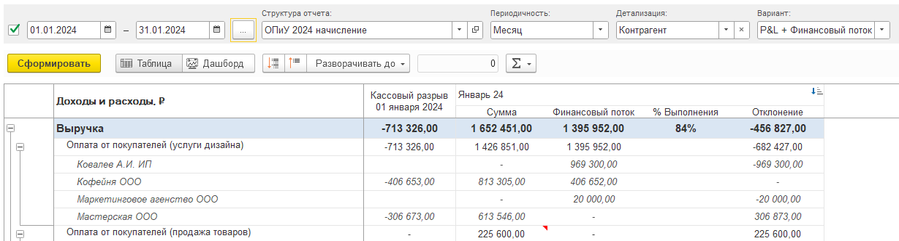

## **Что за функционал?**

В систему добавлен блок "Взаиморасчеты", который предназначен для детального учета управленческой дебиторской и кредиторской задолженности.

Он позволяет собирать и анализировать задолженность по самым разным разрезам (аспектам):

-  Статьи доходов/расходов

-  Контрагенты

-  Договоры

-  Проекты

-  И другие аналитики

### **Преимущества:**

-  Точная картина задолженности: Вы в любой момент времени на любую дату точно знаете, сколько вам должны (дебиторка) и сколько должны вы (кредиторка).

-  История операций: Видите все операции (движения), которые привели к текущему состоянию задолженности.

-  Интеграция с P&L и балансом: Данные этого модуля напрямую интегрируются в отчеты системы P&L и в управленческий баланс.

-  Принцип двойной записи: Все операции по задолженности автоматически отражаются в системе по принципу двойной записи, обеспечивая достоверность данных.

-  Актуальность в реальном времени: Как только в систему поступает новый документ (например, счет, акт, платежка), информация о дебиторской и кредиторской задолженности мгновенно обновляется.

## **Настройка**

Настройка происходит в несколько ключевых этапов:

### **Шаг 1: Установка "управленческого старта"**

1.  Откройте блок **"Настройки"**, блок P&L.

2.  Внутри настройки P&L найдите подраздел, называющийся **"Взаиморасчеты"**.

3. В этом блоке вам необходимо указать **"Дату начала учета по взаиморасчетам"**.

   -  **Что это?** Это дата, с которой система начнет полноценно вести учет дебиторской и кредиторской задолженности в новом модуле. Это ваш **"Управленческий старт"** для расчетов.

   -  **Как выбрать?** Обычно это:

      -  Первый день нового периода (месяца, квартала).

      -  Дата, на которую у вас есть полные и проверенные данные о задолженности.

   -  **Рекомендация:** Лучше всего установить ее **на начало периода** (например, 1-е число месяца), когда вы начинаете использовать функционал.

      [image:./vzaimoraschety-2.png:::0,0,100,100::square,88.6278,0,9.1165,8.172,,top-left&square,0.4699,63.6559,38.1579,12.9032,,top-left&square,40.8835,81.2903,36.3722,18.7097,,top-left:1064px:465px]

   

### **Шаг 2: Заполнение движений документов**

Чуть ниже в этом блоке есть инструмент «Заполнить движения». Необходимо указать дату, которая соответствует дате начала учета взаиморасчета, и нажать на кнопку «Заполнить движения»

[image:./vzaimoraschety.png:::0,0,100,100::square,0.4246,30.4762,36.0934,35.2381,,top-left&square,0,67.619,36.3057,32.381,,top-left:471px:105px]

### **Шаг 3: Заполнение начальных остатков**

На дату "Управленческого старта" (указанную в шаге 1) у вас уже есть дебиторская (вам должны) и кредиторская (вы должны) задолженность. Ее необходимо внести в систему вручную.

1. Откройте блок **"Управленческие документы"**.

2. Найдите и откройте специальный документ, который называется **"**Ввод начальных остатков**"**.

3. **Установите дату:** Убедитесь, что дата этого документа **совпадает** с "Датой начала учета по взаиморасчетам", которую вы указали в Шаге 1.

4. **Введите остатки:**

   -  **Дебиторская задолженность (Актив):** Внесите информацию о том, **кто должен вам** денежные средства на эту дату.

   -  **Кредиторская задолженность (Пассив):** Внесите информацию о том, **кому должны вы** денежные средства на эту дату.

5. При вводе **обязательно** укажите детализацию по каждому остатку:

   -  Проект (если применимо)

   -  Доп. аналитика

   -  Статья

   -  Контрагент

   -  Договор

   -  Сумма

[image:./vzaimoraschety-3.png:::0,0,100,100::square,65.0177,0,33.9223,21.0256,,top-left&square,0,68.2051,35.3357,18.4615,,top-left:566px:195px]

##  **Где отражаются данные из этого модуля?**

1. **В отчете** **P&L**. В варианте отчета «P&L + Финансовый поток» вы увидите **отклонение** между признанной выручкой/расходами (по методу начисления) и фактическим движением денежных средств.

   {width=1230px height=332px}

    

2. **В балансе:**

   1. **Активы:** Статья "Взаиморасчеты по дебиторской задолженности" (то, что должны вам).

   2. **Пассивы:** Статья "Взаиморасчеты по кредиторской задолженности" (то, что должны вы).

