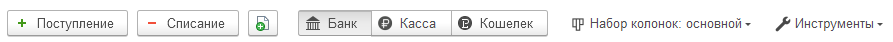

Блок со всеми финансовыми документами, отраженные в системе. Инструмент позволяет контролировать и вручную распределить суммы для корректного отображения в управленческих отчетах.

## Основной функционал

### Шапка

{width=893px height=42px}

1. Отборы:

-  Период

-  Состояние документа:

   -  *Вручную* - означает, что документ был отражен вручную;

   -  *Автоматически* - При проведении документа движения документа были сформированы автоматически. Если стандартные движения корректно отражают действительность, то их можно не исправлять. Однако, если есть сомнения, рекомендуется проверить и при необходимости скорректировать движения документа вручную.

   -  *Не распределено* - данный документ никак не будет отражен в отчетах.

   -  *Не отражено* - данный документ был отражен вручную, но статья, указанная в распределении, исключена из движений (статья отражена в “*Исключение движений по статьям*”)

-  Банковский счет, касса

-  Организация

-  Контрагент

1. Информационный блок - отражает по текущим отборам, как распределены документы

2. Если в списке отражен знак, значит:

-  Сумма, отраженная в управленческом учете не соответствует с суммой документа. Это может быть связано с тем, что суммы были некорректно распределены вручную.

-  Данный документ не распределен и никак не учитывается в управленческих отчетах.

-  Статья, указанная в документе, добавлена в Настройках “Исключение движений по статьям”, поэтому данный документ не будет отражен в учете.

1. Инструмент: ручное распределение каждого документа. \
   Для того, чтобы вручную распределить документ, необходимо нажать статус документа. По умолчанию он указан как “Автоматически”. После чего откроется форма распределения. Пользователь может в данной строке поменять параметры, либо раскидать данную сумму на несколько частей, указав разные параметры. После изменения и сохранения параметров, статус документа изменится на “Вручную”.\
   Если пользователь желает отменить правки, ему необходимо нажать на статус на “Вручную”, на форме убрать галочку “Включить ручное распределение” и нажать “Сохранить”. После чего в данном документе отразится статус “Не распределено”. Далее пользователю необходимо провести документ (В контекстном меню правой кнопкой мыши нажать Провести) и тогда отразится статус “Автоматически”.

2. Сейф\
   Дополнительный документ, необходимый для отражения дополнительных средств и операций, которые не были отражены в системе, но являются необходимыми для отражения в управленческих отчётах. Документ позволяет вносить информацию о таких средствах и операциях, а также связывать их с основными данными системы для обеспечения целостности информации.\
   **ПРЕИМУЩЕСТВО!** Данный документ не учитывается в стандартных бухгалтерских проводках.

   1. *Вид операции*\
      Гибкий справочник, необходимый для настройки движений документа.\
      Пользователю необходимо заполнить следующие параметры для корректного отражения движений документа:

-  Наименование

-  Вид: Доход, Расход

-  Тип:

   -  Прочие доходы расходы

   -  Взаиморасчеты с контрагентами

   -  Отражение заработной платы

\
*Касса* - используется для определения мест, где фактически хранятся и перемещаются деньги.