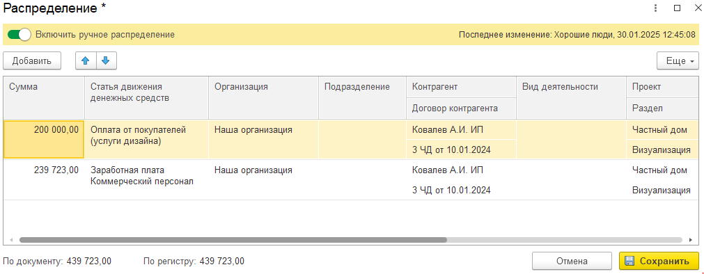

Блок со всеми финансовыми документами, отраженные в системе. Инструмент позволяет контролировать и вручную распределить суммы для корректного отображения в управленческих отчетах.

## Основной функционал

### Шапка

[image:./_index.png:::0,0,100,100::square,0.3359,14.2857,26.8757,80.9524,,top-left,&square,32.2508,14.2857,29.7872,78.5714,,top-left,&square,63.3819,7.1429,21.6125,88.0952,,top-left,&square,86.3382,7.1429,13.6618,85.7143,,top-left:893px:42px]

1. Команды создания документов. Документы создаются в соответствии от вкладки документов

2. Вкладки документов: Банк, Касса, [Кошелек](./koshelek);

3. Наборы колонок

4. Дополнительные инструменты: Выгрузка в Нескучные финансы, [Загрузить операции по кошельку](./koshelek#загрузить-операции-по-кошельку), [Настройки автозаполнения реквизитов](./nastroyki-avtozapolneniya-rekvizitov).

### Отборы

-  Период

-  Состояние документа:

   -  *Вручную* - означает, что документ был отражен вручную;

   -  *Автоматически* - При проведении документа движения документа были сформированы автоматически. Если стандартные движения корректно отражают действительность, то их можно не исправлять. Однако, если есть сомнения, рекомендуется проверить и при необходимости скорректировать движения документа вручную.

   -  *Не распределено* - данный документ никак не будет отражен в отчетах.

   -  *Не отражено* - данный документ был отражен вручную, но статья, указанная в распределении, исключена из движений (статья отражена в “*Исключение движений по статьям*”)

-  Банковский счет, касса

-  Организация

-  Контрагент

### Список

[image:./dengi.png:::0,0,100,100::square,21.8877,94.6532,54.1904,4.9133,,top-left,&square,2.2783,31.7919,3.0106,9.8266,,top-left,&square,87.5509,5.3468,11.7168,84.104,,top-left:1229px:692px]

1. Информационный блок - отражает по текущим отборам, как распределены документы

2. Если в списке отражен флажок, значит:

   -  Сумма, отраженная в управленческом учете не соответствует с суммой документа. Это может быть связано с тем, что суммы были некорректно распределены вручную.

   -  Данный документ не распределен и никак не учитывается в управленческих отчетах.

   -  Статья, указанная в документе, добавлена в Настройках “Исключение движений по статьям”, поэтому данный документ не будет отражен в учете.

3. Инструмент: ручное распределение каждого документа. \
   Для того, чтобы вручную распределить документ, необходимо нажать статус документа. По умолчанию он указан как “Автоматически”. После чего откроется форма распределения.

   Пользователь может в данной строке поменять параметры, либо раскидать данную сумму на несколько частей, указав разные параметры. После изменения и сохранения параметров, статус документа изменится на “Вручную”.

{width=1011px height=394px}

Если пользователь желает отменить правки, ему необходимо нажать на статус на “Вручную”, на форме убрать галочку “Включить ручное распределение” и нажать “Сохранить”. После чего в данном документе отразится статус “Не распределено”. Далее пользователю необходимо провести документ (В контекстном меню правой кнопкой мыши нажать Провести) и тогда отразится статус “Автоматически”.