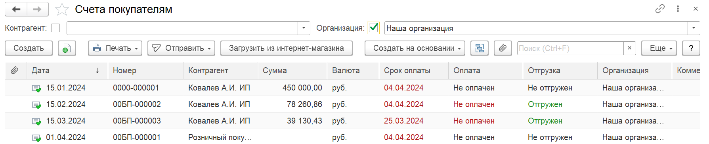
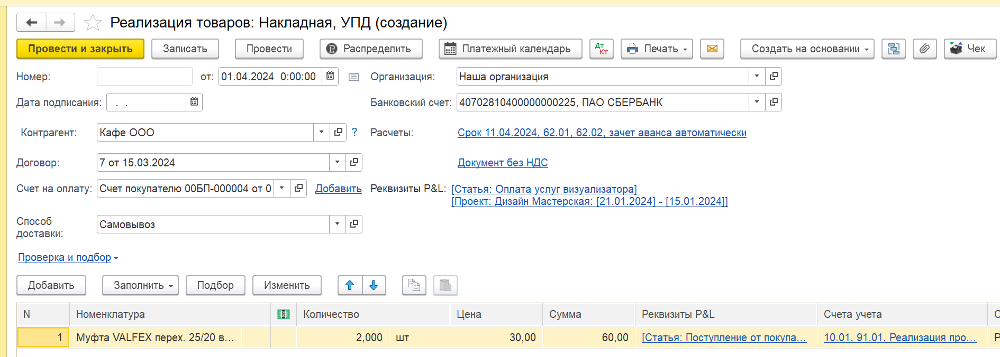

Для многих компаний счета от покупателей и счета от поставщиков являются точкой входа в учет. Эти документы фиксируют ключевые события -- отгрузку и оплату. На их основе формируются банковские выписки, акты и накладные.

{width=1789px height=366px}

Наш модуль **P&L для 1С:Предприятия** интегрируется в эту цепочку и автоматизирует перенос финансовой аналитики, избавляя от ручного дублирования данных.

## **Ключевые возможности:**

### **Расширение первичных документов:**

В документах **«Счет покупателю»** и **«Счет от поставщика»** добавлены специальные реквизиты P&L ( статья, проект, раздел проекта, доп аналитика):

-  Реквизиты доступны как в шапке, так и в табличной части.

-  Доступен инструмент ручного распределения

[image:./avtomaticheskie-raspredelenie-na-osnovanii-scheto-2.png:::0,0,100,100::square,45.544,53.9427,32.4074,11.2903,,top-left&square,65.0463,79.0323,27.0255,15.233,,top-left&square,26.9676,6.4516,10.0116,9.6774,,top-left:2146px:693px:center]

## **Автоматическое наследование аналитики:**

В настройках модуля пользователь может активировать опцию **«Распределять денежные операции на основании ПК»**.

[image:./avtomaticheskie-raspredelenie-na-osnovanii-scheto-3.png:::0,0,100,100::square,36.6898,81.3333,33.5069,18.5185,,top-left:1758px:687px:center]

**После этого при создании:**

В банковских выписках (поступление/списание), где в основании указан счет, и в документах реализации (акты, накладные) реквизиты P&L будут автоматически перенесены из исходного счета в соответствующий блок документа.

В случае банковских выписках, если в счете реквизиты P&L были указаны в табличной части или в блоке **ручном распределении**, то данные сохранятся в блоке «**Ручные распределения**»

[image:./avtomaticheskie-raspredelenie-na-osnovanii-scheto-4.png:::0,0,100,100::square,31.4236,5.787,12.2685,6.0185,,top-left:1813px:907px:center]

{width=1890px height=676px}

## **Результат:**

Исключается дублирующий ручной ввод. Данные о реквизитах P&L, единожды указанные в счете, автоматически проходят через всю цепочку документов, обеспечивая консистентность учета и значительно экономя время.