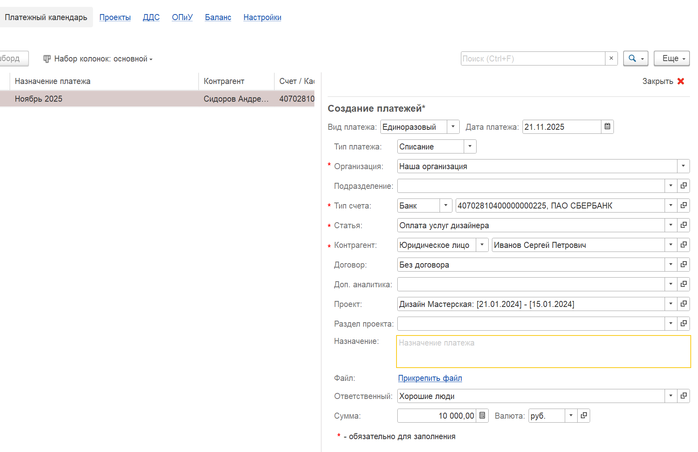
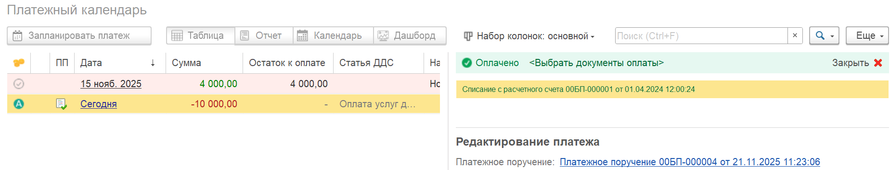

Этот процесс позволяет избежать двойного ручного ввода данных и обеспечивает согласованность информации между платежным календарем, банковскими выписками и данными для отчета о движении денежных средств.

#### **Цель процесса:**

Один раз ввести аналитику (статьи ДДС, проекты, этапы, доп. аналитику) в платежном календаре, чтобы они автоматически подставлялись в банковские операции и корректно отражались в управленческом и финансовом учете.

## **Шаг 1: Включение функционала автоматического распределения**

Прежде чем начать работу, необходимо активировать эту возможность в настройках системы.

1. Перейдите в раздел «Настройки»

2. Найдите блок настроек «Деньги»

3. В списке параметров найдите опцию:

   `«Распределять денежные операции на основании платежного календаря»`.

4. Поставьте галочку напротив этой опции.

:::quote 

Система теперь будет знать, что при проведении банковской выписки ей нужно искать связь с Платежным Календарем и автоматически подтягивать оттуда реквизиты.

:::

[image:./avtomaticheskoe-raspredelenie-na-osnove-platezhn.png:::0,0,100,100::square,40.8344,85.042,47.8508,14.7899,,top-left:1582px:595px:center]

## **Шаг 2: Создание и настройка записи в Платежном Календаре**

1. Создайте новую запись в платежном календаре.

2. Убедитесь, что выбран тип операции «списание».

3. Внимательно заполните все обязательные и необходимые для учета поля:

   -  Статья ДДС

   -  Проект

   -  Раздел проекта

   -  Доп. аналитика

:::quote 

**Важно!** Именно эти данные становятся основой для автоматического заполнения реквизитов в будущей денежной операции и для корректного отражения в отчете P&L.

:::

{width=1734px height=1125px}

## **Шаг 3: Создание платежного поручения на основе календаря**

Теперь нужно превратить план (запись в календаре) в реальный платежный документ.

1. В интерфейсе Платежного Календаря найдите созданную вами строку.

2. Кликните на ней правой кнопкой мыши.

3. В появившемся контекстном меню выберите действие «Создать платежное поручение».

4. Система автоматически создаст новый документ "Платежное поручение", куда уже будут перенесены основные реквизиты, создана связь с записью в Платежном Календаре.

:::quote 

**Результат:** Теперь у вас есть два связанных документа: запись в Платежном Календаре (с аналитикой) и Платежное Поручение (для отправки в банк).

:::

[image:./avtomaticheskoe-raspredelenie-na-osnove-platezhn-3.png:::0,0,100,100::square,50.5855,86.0789,31.0695,5.4524,,top-left:1281px:862px:center]

[image:./avtomaticheskoe-raspredelenie-na-osnove-platezhn-4.png:::0,0,100,100::square,18.2879,0,11.8677,97.8417,,top-left:514px:139px:center]

## **Шаг 4: Автоматическое распределение при проведении Банковской Выписки**

1. Загружаете или вводите Банковскую выписку в 1С.

2. Система видит в выписке операцию, соответствующую платежному поручению.

3. Система находит связь "Выписка -> Платежное Поручение -> Платежный Календарь".

4. В документе банковской выписки автоматически устанавливается галочка, подтверждающая, что операция распределена на основании Платежного Календаря.

5. В разделе ручного распределения все реквизиты уже заполнены автоматически.

   [image:./avtomaticheskoe-raspredelenie-na-osnove-platezhn-5.png:::0,0,100,100::square,0,95.3144,43.9665,4.5623,,top-left&square,47.8495,5.4254,17.0848,7.275,,top-left&square,33.871,5.9186,12.9032,7.1517,,top-left:1674px:811px:center]

{width=1849px height=355px}

## **Итог и Преимущества**

-  **Ликвидация двойного ввода:** Необходимо один раз ввести данные в платежном календаре, и они сквозным образом проходят через все документы.

-  **Скорость и эффективность:** Не нужно вручную разносить операции по статьям и реквизитам P&L.

-  **Точность данных:** Исключаются человеческие ошибки, которые возможны при повторном ручном вводе.

-  **Согласованность управленческого и бухгалтерского учета:** Данные в P&L-отчете точно соответствуют тому, что было запланировано в платежном календаре.

Таким образом, после настройки этого процесса система сама заботится о том, чтобы каждая платежная операция сразу получала правильную финансовую "метку", обеспечивая вам чистый и прозрачный управленческий учет.