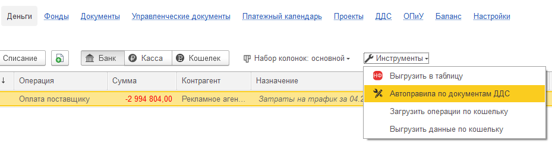

Представьте, что каждый день в вашу бухгалтерскую программу  поступают десятки или сотни банковских выписок и кассовых документов -- оплаты от клиентов, переводы поставщикам, выдача денег под отчет, снятие наличных и т.д. По каждому такому документу бухгалтеру или финансовому специалисту нужно вручную проставлять **статьи движения денежных средств (ДДС)**, а также другую аналитику: проект, этап проекта и направление деятельности.

**Проблема:** Это рутинная, однообразная работа, которая отнимает много времени и чревата ошибками. Например, все платежи одному и тому же контрагенту за "услуги связи" должны всегда проводиться по одной и той же статье ДДС.

**Решение:** **автоправила автораспределения ДДС** -- это механизм, который **автоматически** заполняет эти поля на основе заранее заданных условий.

## **Как эти правила используются? Подробный разбор.**

Давайте пройдем по всему жизненному циклу правила: от создания до применения.

### **Шаг 1: Создание и настройка правила**

Необходимо перейти в модуль **«Деньги»** -> внутри него найти вкладку **«Инструменты»** -> в инструментах найти блок **«Автоправила по документу ДДС»** и открыть его. Вы попадете в список всех существующих правил.

{width=929px height=242px}

**Создание нового правила:**

Нажмите кнопку **«Создать»**.

[image:./avtopravila-po-dokumentam-dds-2.png:::0,0,100,100::square,0,8.2258,85.2555,10.6452,,top-left&square,0,19.8387,100,14.6774,,top-left&square,0,37.7419,91.9708,60.9677,,top-left&square,40.146,0,17.9562,7.2581,,top-left&square,58.5401,0,28.9051,7.0968,,top-left:685px:620px:center]

#### **1\. Настройка параметров правила:**

1. **Тип документа:** Первое, что нужно выбрать -- к каким именно документам будет применяться правило.

   -  *Поступление на расчетный счет* (приход денег на счет)

   -  *Списание с расчетного счета* (расход денег со счета)

   -  *Приходный кассовый ордер* (приход денег в кассу)

   -  *Расходный кассовый ордер* (расход денег из кассы)

2. **Операция:** Это уточняющий справочник из самой бухгалтерии. Он помогает дополнительно классифицировать платеж.

:::tip 

*Примеры:* "Оплата по счету", "Снятие наличных в кассу", "Перечисление подотчетному лицу" и т.д.

:::

#### **2\. Блок «Если» (Условия):** Здесь вы задаете условия, при которых правило сработает.

Можно комбинировать условия, делая правило очень гибким.

:::tip Пример:

`Контрагент` `Равен` `ООО "Вектор"`

`Назначение платежа` `Содержит` `Оплата за маркетинговые услуги`

:::

#### **3\. Блок «Тогда» (Действия):** Что правило должно сделать, когда условия выполнены.

Здесь есть важное разделение:

1. Статьи ДДС по бухгалтерскому учету: Если вы укажете статью здесь, она изменится в самом бухгалтерском документе и проводках. Это влияет на регламентированный учет. Используйте осторожно и только если уверены в последствиях для бухгалтерии.

2. Статьи ДДС по управленческому учету (P&L): Это основной и самый безопасный способ.

   -  Указав статью здесь, вы не меняете бухгалтерские проводки. В самом документе все остается как было.

   -  Вместо этого, система помечает документ как "вручную распределенный" (хотя распределило правило) и подставляет нужную управленческую статью.

   -  Важный плюс: Здесь можно указать не одну, а несколько статей и разбить сумму платежа между ними в определенных пропорциях или процентах. Например, 70% суммы отнести на статью "Закупка материалов", а 30% -- на "Услуги логистики".

3. **Блок «Реквизиты P&L» (Дополнительная аналитика):** Помимо статьи, правило может автоматически заполнять и другие поля:

   -  **Проект**

   -  **Раздел** (Направление деятельности)

   -  **Доп. аналитика** (любая другая ваша аналитическая разбивка).

4. **Передавать реквизиты P&L из договора:**

   -  Если поставить эту галочку, система в первую очередь попытается взять значения для "Проекта" и "Раздела" из настроек договора с контрагентом. Если там ничего не задано, то подставятся значения из самого правила.

   -  Это позволяет централизованно настраивать аналитику для постоянных контрагентов.

#### **4\. Активация правила:**

-  После настройки обязательно поставьте галочку **«Используется»**, чтобы правило стало активным.

-  Сохраните правило.

#### 5\. Заполнить прошлые документы

Команда позволяет по всем этим условиям найти прошлые документы и распределить их  в соответствии с правилами.

### **Шаг 2: Применение правил на практике**

Теперь посмотрим, как эти правила работают в реальной жизни.

1. **Сценарий 1: При загрузке банковских выписок.**

   -  Вы загружаете выписку из банка-клиента в 1С.

   -  Открывается стандартная форма загрузки, и в ней появляется кнопка **«Распределить по правилам P&L»**.

   -  Нажимаете ее -- система пробегает по всем новым операциям в выписке и автоматически применяет к ним подходящие правила. Статьи и аналитика проставляются мгновенно.

      [image:./avtopravila-po-dokumentam-dds-3.png:::0,0,100,100::square,41.4612,62.7803,24.9315,24.6637,,top-left:1095px:223px:center]

2. **Сценарий 2: Ручной запуск для существующих документов.**

   -  Вы можете распределить документы "задним числом".

   -  Перейдите в список всех банковских и кассовых документов (вкладка **«Деньги»**).

   -  Выделите нужные документы (можно несколько), щелкните правой кнопкой мыши и в контекстном меню выберите команду **«Распределить по правилам P&L»**.

   -  Система применит правила к выбранным документам.

3. **Сценарий 3: Инструмент «Найти и заполнить документы».**

   -  Это мощный инструмент, доступный прямо в карточке самого правила.

   -  Он позволяет найти **все документы за любой период**, которые подходят под условия этого правила, но еще не были распределены, и сразу применить к ним правило. Отлично подходит для массового исправления или первоначальной настройки.

#### **Шаг 3: Как понять, что документ распределен автоматически?**

В общем списке банковских и кассовых документов появилась **дополнительная колонка** (крайняя справа), в которой отображается **иконка-инструмент**. Эта иконка -- визуальный сигнал о том, что статья в этом документе была проставлена **автоматически по правилу**, а не вручную.

---

### **Резюме и ключевые выгоды:**

-  **Автоматизация рутины:** Избавляет от необходимости постоянно вручную проставлять одни и те же статьи для типовых операций.

-  **Скорость:** Обработка пачки выписок занимает секунды.

-  **Точность и единообразие:** Исключает человеческий фактор. Все платежи одному контрагенту с одинаковым назначением всегда будут разноситься по одной и той же статье.

-  **Гибкость:** Можно создавать сложные условия и разбивать суммы по нескольким статьям и проектам.

-  **Сегрегация учетов:** Возможность настраивать правила отдельно для строгого бухгалтерского и для гибкого управленческого учета.

-  **Прозрачность:** Визуальное обозначение автоматически распределенных документов.

Таким образом, правила автораспределения ДДС -- это не просто "удобная фича", а **ключевой инструмент** для построения эффективной, быстрой и безошибочной системы финансового учета в компании.