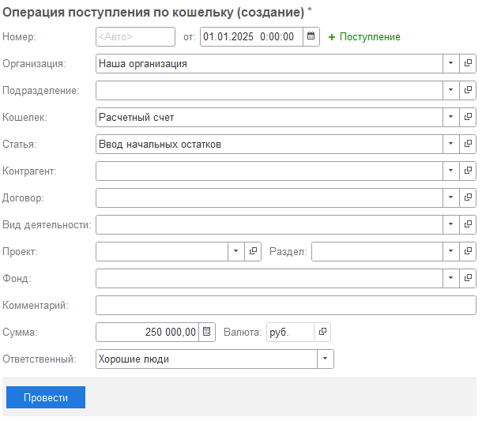
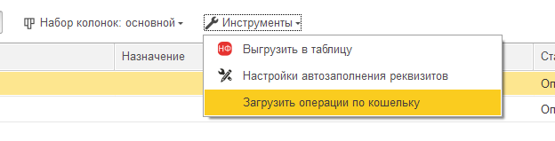
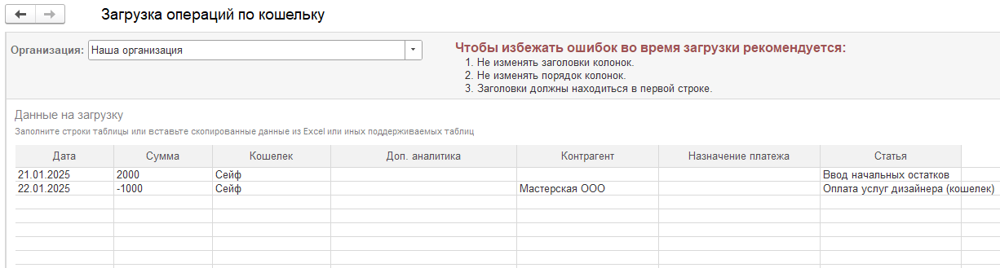

Позволяет учитывать деньги предпринимателя, которые не отражаются в банке или кассе. Данные операции будут отражаться в отчете ДДС.

### Ввод начальных остатков

Чтобы начать учет по кошельку, достаточно создать **Поступление**, указав соответствующую дату, с которой начнется учет по данному кошельку.

{width=610px height=533px}

### Загрузить операции по кошельку

Чтобы загружать операции из внешних файлов в систему, предусмотрен специальный инструмент.

1. Для этого необходимо зайти в **Инструменты** -> **Загрузить операции по кошельку**

   {width=624px height=159px}

2. В табличную часть достаточно вставить в соответствующие колонки данные и нажать **Далее**

   {width=1226px height=329px}

3. В следующем окне система покажет, каких элементов не найдено в системе и предложит их создать

   [image:./koshelek-4.png:::0,0,100,100::square,2.1396,36.9668,96.7342,12.7962,,top-left:888px:422px]

4. После того, как во всех строках будет указан статус **Ожидает загрузки** необходимо нажать **Загрузить**

5. После загрузки во всех строках будет установлен статус **Загружено.** Работа с инструментов завершена, [comment:t8Git]данные загружены.[/comment]

