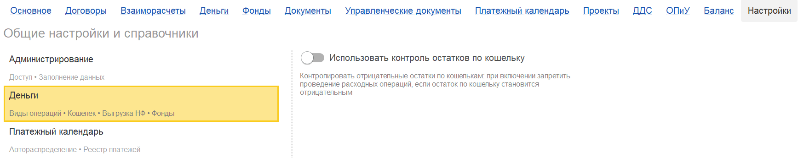

Включение функционала, запрещающего списание денежных средств (проведение документов) при отсутствии достаточного остатка на кошельке (в кассе/счете учета).

По умолчанию в системе **не предусмотрен** автоматический контроль отрицательных остатков. Это означает, что при проведении расходных документов баланс кошелька может уходить в минус. Данная инструкция описывает, как активировать блокировку таких операций.

### **Включить настройку**

1. Раздел **«Настройки»**,переходим в раздел **«Деньги»**.

2. Установите флажок  в поле **«Использовать контроль остатка по кошельку»**.

   {width=1735px height=345px}

### **Результат включения настройки**

После активации данной опции алгоритм работы системы изменится:

-  При попытке провести расходный документ по кошельку, сумма в котором превышает доступный остаток средств на кошельке, **программа заблокирует проведение**.

-  Система не даст оформить операцию, если денег на кошельке недостаточно для списания, предотвращая тем самым образование отрицательных остатков.