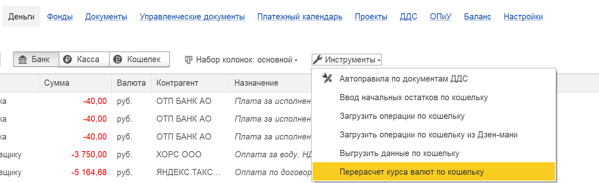
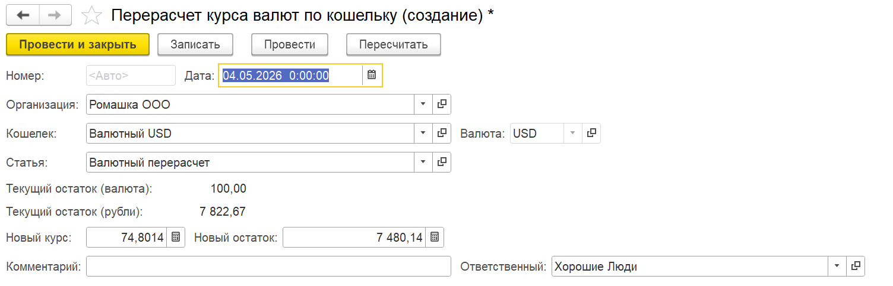

Документ предназначен для корректировки рублевых остатков по валютным кошелькам (счетам) в случае возникновения курсовых «хвостов» – когда остаток в валюте равен нулю, а в рублях остаются копейки, либо для принудительного пересчета рублевого эквивалента по заданному курсу.

Инструмент позволяет привести в порядок валютный учет, закрыть незначительные остатки и обеспечить соответствие рублевых сумм текущему валютному остатку.

 

Документ доступен в списке команд «Инструменты» раздела «Деньги».

{width=1441px height=442px}

{width=1504px height=484px}

Валютная разница будет показана в отчете о движении денежных средств (ДДС) по соответствующей статье.