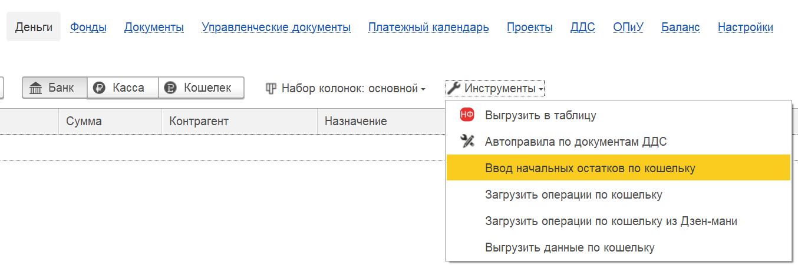

Для корректного старта ведения управленческого учёта необходимо правильно ввести начальные остатки денежных средств (по кошельку). Это обеспечит точность всех дальнейших финансовых данных.

#### **Шаг 1. Навигация по меню**

1. Перейдите в раздел **«Деньги»**.

2. Откройте меню **«Инструменты»**.

3. Выберите команду **«Ввод начальных остатков по кошельку»**.

{width=1354px height=451px}

#### **Шаг 2. Заполнение параметров**

В открывшемся окне необходимо указать следующие данные:

-  **Организация:** Выберите нужную организацию.

-  **Кошелёк:** Укажите конкретный кошелёк (или счёт), для которого вводятся остатки.

-  **Сумма:** Введите сумму начального остатка.

{width=1555px height=370px}

#### **Шаг 3. Выбор правильной даты (Важно!)**

Остатки вносятся **на начало ведения управленческого учёта**.

Если вы начинаете вести учёт **с января 2026 года**, лучше всего ввести остаток **на 31 декабря 2025 года**.

Такой подход гарантирует, что все последующие операции в январе и далее будут отражаться корректно, а начальный баланс будет верным.