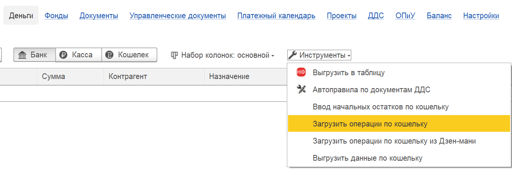
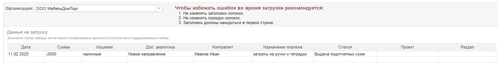
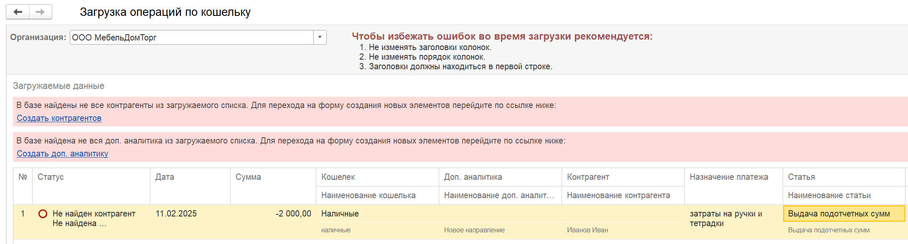
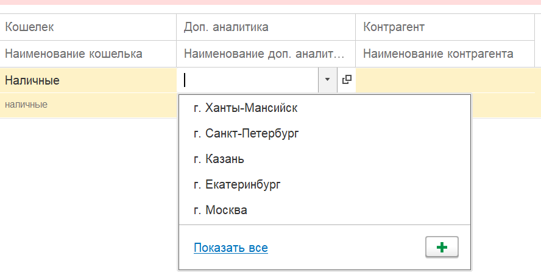
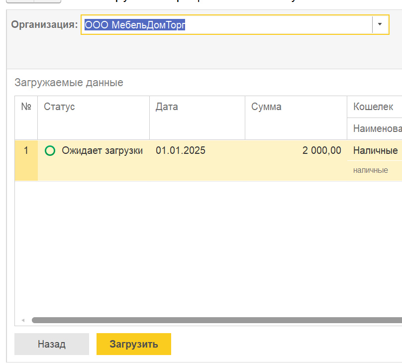

### **Навигация по меню**

1. Перейдите в раздел **«Деньги»**.

2. Откройте меню **«Инструменты»**.

3. Выберите команду **«Ввод начальных остатков по кошельку»**.

{width=1344px height=445px}

### **Подготовьте данные в Excel**

Данные должны быть расположены в колонках в следующем порядке (без заголовков):

-  **Дата** – в формате `ДД.ММ.ГГ` (например, `11.02.25`).

-  **Сумма** – для поступлений указывается со знаком «+» (или просто положительное число), для расходов – со знаком «–» (отрицательное число).

-  **Кошелёк** – наименование кошелька.

-  **Направление деятельности**.

-  **Контрагент**.

-  **Значение платежа** – текстовое описание.

-  **Статья**.

-  **Проект**.

-  **Раздел**.

### **Вставьте данные в таблицу системы**

Выделите и скопируйте подготовленные строки из Excel. В открывшемся окне загрузки вставьте их в появившуюся таблицу (обычно через `Ctrl+V`).

{width=2407px height=309px}

### **Запустите проверку**

Нажмите кнопку **«Далее»**. Откроется форма сопоставления данных, где система проверит, все ли значения есть в справочниках.

{width=2173px height=585px}

### **Обработайте ошибки и несоответствия**

После нажатия «Далее» система проверит вставленные данные. В верхней части формы появятся уведомления о значениях, которые отсутствуют в справочниках.

Для каждого такого поля вам предлагается два варианта действий:

1. **Создать новый элемент** – нажмите команду «**Создать**», чтобы добавить это значение в справочник.

2. **Заменить вручную** – выберите подходящее значение из существующих записей справочника.

*Подсказка:* Чтобы упростить выбор, под каждым полем отображается служебная информация:

-  **Ссылка сверху** указывает, к какому справочнику относится поле.

-  **Значение снизу** показывает исходные данные, которые были вставлены из Excel.

{width=888px height=457px}

Повторяйте эти действия, пока все уведомления не исчезнут. После этого можно переходить к загрузке данных. У всех строк должен быть статус «**Ожидает загрузки**»

### **Загрузите данные**

{width=808px height=729px}

После устранения всех ошибок  нажмите кнопку **«Загрузить»**. Операции будут добавлены в кошелёк.