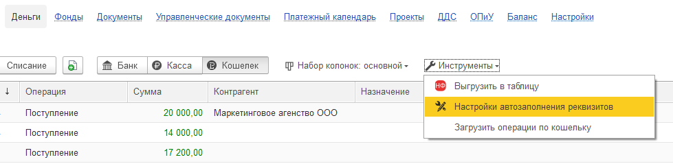
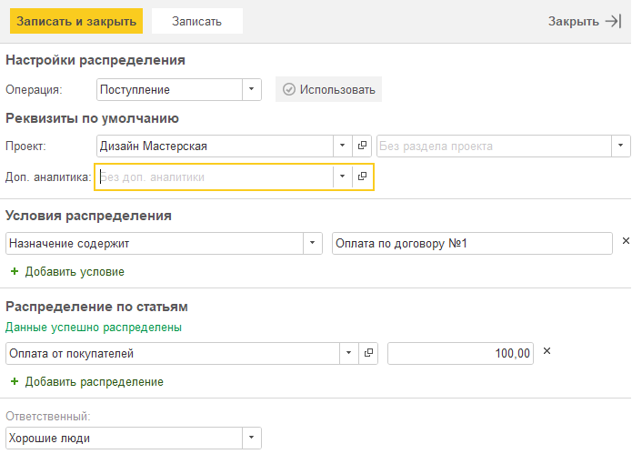

Инструмент, позволяющий настроить автоматическое заполнение реквизитов в момент загрузки банковских выписок

Чтобы перейти в данную настройку, необходимо зайти во вкладку **Деньги** -> **Инструменты** -> **Настройки автозаполнения реквизитов.**

{width=979px height=239px}

В открытом окне необходимо создать новое правило, указав все необходимые параметры для заполнения и записать настройки

{width=695px height=499px}

Чтобы новые правила начали действовать, их нужно активировать.

[image:./nastroyki-avtozapolneniya-rekvizitov-3.png:::0,0,100,100::square,0.3417,50.7246,4.328,39.1304,,top-left:878px:69px]

