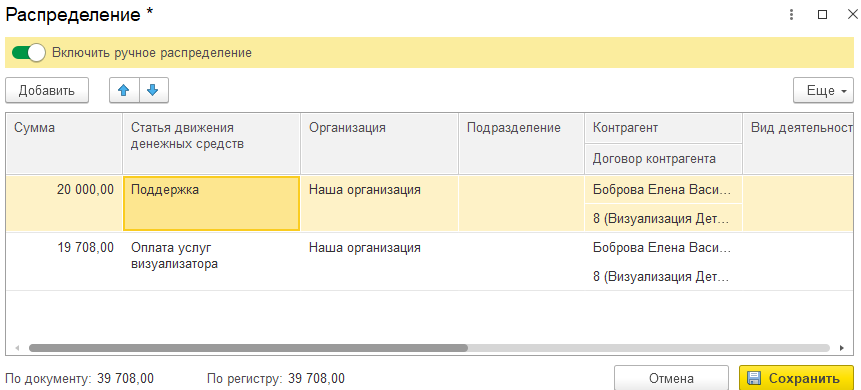

Проведенный денежный документ по умолчанию имеет статус **Автоматически** - значит, что данный для управленческого учета взяты из самого документа. В случае, если бухгалтерский учет не совпадает с управленческим, документ можно перераспределить.

Два способа перераспределить документ вручную:

### Ручное распределение в списке

В списке денежных документов можно нажать на **Автоматически** для открытия формы редактирования распределения

[image:./ruchnoe-raspredelenie-dokumentov.png:::0,0,100,100::square,54.6323,15.6923,15.0907,84,,top-left:1047px:325px]

Данный инструмент позволяет перераспределить сумму документа по нескольким строкам и распределить её на разные параметры.

{width=861px height=390px}

### Ручное распределение в документе

Данную форму распределения можно открыть в документе с помощью команды **Распределить**

[image:./ruchnoe-raspredelenie-dokumentov-3.png:::0,0,100,100::square,52.381,18.2857,20.4482,25.1429,,top-left:714px:175px]

