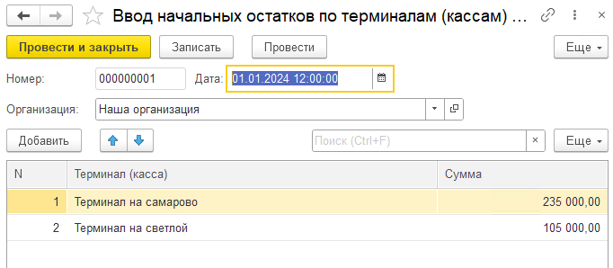

В конфигурации «**Бухгалтерия предприятия**» существует системное ограничение: учет денежных средств в кассе ведется обобщенно, в разрезе одной кассы на организацию.

Это приводит к следующим операционным проблемам для пользователей:

1. Невозможно отследить источник поступления денежных средств в кассу.

2. Нет возможности разделить операции по различным точкам инкассации, таким как:

   -  фискальные кассы (онлайн-кассы).

   -  Эквайринговые терминалы.

   -  Сейфы и другие места хранения наличности.

3. Вся выручка "сливается в одну кучу", что делает невозможным:

   -  Анализ операций по каждому отдельному терминалу или точке сбора денег.

   -  Контроль остатков денежных средств в разрезе каждого такого терминала/кассы.

:::info 

**Цель:**

Реализовать механизм детализированного учета движения наличных денежных средств по различным кассам (терминалам).

**Назначение:**

-  Предоставить пользователям возможность вести учет по нескольким кассам в рамках одной организации.

-  Обеспечить ввод начальных остатков, отражение операций и получение отчетности в разрезе каждой кассы (терминала).

-  Сделать функционал опциональным, чтобы компании, не нуждающиеся в таком детализированном учете, могли продолжать работать в стандартном режиме.

:::

Чтобы решить эту проблему, в систему P&L реализован модуль, который позволяет вести учет денежных средств по нескольким кассам (терминалам) в рамках одной организации.

### **Шаг 1: Включаем функционал**

Функционал сделан опциональным, то есть его можно включить или выключить в настройках. Это удобно: компании, которым не нужна такая детализация, продолжают работать как раньше, а тем, кому нужно, -- активируют его.

-  Заходим в **«Настройки»** системы.

-  Переходим в раздел **«Деньги»**.

-  Здесь мы видим новую подсистему -- **«Терминалы»**.

-  Чтобы начать ей пользоваться, нужно просто **поставить галочку** «Вести учет по терминалам (кассам)». Все, система готова к детализированному учету.

[image:./uchet-denezhnykh-sredstv-po-terminalam-kassam.png:::0,0,100,100::square,41.3127,31.9372,33.8803,63.3508,,top-left:1036px:191px:center]

### **Шаг 2: Создаем справочник терминалов**

Теперь нужно рассказать системе, какие именно точки сбора денег у нас есть.

-  Чуть ниже в тех же настройках находим ссылку **«Терминалы»**.

-  Открываем ее и создаем список всех наших касс, терминалов и точек хранения: «Онлайн-касса №1», «Терминал входа», «Сейф главного офиса» и т.д.

### **Шаг 3: Вводим начальные остатки**

На момент включения функционала в наших терминалах уже лежат какие-то деньги. Их нужно внести в систему, чтобы остатки сошлись.

-  Заходим в специальный документ для ввода **начальных остатков по терминалам (кассам)**.

-  Для каждого созданного терминала указываем дату, на которую вводим остаток, и сумму наличных, которые в нем находятся.

   {width=682px height=298px}

### **Шаг 4: Работаем с кассовыми документами**

Самое главное изменение происходит в повседневной работе с кассовыми документами.

-  В документах **Приходный кассовый ордер (ПКО)** и **Расходный кассовый ордер (РКО)**, в блоке реквизитов P&L документа появилось новое поле -- **«Терминал»**.

-  При оформлении каждого документа необходимо указывать, к какому именно терминалу (кассе) относится эта операция.

   [image:./uchet-denezhnykh-sredstv-po-terminalam-kassam-3.png:::0,0,100,100::square,55.2423,74.8571,28.8106,25.1429,,top-left:1135px:175px:center]

{width=521px height=128px}

### **Шаг 5: Получаем детальную отчетность**

Вся эта работа нужна для того, чтобы в итоге получить понятную и детальную картину. Главный отчет по движению денежных средств (ДДС) теперь стал гораздо информативнее. Теперь в отчете мы видим не просто общий остаток по кассе организации, а **развернутую картину по каждому терминалу**. Мы можем посмотреть:

-  Остатки на начало и конец периода в разрезе каждого терминала.

-  Все приходы и расходы, детализированные по этим точкам.

[image:./uchet-denezhnykh-sredstv-po-terminalam-kassam-5.png:::0,0,100,100::square,4.9467,52.6316,73.8118,21.8623,,top-left:1031px:494px:center]

