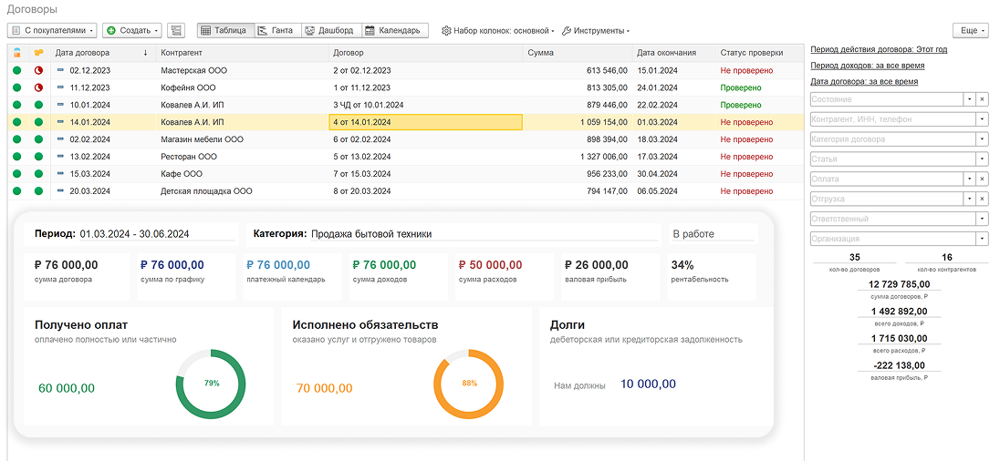
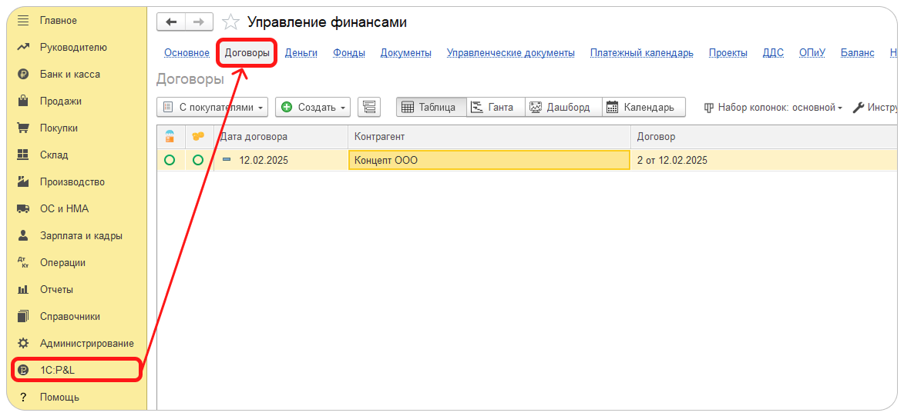

Раздел Договоры позволяет

-  Определять состав договора

-  Вести график платежей

-  Отслеживать статусы оплаты и отгрузки товаров и услуг

-  Следить за сроками исполнения обязательств

-  Планировать доходы и расходы по периодам

-  Автоматизировать процесс выставления актов и счетов

{width=1096px height=506px}

## Как определить состав договора

1. В карточке договора перейдите в раздел **Сведения по PNL**.

2. В поле **Период** установите период действия договора.

3. На вкладке Состав договора нажмите кнопку Добавить.

4. Заполните номенклатуру, при необходимости, расшифровку, а также статью ДДС.

5. Заполните количество и цену по номенклатуре. Сумма будет рассчитана автоматически.

6. Если договор с покупателем, то введите статью и цену себестоимости. Сумма будет рассчитана автоматически.

## Как заполнить график платежей

1. В карточке договора перейдите в раздел **Сведения по PNL**.

2. В нужной строке на вкладке **Состав договора** нажмите правой кнопкой мыши и нажмите на **Заполнить график**.

3. В открывшемся окне установите параметры распределения суммы по графику

   1. В поле **Период** установите период, на который требуется распределить сумму

   2. В поле **Статья** установите статью ДДС

   3. В поле **Оплата каждый** выберите периодичность графика платежей из возможных значений

      -  Месяц

      -  Квартал

      -  Год

   4. В поле **День выплаты** установите в день оплаты по графику

4. Нажмите на кнопку Заполнить.

:::info:true Как внести изменения в график

При необходимости можно внести уточнения в график платежей. Для этого перейдите на вкладку **График** и внесите необходимые изменения.

:::

:::tip Для автоматизации создания Актов и Счетов установите флажки на Счет и Акт

При заполнения графика платежей автоматически устанавливаются флажки на колонках **Счет** и **Акт**. По отмеченным строкам будет автоматизирован процесс выставления актов и счетов через инструмент [Формирование актов и счетов \[icon:external-link\]](./sozdanie-aktov-i-schetov).

:::

## Как распределить доходы и расходы договора

Модуль 1С:P&L расширяет возможности ведения учета по договорам, позволяя отслеживать статусы оплаты и отгрузки товаров и услуг, следить за сроками исполнения, планировать доходы и расходы, а также автоматизирует процесс выставление актов и счетов.

## Основные инструменты работы с договорами

### Список договоров

Список договоров отображает список всех доступных договоров, позволяет контролировать статусы проверки данных, состояния оплаты и отгрузки товаров и услуг.

**Договор**

содержит подробную информацию о товарах, услугах и условиях поставки

**Планирование**

доходов и расходов, периода выставления актов и счетов, поступлений и платежей

v0.1

Раздел Договоры -- это незаменимый инструмент для эффективного управления всеми аспектами договорных отношений. Система обеспечивает полную прозрачность и контроль над процессом заключения, исполнения и закрытия договоров, что в свою очередь позволяет оптимизировать финансовые потоки и ресурсы компании.

Система позволяет автоматизировать процесс [создания актов и счетов](<app://obsidian.md/2. Создание актов и счетов>) и уведомлять контрагентов по электронной почте. Мониторинг договоров осуществляется с помощью привлекательных дашбордов и диаграммы Ганта, что делает процесс более наглядным и удобным.

Переход в раздел Договоры производится через переход по команде Договоры основной формы Управление финансами. При переходе по умолчанию отображается [список договоров](<app://obsidian.md/1. Список договоров>).

{width=1173px height=541px}

### Основные функции раздела Договоры:

Раздел Договоры предлагает широкий спектр возможностей, которые помогут эффективно управлять договорными отношениями и принимать обоснованные решения, а именно:

1. Отображение [списка договоров](./spisok-dogovorov) с ключевыми показателями

2. Возможность настройки фильтров по ключевым показателям для более точного анализа состава и состояния договоров

3. Контроль статусов проверки данных, оплаты и отгрузки товаров и услуг

4. Назначение ответственных лиц и менеджеров

5. Контроль сроков исполнения договоров с помощью диаграммы Ганта

6. Распределение \[\[4. Распределение плановых доходов|плановых доходов\]\] и \[\[5. Распределение плановых расходов|плановых расходов\]\], а также контроль рентабельности договоров

7. Проведение план-фактного анализа доходов и расходов

8. Планирование платежей с помощью Платежного календаря

9. Автоматизация процесса выставления актов и счетов

10. Формирование шаблонов файлов по категориям договоров

