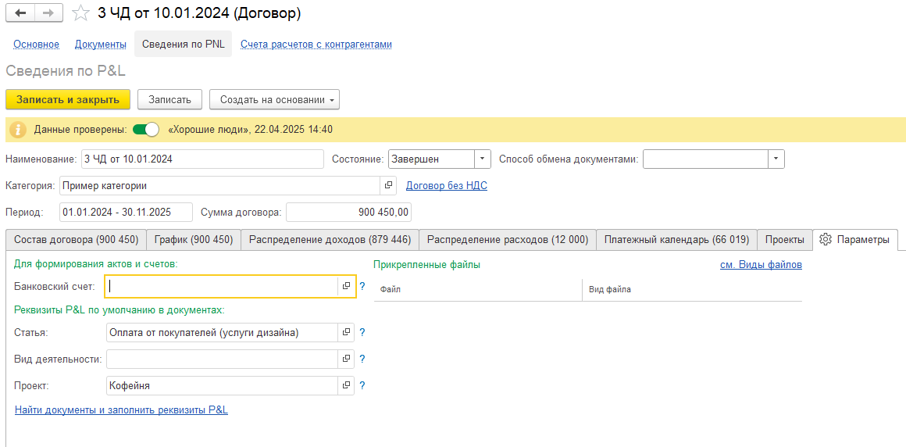

Чтобы упростить ручной ввод информации:

1. В карточке **Договора** перейдите на вкладку **«Сведения по P&L» --> Параметры**.

   {width=1160px height=572px}

   

2. Укажите:\
    • Статью по умолчанию;\
    • Проект;\
    •  Доп. аналитику.

   

   Теперь данные значения будут подставляться в новые документы автоматически.

   

3. Используйте кнопку **«Найти документы и заполнить реквизиты P&L»** -- это массово обновит все документы, связанные с этим договором по этим новым параметрам.

