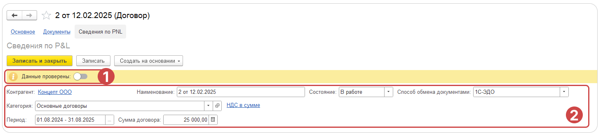

Список договоров позволяет:

1. Отображать список всех доступных договоров.

2. Создавать новые договоры по шаблонам.

3. Контролировать сроки и состояния оплаты и отгрузки товаров и услуг.

4. Контролировать сроки исполнения договоров.

[image:./spisok-dogovorov-2.png:::0,0,100,100:100::4377px:1728px]

## Как отобразить список договоров

Список договоров в модуле 1С: P&L можно открыть нажав на раздел **Договоры.** По умолчанию отображаются договоры С Покупателями и указан период действия договора - этот год. Чтобы отобразить иные виды договоров:

1. Нажмите на соответствующий отбор в шапке формы

2. Из выпадающего списка выберите нужный вид из доступных

   -  **С покупателями**

   -  **С поставщиками**

   -  **Все договоры**

Чтобы договора попали в список, необходимо указать период действия договора. Для этого необходимо открыть сам договор и перейти во вкладку [Сведения по P&L](./svedeniya-po-pnl/_index)

## Как установить отборы в список договоров

Список доступных отборов доступны в правой части формы списка договоров.

:::info:true Как установить отборы по периодам

Список договоров можно отобразить в разрезе следующих периодов:

-  **Период действия договора**

-  **Период доходов**

-  **Дата договора**

Для установки отборов нажмите на соответствующее поле и в открывшемся окне введите период.

:::

:::info:true Какие отборы доступны в списке договоров

На список договоров можно установить [comment:ndwZO]отборы[/comment] по следующим параметрам:

-  **Состояние** - отбор по состоянию договора

-  **Контрагент** - отбор по контрагенту договора. Доступен как поиск по наименованию контрагента, так и по ИНН или[comment:Jkusk] ном[/comment]еру телефона

-  **Категория договора** - отбор по категории договора

-  **Статья** - отбор по статье ДДС распределенных доходов и расходов.

-  **Оплата** - отбор по состоянию оплаты договора с учетом просрочек и переплат

-  **Отгрузка** - состояние отгрузки договора с учетом просрочек

-  **Организация** - организация, заключившая договор с контрагентом

-  **Ответственный** - пользователь, отвечающий за договор

-  **Менеджер** - пользователь, отвечающий за коммуникацию с контрагентом по договору

:::

## Как отобразить диаграмму Ганта договоров

В шапке формы выберите режим отображения **[icon:gantt-chart] Ганта.**

Сформируется диаграмма  Ганта, отображающая периоды действия договоров.

:::info:true Какие цвета отображаются в диаграмме Ганта

Состояние и статусы оплаты договоров отмечаются определенными цветами:



---

*  

   [image:./spisok-dogovorov-3.png:::0,0,100,100:100::34px:15px]

*  

   Активные

---

*  

   [image:./spisok-dogovorov-4.png:::0,0,100,100:100::34px:15px]

*  

   Завершенные и полностью оплаченные

---

*  

   [image:./spisok-dogovorov-5.png:::0,0,100,100:100::34px:15px]

*  

   Завершенные и не оплаченные полностью

---

*  

   [image:./spisok-dogovorov-6.png:::0,0,100,100:100::34px:15px]

*  

   Завершенные и оплаченные частично

---

*  

   [image:./spisok-dogovorov-7.png:::0,0,100,100:100::34px:15px]

*  

   Активные и  оплаченные частично



## 

:::

## Интерфейс формы

### Основные инструменты

{width=1463px height=332px}

1. **Отбор по Виду договора** - данный отбор позволяет установить фильтр по виду договора. Доступны значения:

   -  ***С покупателями*** - отображает только договоры с видом С [comment:ZyHk1]покупателям[/comment]

   -  ***С поставщиками*** - отображает только договоры с видом С [comment:Qhfz9]поставщиками[/comment]

   -  ***Все договоры*** - отображает список всех д[comment:Sksxi]оговоров[/comment]

2. **Список связанных документов** - команда, отображающая список всех документов, связанных с выделенным в списке договором

3. **Вариант отображения договоров** - Инструмент позволяет взаимодействовать с данными в следующих форматах:

   -  ***Таблица*** - раздел, открывающийся по умолчанию. Является гибким инструментом для отображения данных с разными наборами колонок;

   -  ***Ганта*** - раздел, отображающий период действия договоров в виде диаграммы Ганта, позволяющий контролировать сроки исполнения договоров

   -  ***Дашборд*** - раздел, отображающий ключевые показатели договоров в виде информативных досок

   -  ***Календарь*** - раздел, отображающий график выставления актов и счетов по договорам

4. ***Набор колонок*** - инструмент, позволяющий отображать данные с различными наборами колонок, такими как основная информация, рентабельность, акты и счета, а также финансы. Функция произвольного выбора позволяет вручную настроить все нужные колонки для мониторинга договоров

5. **Инструменты** - инструменты автоматизации выставления актов, счетов, заказов

   -  ***Формирование актов и счетов*** - инструмент, позволяющий автоматизировать процесс выставления актов и счетов контрагентам и уведомлять о них контрагентов по почте

### Отборы и информационные дашборды

1. Область отборов по периодам договора

   -  **Период действия договора** - устанавливает отбор по периоду на дату окончания периода действия договора

   -  **Период доходов** - устанавливает отбор  по периоду на период распределенных доходов состава договора

   -  **Дата договора** - устанавливает отбор по периоду на дату договора

2. Область фильтров по ключевым полям

   -  **Состояние** - устанавливает отбор по состоянию договора

   -  **Контрагент** - устанавливает отбор по контрагенту договора. Доступен как поиск по наименованию контрагента, так и по ИНН или номеру телефона

   -  **Категория договора** - устанавливает отбор по категории договора

   -  **Статья** - устанавливает отбор по статье движения денежных средств распределенных доходов или расходов договора.

   -  **Оплата** - состояние оплаты договора с учетом просрочек и переплат

   -  **Отгрузка** - состояние отгрузки договора с учетом просрочек

   -  **Ответственный** - пользователь, отвечающий за договор

   -  **Организация** - организация, заключившая договор с контрагентом

   -  **Менеджер** - пользователь, отвечающий за коммуникацию с контрагентом по договору

3. **Область дашбордов по отобранным договорам** - отображает общие сведения по отобранным фильтрами из п.2 договорам:

   -  **Кол-во договоров** - всего количество договоров

   -  Кол-во контрагентов - всего количество контрагентов, по которым заключены договоры

   -  Сумма договора - сумма всех договоров

   -  Всего доходов - сумма распределенных доходов по всем договорам

   -  Всего расходов - сумма распределенных расходов по всем договорам

   -  Валовая прибыль - сумма валовой прибыли по всем договорам

4. **Команда Свернуть область отборов** - позволяет полностью скрыть всю область с отборами и дашбордами. Предназначена для удобства отображения данных. Для того, чтобы снова отобразить область отборов при нажатии на Свернуть появится команда Развернуть, представленная в виде 3 вертикальных точек в правой части формы.

### Инструменты

#### **Набор колонок**

Инструмент, позволяющий просматривать данные с различными наборами колонок, такими как основная информация, рентабельность, акты и счета, а также финансы. Функция произвольного выбора позволяет вручную настроить все нужные колонки для мониторинга договоров.

В системе уже созданы варианты отображения колонок:

-  **Основной** - отображает основные колонки договоров, а именно:

   -  Статус отгрузки

   -  Статус оплаты

   -  Дата договора

   -  Контрагент

   -  Договор

   -  Сумма договора

   -  Дата окончания договора

   -  Статус проверки

-  **Рентабельность** - отображает колони с информацией рентабельности договоров, а именно:

   -  Все колонки из набора колонок **Основной**

   -  Сумма доходов

   -  Сумма расходов

   -  Валовая прибыль

   -  Рентабельность

-  **Акты и счета**

   -  Все колонки из набора колонок \**Основной*

-  **Деньги**

   -  Все колонки из набора колонок **Основной** При необходимости определить свой произвольный пользовательский набор отображаемых колонок можно выбрав команду **Произвольный**.