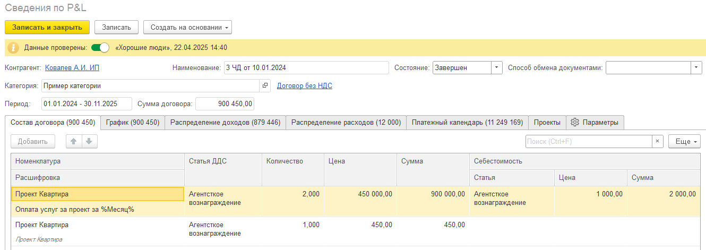

Раздел **Сведения по PNL** позволяет детализировать договоры для автоматизации учета, планирования платежей, отслеживания статусов проектов а также формирования и прикрепления файлов по их видам.

### Основные данные договора

{width=1330px height=471px}

1. **Данные проверены** - позволяет контролировать корректность заполнения договора, исключая несанкционированные или случайные изменения реквизитов. При активизации переключателя данные формы становятся недоступными для редактирования. Исключениям являются реквизиты Состояние, и Менеджер.

2. **Основные данные** - реквизиты для детализации договора по следующим параметрам:

   -  **Категория** Реквизит **Категория** служит для удобства ведения однотипных договоров, а также их группировке по единому признаку. По данному признаку возможен отбор всех договоров в разделе [**\[Список договоров\]**](./../spisok-dogovorov).

   -  **Период** Для определения периода действия договора используется реквизит **Период**. В нём устанавливается дата начала и дата окончания договора. По периоду в дальнейшем происходит распределение доходов и расходов состава договора, а также планирование оплаты по графику.

   -  **Состояние** Реквизит **Состояние** позволяет определять состояние договора и служит для удобства ведения учета. По данному реквизиту возможен отбор всех договоров в разделе [**\[Список договоров\]**](./../spisok-dogovorov). По умолчанию созданы следующие статусы:

      -  Черновик

      -  Подписан

      -  Отменен

      -  Завершен При необходимости список состояний может быть дополнен в пользовательском режиме по кнопке Создать (или при нажатии на F8 во время редактирования реквизита).

   -  **Способ обмена документами** Реквизит **Способ обмена документами** позволяет определять хранить способ обмена документами, служит для удобства ведения учета. По умолчанию созданы следующие способы обмена документами:

      -  1С-ЭДО

      -  Диадок

      -  Курьер

      -  По email

      -  Почта РФ

      -  Неопределен При необходимости список способов обмена документами может быть дополнен в пользовательском режиме по кнопке Создать (или при нажатии на F8 во время редактирования реквизита).

   -  **НДС** Позволяет собирать состав договора с учетом НДС.

### Состав договора

Таблица **Состав договора** позволяет детализировать сумму договора по оказываемым услугам и купля-продаже товаров. Суммы состава договора распределяются на периоды **график платежей**, по которым автоматизируется процесс **создания актов и счетов**, а также на **плановые доходы и расходы** для контроля рентабельности договора

Планировать по Платёжному календарю Прикреплять и формировать по шаблонам связанные с договором файлы по видам.