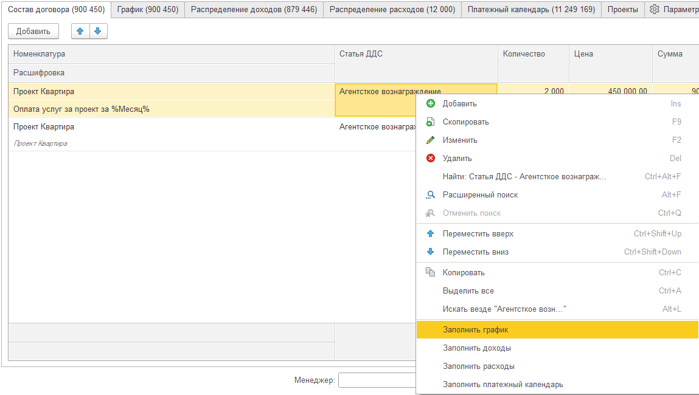

Таблица **Состав договора** позволяет детализировать сумму договора по оказываемым услугам и купля-продаже товаров. Суммы состава договора распределяются на периоды в **график платежей**, по которым автоматизируется процесс **создания актов и счетов**.

**Состав договора** содержит в себе колонки:

-  **Номенклатура** - товар или услуга по договору

-  [comment:5EoSU]**Статья доходов**[/comment]

-  **Количество**

-  **Цена**

-  **Сумма**

-  **% НДС** - [comment:c0H0T]процент НДС[/comment]. Отображае[comment:bF1lu]тся ес[/comment]ли включен учет НДС по договору

-  **НДС** - [comment:b53EW]ставка НДС, по которому рассчитывается договор. Отображается если включен учет НДС по договору[/comment]

-  **Всего** - итоговая сумма номенклатуры [comment:bBDJE]договора[/comment][comment:Chv4s], учитывая учет НДС[/comment]

## Команды распределения

На основе состава договора есть возможность распределить остальные табличные части. Команды распределения находятся в контекстном меню.

{width=1149px height=650px}