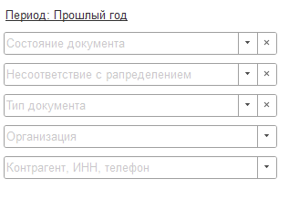
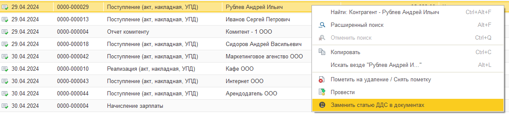

Блок со всеми бухгалтерскими документами, отраженные в системе. Инструмент позволяет контролировать и вручную распределить суммы для корректного отображения в управленческих отчетах.

## Основной функционал.

### Отборы

{width=317px height=219px}

-  Период;

-  Состояние документа:

   -  *Вручную* - означает, что документ был отражен вручную;

   -  *Автоматически* - При проведении документа движения документа были сформированы автоматически. Если стандартные движения корректно отражают действительность, то их можно не исправлять. Однако, если есть сомнения, рекомендуется проверить и при необходимости скорректировать движения документа вручную.

   -  *Не распределено* - данный документ никак не будет отражен в отчетах.

   -  *Не отражено* - данный документ был отражен вручную, но статья, указанная в распределении, исключена из движений (статья отражена в “*Исключение движений по статьям*”)

-  Тип документа;

-  Организация;

-  Контрагент.

### Дополнительные команды

Расположены в контекстном меню, которые позволяют:

-  Пометить на удаление/снять пометку;

-  Провести;

-  Заменить статью ДДС в документа - инструмент позволяет массово отметить статью в документах без необходимости повторного проведения, но при этом данные отображаются в управленческих отчетах.

{width=1188px height=270px}