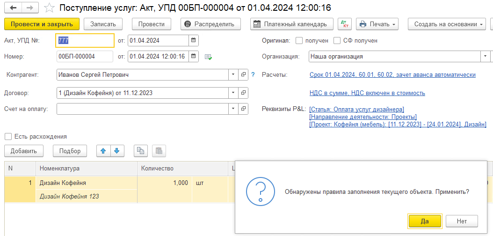

В 1С каждый день создаются десятки, а то и сотни документов: **акты выполненных работ, накладные на приход и расход, счета-фактуры, реализации** и так далее. В каждом из этих документов есть специальное поле -- **«Статья»** (а также проект, статья ДДС и другие аналитические разрезы).

Эта информация критически важна для формирования главного финансового отчета -- **ОПиУ.** Именно по статьям система понимает, к какой части финансовой деятельности отнести ту или иную операцию: это была выручка от продаж, затраты на аренду, зарплата или, например, прочий доход.

Бухгалтеру приходилось **вручную** в каждом документе открывать его, искать нужное поле и выбирать подходящую статью. Это:

-  **Очень рутинно.** Одна и та же операция повторяется сотни раз.

-  **Занимает много времени.** Время, которое можно потратить на более важные аналитические задачи.

-  **Велик риск человеческой ошибки.** Усталый сотрудник может выбрать не ту статью, что приведет к ошибкам в отчетности.

**Решение -- система автоправил.**

Эта система позволяет **настроить правила один раз**, а дальше 1С будет **автоматически** подставлять нужные статьи и другие параметры в документы, основываясь на заданных вами условиях.

## **Как эти правила используются? Подробный разбор.**

### **Шаг 1: Создание и настройка правила**

1. Заходим в модуль P&L, в раздел **«Документы»**.

2. Находим блок **«Инструменты»** и в нем -- **«Автоправила по документам ОПиУ»**.

3. Открываем этот справочник и нажимаем кнопку **«Создать»**.

   {width=375px height=153px}

### **Шаг 2: Выбираем тип документа и режим настройки**

Первым делом система спросит: **«Для какого документа мы настраиваем правило?»** Выбираем из списка, например, «Реализация товаров и услуг» или «Поступление товаров».

Далее у вас есть **три основных способа** настройки правил, в зависимости от вашей квалификации и сложности задачи.

---

### **Вариант А: Простой режим (Для начинающих)**

Этот режим идеален, если вы не хотите глубоко погружаться в устройство 1С.

{width=693px height=516px}

**Блок «Условия»:** Здесь вы задаете простые и понятные критерии. 

**Блок «Автоматически выполнить действия» :** Здесь вы указываете, что именно должно подставиться в документ, если условия совпали.

-  **Статья ДДС** (Движение Денежных Средств)

-  **Статья себестоимости**

-  **Проект**

-  **Раздел проекта**

-  **Аналитика направления деятельности**

:::tip Пример простого правила

*Условие:* Если `Контрагент` = "ОАО "Вектор" и `Договор` = "№123 на поставку".

*Действие:* То автоматически проставлять `Статью ДДС` = "Оплата поставщикам" и `Проект` = "Основной".

:::

### **Вариант Б: Профессиональный режим (Для продвинутых пользователей и разработчиков)**

Этот режим дает полную власть над настройками. Он для тех, кто хорошо знаком с системой компоновки данных (СКД) и структурой документов в 1С.

{width=708px height=639px}

**Блок «Условия»:** Здесь вы видите не ограниченный список, а **все реквизиты выбранного документа**. Вы можете выбрать любое поле из документа и задать для него условие.

**Блок «Заполнить реквизиты»:** Аналогично, вы можете заполнить практически любой реквизит документа, а не только стандартный набор статей.

### **Вариант В: Распределение для табличных частей (Особый случай)**

Этот режим предназначен для документов с **табличной частью**, таких как акты или накладные, где есть список номенклатуры (товаров, услуг).

-  **Что это делает?** Он позволяет назначать статьи не для всего документа в целом, а **для каждой конкретной позиции (строки) в документе**, в зависимости от того, что это за товар или услуга.

-  **Ключевые параметры:**

   -  **Номенклатура** (конкретный товар "Стул офисный")

   -  **Номенклатурная группа** (группа товаров "Мебель для офиса")

   -  **Статья затрат** (указанная в документе)

-  **Соответствие:** Вы можете настроить, что, например, для всех товаров из группы "Канцелярия" должна автоматически проставляться статья "Затраты на хоз. нужды".

## **Как применять настроенные правила?**

После того как вы создали и активировали правила, они начинают работать. Есть **три основных сценария** их применения:

1. **Автоматически при проведении документа (Самый частый сценарий)**

   -  Бухгалтер создает или меняет документ и нажимает кнопку **«Провести»**.

   -  Система проверяет, подходит ли документ под какое-либо из ваших правил.

   -  Если подходит, появляется сообщение: **«Обнаружены правила заполнения текущего объекта. Примените?»**.

   -  Бухгалтер жмет **«Да»**, и все необходимые статьи и реквизиты мгновенно заполняются. Документ можно проводить.

      {width=1054px height=504px}

2. **Массово из списка документов**

   -  Вы заходите в общий список документов.

   -  Выделяете мышью несколько документов (или все с помощью галочки).

   -  Нажимаете правой кнопкой мыши и выбираете опцию **«Заполнить по автоправилам ОПУ»**.

   -  Система пройдется по всем выделенным документам и автоматически заполнит их согласно правилам. Это идеально для обработки «хвостов» или применения новых правил к старым документам.

      {width=955px height=731px}

3. **Поиск и заполнение из самого правила**

   -  Вы заходите в конкретное созданное вами правило.

   -  В нем есть специальная команда -- **«Найти и заполнить документы»**.

   -  Система сама найдет все документы в базе, которые подходят под условия этого правила, но еще не были заполнены, и предложит их обработать.

      [image:./avtopravila-po-dokumentam-opiu-6.png:::0,0,100,100::square,59.2806,8.6022,27.9137,23.6559,,top-left:695px:186px:center]