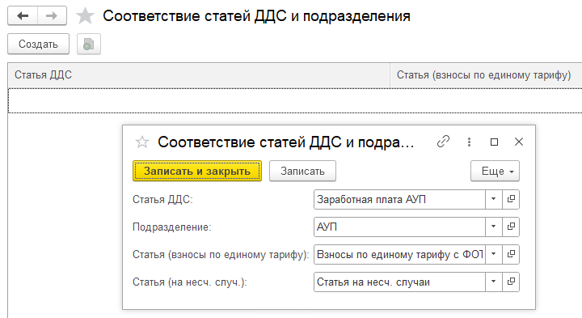

Как правило, документы по начислению зарплаты создаются в конфигурации «1С:Зарплата и Управление Персоналом» (ЗУП), а затем передаются в «1С:Бухгалтерию Предприятия». Однако, для управленческого учета этих проводок недостаточно -- их нужно корректно разнести по статьям в системе P&L. Давайте рассмотрим два основных способа решения этой задачи.

### **Способ 1: Обобщенный метод**

Он подходит, если вам не нужна детализация зарплатных расходов по подразделениям, а достаточно видеть общие суммы по статьям в отчете P&L.

**Суть метода:** Все начисления по зарплате будут попадать в отчет P&L крупными блоками (статьями), например: «ФОТ», «НДФЛ», «Страховые взносы».

**Пошаговая настройка:**

1. Откройте документ «Отражение зарплаты в бухучете» или «Начисление платы»

2. Найдите раздел с реквизитами P&L. В форме документа есть специальные поля (реквизиты) для управленческого учета. 

3. Заполните статьи для каждого типа начисления.

4. Проведите документ.

   После того как вы указали все статьи, просто проведите документ. Система автоматически учтет эти суммы в отчете P&L по указанным вами обобщенным статьям.

**Плюсы:** Быстрая настройка, минимальные трудозатраты.

**Минусы:** Отсутствие детализации по отделам и подразделениям.

[image:./otrazhenie-zarplaty-v-bukh-uchete-2.png:::0,0,100,100::square,36.4528,24.1563,63.5472,5.8615,,top-left:1122px:563px:center]

---

### **Способ 2: Детализированный метод (с привязкой к подразделениям)**

Он подходит, если вам нужно видеть, например, сколько зарплаты ушло на производственный цех, а сколько -- на отдел маркетинга.

**Суть метода:** Система будет автоматически распределять суммы из документа о зарплате по разным статьям P&L в зависимости от того, к какому подразделению относится сотрудник.

**Пошаговая настройка:**

1. **Перейдите в «Настройки», в блок P&L**

2. **Найдите настройку «Соответствие статей ДДС и подразделений».**

   [image:./otrazhenie-zarplaty-v-bukh-uchete-3.png:::0,0,100,100::square,89.7533,0,8.6338,9.7493,,top-left&square,0.4744,82.4513,38.5199,17.5487,,top-left&square,40.9867,55.9889,26.6603,8.9136,,top-left:1054px:359px:center]

   

3. **Заполните таблицу соответствий.**

   Вам необходимо для каждого подразделения создать правило, по которому виды зарплатных начислений будут относиться на конкретные статьи P&L.

   **Пример настройки:**

   -  **Подразделение:** «Производственный цех»

      -  *Вид начисления (ФОТ)* -> *Статья P&L*: «ФОТ Производства»

      -  *Вид начисления (Взносы)* -> *Статья P&L*: «Страховые взносы (Производство)»

   -  **Подразделение:** «Офис продаж»

      -  *Вид начисления (ФОТ)* -> *Статья P&L*: «ФОТ Офиса»

      -  *Вид начисления (Взносы)* -> *Статья P&L*: «Страховые взносы (Административные)»

         {width=720px height=393px}

4. **Проведите документ «Отражение зарплаты в бухучете».**

   После того как соответствия настроены, вам больше не нужно будет вручную проставлять статьи в каждом документе. Просто проводите документ, и система **автоматически** разнесет все суммы по правилам, которые вы задали на предыдущем шаге.

:::tip Примечение

В системе 1С:Бухгалтерия предприятия начисления по НДФЛ не разбивается по подразделениям. Поэтому необходимо: либо указывать общую статью НДФЛ в самом документе, либо отражать НДФЛ с помощью дополнительной управленческой операцией. 

:::

:::tip Примечание

[Для более детального учета заработной платы используйте систему управленческой заработной платы.](./../../new-article-3/upravlencheskiy-uchet-zarabotnoy-platy)

:::

