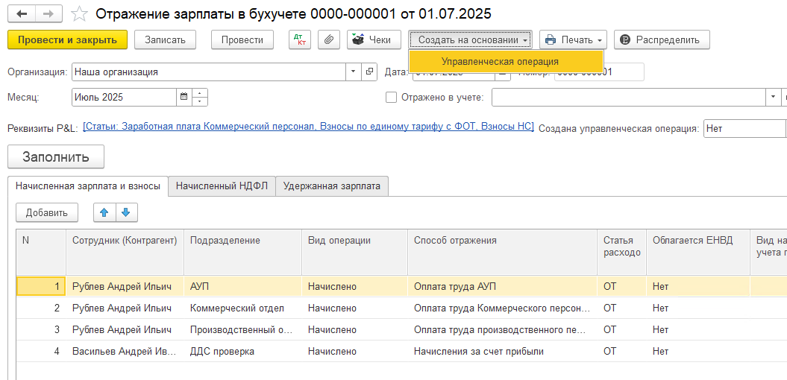

Бухгалтерский документ «Отражение зарплаты в бухучете» и «Начисление зарплаты». Добавлена возможность создать на основании документ “Управленческая операция“, с помощью которой удобнее распределять по статьям/проектам/видам деятельности заработную плату.

По умолчанию статьи берутся из самого документа. Если был создан на основании документ, необходимо указать статус “Создана управленческая операция“, чтобы избежать дублей в отчете.

{width=1055px height=510px}

1. Для начала необходимо в документе «Отражение зарплаты в бухучете» указать все статьи в реквизитах P&L.

2. Создать на основании управленческую операцию.

3. Указать в документе «Создана управленческая операция» как **Да**, чтобы не было дублей в отчетах.